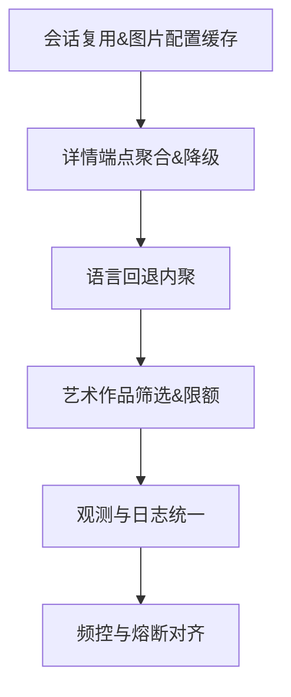

# Align（需求对齐）
## 背景与现状
- 架构：FastAPI 后端（`media-server`），插件化刮削（`services/scraper/tmdb.py`）+ 元数据丰富（`services/media/metadata_enricher.py`）+ 统一任务队列/调度/执行（Redis + `unified_task_scheduler.py`/`unified_task_executor.py`）。
- 现状问题：
  - 会话未复用，请求握手开销大；详情、演职员、图片分步请求导致 HTTP 往返多。
  - 图片配置频繁调用；语言回退策略分散在上层。
  - 批量刮削易触发限流；观测与日志字段不统一。
  - 侧车本地化已改为异步，但需通过 env 强控制与强制 `storage_id`。
- 改造目标：降低请求数与时延、统一回退与限额策略、提升成功率与可观测性；保持 `ScraperResult` 契约与上层接口稳定。
## 范围与边界
- 不改动 API 路由与上层调用契约；不改变数据库结构（新设计已适配）。
- 仅优化 TMDB 插件内部实现与侧车本地化控制；保留现有任务框架。
## 验收标准
- 刮削批量任务请求数与平均耗时降低≥20%；详情成功率提升；英文回退命中统计可用。
- 侧车写图数量符合 env 限额；NFO仅在异步阶段生成与上传。
- 日志统一包含 `provider_id/endpoint/latency`；失败响应摘要≤200字符。

# Architect（架构设计）
## 组件与职责
- `TmdbScraper`：
  - 复用 `aiohttp.ClientSession`（实例生命周期内共享，TTL/关闭钩子）。
  - 缓存 `image_config`（含 `expires_at`），失败回退 `image_base_url`。
  - 详情端点 `append_to_response=external_ids,keywords,credits,images`，不支持时降级分步请求。
  - 内聚语言回退：首选语言失败或空结果→一次备选语言（可配置）。
  - 暴露基础指标（请求计数、失败计数），供 `plugin_manager` 读取。
- 侧车异步本地化：
  - 通过 `SIDE_CAR_LOCALIZATION_ENABLED` 控制开关；`storage_id` 必填。
  - `SidecarLocalizeProcessor` 基于规范外部ID重建详情，调用 `_write_sidecar_files` 生成NFO与图片；图像数量遵循 `SIDE_CAR_LOCALIZATION_ARTWORK_LIMIT`。
## 接口契约（保持不变）
- `search(title, year?, media_type, language) -> List[ScraperResult]`
- `get_details(provider_id, media_type, language) -> ScraperResult?`
- `get_episode_details(series_id, season_number, episode_number, language, user_id?) -> ScraperResult?`

# Atomize（原子化任务拆分）
## 任务清单
1. 会话复用与图片配置缓存
- 输入：`Settings.TMDB_*`；输出：共享会话与缓存获取的 `image_config`（TTL 30min）。
- 验收：同一批次请求握手次数显著下降；缓存命中率统计。
2. 详情端点聚合与降级
- 输入：`provider_id/media_type/language`；输出：一次请求聚合详情+演职员+图片；端点不支持时分步。
- 验收：请求数下降；结果完整性与一致性不低于现有实现。
3. 语言回退内聚
- 输入：首选语言；输出：失败时自动 `fallback_language` 重试一次。
- 验收：回退命中率统计；避免上层重复回退逻辑。
4. 艺术作品筛选与限额
- 输入：`images` 列表；输出：按评分与语言优先筛选，数量由 `SIDE_CAR_LOCALIZATION_ARTWORK_LIMIT` 控制。
- 验收：侧车阶段写入的图片数量受控且更优质。
5. 观测与日志统一
- 输入：请求与响应；输出：标准日志（`provider_id/endpoint/latency/status`），错误响应截断。
- 验收：日志结构稳定，便于检索与告警。
6. 频控与熔断对齐（可与现有 `MetadataTaskProcessor` 协作）
- 输出：暴露速率与失败计数；或内置简易令牌桶与失败阈值。
- 验收：批量刮削稳定性提升；避免触发对端限流。
## 任务依赖图（Mermaid）

# Approve（审批门控）
- 完整性：六个任务覆盖性能、稳定性、质量与可观测。
- 一致性：契约不变，数据库映射保持；侧车开关与必选参数一致。
- 可行性：改动集中于插件内部与处理器参数校验；低风险可灰度。
- 可测性：逐任务提供可度量指标（请求数、耗时、成功率、命中率）。

# Automate（实施与验证）
- Phase 1：任务 1/2/3（低风险）→ 单元测试（模拟 HTTP 与配置缓存）→ 集成测试（批量文件）。
- Phase 2：任务 4/5 → 验证图片筛选与日志结构 → env 限额验证。
- Phase 3：任务 6 → 与处理器限流/熔断整合 → 压测与告警阈值。
- 验证数据：对比实施前后请求数、平均耗时、失败率；侧车写入成功率与时延。

# Assess（评估与交付）
- 产出：优化报告（指标对比）、变更说明；回滚预案（关闭聚合/回退到分步，关闭语言回退）。
- 结论：达到目标阈值则合入默认配置；否则保留为可选增强。
