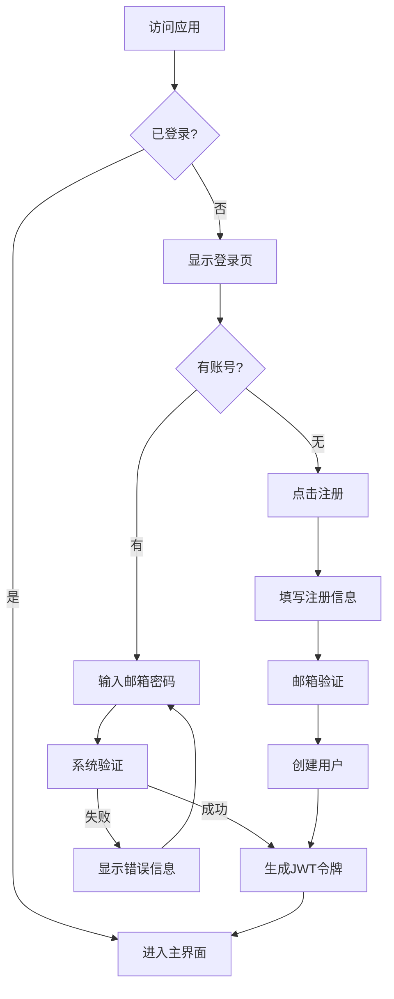
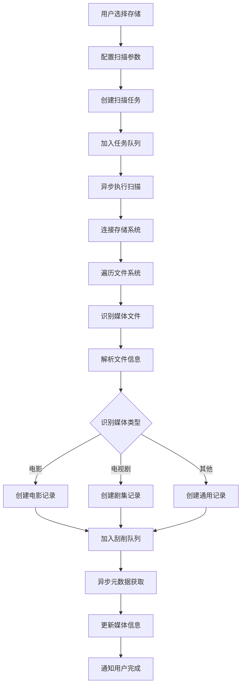
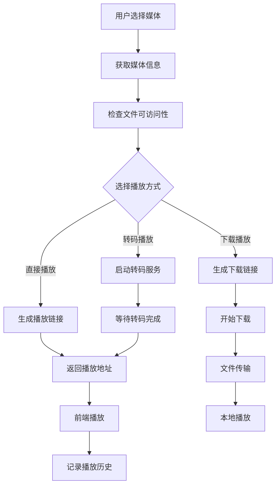

# MediaCMN 产品需求文档

## 1. 产品概述

MediaCMN是一个现代化的媒体管理系统，专为个人和小型团队设计，用于管理和组织本地及云端媒体文件。系统支持多种存储类型（WebDAV、SMB、本地存储、云盘），提供智能媒体识别、元数据刮削、统一媒体库管理等功能。

**核心价值**:
- 统一的多存储类型支持，打破数据孤岛
- 智能媒体识别和元数据自动补充
- 多用户隔离和数据安全保障
- 现代化的Web界面和移动应用支持
- 插件化架构，支持功能扩展

**目标用户**:
- 媒体收藏爱好者
- 小型媒体工作室
- 家庭媒体中心用户
- 云存储重度使用者

## 2. 核心功能

### 2.1 用户角色

| 角色 | 注册方式 | 核心权限 |
|------|----------|----------|
| 普通用户 | 邮箱注册 | 管理个人媒体库、配置存储、执行扫描任务 |
| 高级用户 | 系统升级 | 高级刮削配置、批量操作、API访问 |
| 管理员 | 系统预设 | 用户管理、系统配置、监控和审计 |

### 2.2 功能模块

**存储管理模块**:
1. **存储配置管理**: 支持WebDAV、SMB、本地存储、云盘等多种存储类型的配置管理
2. **连接测试**: 实时测试存储连接状态和性能
3. **存储监控**: 监控存储空间使用情况和连接健康状态
4. **文件操作**: 支持文件浏览、下载、上传、删除等基本操作

**媒体管理模块**:
1. **媒体识别**: 自动识别电影、电视剧、综艺等不同媒体类型
2. **元数据刮削**: 从TMDB、豆瓣、TVmaze等数据源获取媒体信息
3. **版本管理**: 支持同一媒体的不同版本（清晰度、剪辑版等）管理
4. **媒体库**: 统一的媒体浏览、搜索、筛选界面

**扫描任务模块**:
1. **智能扫描**: 支持递归、增量、快速等多种扫描模式
2. **任务队列**: 异步任务处理，支持优先级和并发控制
3. **进度跟踪**: 实时显示扫描进度和状态
4. **错误处理**: 完善的错误捕获和重试机制

**插件系统模块**:
1. **刮削器插件**: 支持多种元数据源的可插拔架构
2. **存储插件**: 易于扩展新的存储类型支持
3. **限流保护**: 智能限流，保护第三方API
4. **断路器**: 故障隔离和自动恢复

### 2.3 页面详情

| 页面名称 | 模块名称 | 功能描述 |
|----------|----------|----------|
| 登录页面 | 用户认证 | 支持邮箱密码登录、JWT令牌管理、记住登录状态 |
| 注册页面 | 用户注册 | 邮箱验证、密码强度检查、用户协议确认 |
| 仪表板 | 系统概览 | 显示存储统计、媒体统计、最近活动、系统状态 |
| 存储管理 | 存储配置 | 创建编辑存储配置、连接测试、状态监控 |
| 文件浏览器 | 文件管理 | 树形目录结构、文件预览、批量操作、拖拽上传 |
| 媒体库 | 媒体展示 | 卡片式媒体展示、搜索筛选、分类浏览、收藏功能 |
| 媒体详情 | 详情展示 | 媒体信息展示、版本管理、元数据编辑、播放链接 |
| 扫描任务 | 任务管理 | 任务创建、进度监控、日志查看、任务调度 |
| 插件管理 | 插件配置 | 插件启用禁用、参数配置、状态监控、更新检查 |
| 用户设置 | 个人配置 | 个人信息管理、偏好设置、通知配置、安全设置 |
| 系统管理 | 系统配置 | 用户管理、角色权限、系统监控、日志审计 |

## 3. 核心流程

### 3.1 用户注册登录流程

### 3.2 媒体扫描流程

### 3.3 媒体播放流程

## 4. 用户界面设计

### 4.1 设计规范

**色彩方案**:
- 主色调: #2196F3 (Material Blue)
- 辅助色: #4CAF50 (Material Green)
- 警告色: #FF9800 (Material Orange)
- 错误色: #F44336 (Material Red)
- 背景色: #FAFAFA (浅灰)
- 文字色: #212121 (深灰)

**字体规范**:
- 标题: 24px/32px 加粗
- 副标题: 18px/24px 中等
- 正文: 14px/20px 常规
- 辅助文字: 12px/16px 常规
- 字体族: -apple-system, BlinkMacSystemFont, 'Segoe UI', Roboto

**布局规范**:
- 导航栏高度: 64px
- 侧边栏宽度: 240px
- 内容区域: 自适应
- 卡片间距: 16px
- 按钮圆角: 4px

**图标风格**:
- 使用Material Design图标
- 线条简洁，识别度高
- 支持彩色和单色版本
- 动画过渡自然

### 4.2 页面设计

**仪表板页面**:
- 顶部统计卡片: 显示存储数量、媒体总数、今日新增、系统状态
- 存储状态图表: 饼图显示各存储使用情况
- 最近活动: 时间线展示最近扫描和访问记录
- 系统状态: 显示服务运行状态和性能指标

**媒体库页面**:
- 分类导航: 电影、电视剧、综艺、其他
- 筛选器: 类型、年份、评分、存储位置
- 搜索框: 支持模糊搜索和高级搜索
- 媒体卡片: 封面图、标题、年份、评分、时长
- 分页控件: 支持页码跳转和每页数量设置

**存储管理页面**:
- 存储列表: 卡片式展示各存储配置
- 状态指示: 在线/离线、连接质量、剩余空间
- 操作按钮: 编辑、测试连接、查看文件、删除
- 添加按钮: 引导式配置向导

**扫描任务页面**:
- 任务列表: 显示所有扫描任务状态
- 进度条: 实时显示任务完成进度
- 操作按钮: 开始、暂停、取消、重新执行
- 日志查看: 展开显示详细执行日志

### 4.3 响应式设计

**桌面端 (≥1200px)**:
- 完整侧边栏导航
- 多列卡片布局
- 丰富的交互控件
- 完整的功能展示

**平板端 (768px-1199px)**:
- 折叠式侧边栏
- 双列卡片布局
- 适配触摸操作
- 核心功能完整

**手机端 (<768px)**:
- 底部导航栏
- 单列卡片布局
- 手势操作支持
- 核心功能优先

## 5. 技术实现要求

### 5.1 前端技术要求

**框架选择**:
- Flutter 3.x - 跨平台移动应用开发
- React 18.x - Web管理界面(可选)

**状态管理**:
- Riverpod - Flutter状态管理
- Redux Toolkit - React状态管理(可选)

**网络通信**:
- Dio - Flutter HTTP客户端
- Axios - React HTTP客户端(可选)

**本地存储**:
- Hive - Flutter本地数据库
- localStorage - Web本地存储(可选)

### 5.2 后端技术要求

**API规范**:
- RESTful API设计
- OpenAPI 3.0文档
- JWT认证机制
- 统一响应格式

**数据处理**:
- 分页查询支持
- 数据验证和清洗
- 错误处理和日志
- 性能监控和优化

**安全要求**:
- 用户数据隔离
- 敏感信息加密
- API访问限流
- 安全头设置

### 5.3 部署运维要求

**容器化部署**:
- Docker容器化
- Docker Compose编排
- 环境变量配置
- 日志收集和管理

**监控告警**:
- 应用性能监控
- 错误日志告警
- 系统资源监控
- 业务指标统计

**备份恢复**:
- 数据库定期备份
- 文件存储备份
- 配置信息备份
- 灾难恢复方案

## 6. 质量要求

### 6.1 功能质量

**完整性**:
- 所有核心功能完整实现
- 边界情况正确处理
- 异常流程完善处理
- 用户操作反馈及时

**正确性**:
- 数据计算准确无误
- 业务逻辑正确执行
- 权限控制严格有效
- 数据一致性保证

**可靠性**:
- 系统稳定运行
- 错误恢复机制
- 数据安全保护
- 服务可用性99.9%

### 6.2 性能质量

**响应时间**:
- API响应 < 200ms
- 页面加载 < 2s
- 文件传输优化
- 搜索查询 < 500ms

**并发能力**:
- 支持1000+并发用户
- 任务队列高效处理
- 资源竞争正确处理
- 内存使用优化

**扩展性**:
- 水平扩展支持
- 垂直扩展能力
- 插件机制完善
- 配置灵活调整

### 6.3 用户体验

**易用性**:
- 界面简洁直观
- 操作流程清晰
- 帮助文档完善
- 新手引导友好

**可访问性**:
- 支持键盘操作
- 屏幕阅读器兼容
- 色彩对比度达标
- 字体大小可调

**国际化**:
- 多语言支持
- 时区处理正确
- 日期格式本地化
- 数字格式适配

## 7. 验收标准

### 7.1 功能验收

**核心功能验证**:
- ✅ 用户注册登录功能完整
- ✅ 多存储类型配置和管理
- ✅ 媒体文件扫描和识别
- ✅ 元数据自动刮削功能
- ✅ 媒体库浏览和搜索
- ✅ 文件下载和播放
- ✅ 任务队列和状态跟踪
- ✅ 插件系统正常运行

**边界条件测试**:
- ✅ 大文件处理能力
- ✅ 网络异常处理
- ✅ 存储连接失败
- ✅ 并发操作冲突
- ✅ 权限边界验证

### 7.2 性能验收

**基准测试**:
- ✅ API响应时间 < 200ms
- ✅ 数据库查询 < 50ms
- ✅ 文件扫描速度 > 100文件/秒
- ✅ 并发用户支持 > 1000

**压力测试**:
- ✅ 持续运行24小时无异常
- ✅ 内存使用稳定无泄漏
- ✅ CPU使用率合理
- ✅ 磁盘空间管理有效

### 7.3 安全验收

**安全测试**:
- ✅ SQL注入防护
- ✅ XSS攻击防护
- ✅ CSRF攻击防护
- ✅ 敏感数据加密
- ✅ 访问权限控制

**渗透测试**:
- ✅ 认证绕过测试
- ✅ 权限提升测试
- ✅ 数据泄露测试
- ✅ 服务拒绝测试

## 8. 项目交付物

### 8.1 技术交付

**源代码**:
- 完整的后端源代码
- 前端应用源代码
- 数据库迁移脚本
- 配置文件模板

**文档资料**:
- 架构设计文档
- API接口文档
- 部署运维指南
- 用户操作手册

**测试报告**:
- 单元测试报告
- 集成测试报告
- 性能测试报告
- 安全测试报告

### 8.2 运维交付

**部署脚本**:
- Docker镜像构建脚本
- 容器编排配置文件
- 环境初始化脚本
- 监控告警配置

**运维工具**:
- 日志分析工具
- 性能监控面板
- 备份恢复脚本
- 升级部署流程

### 8.3 培训支持

**用户培训**:
- 系统功能培训
- 操作使用培训
- 常见问题解答
- 技术支持渠道

**运维培训**:
- 系统架构讲解
- 部署配置培训
- 监控告警处理
- 故障排查指南

---

**文档版本**: v1.0  
**制定日期**: 2025年11月15日  
**产品经理**: AI Assistant  
**技术负责人**: MediaCMN开发团队