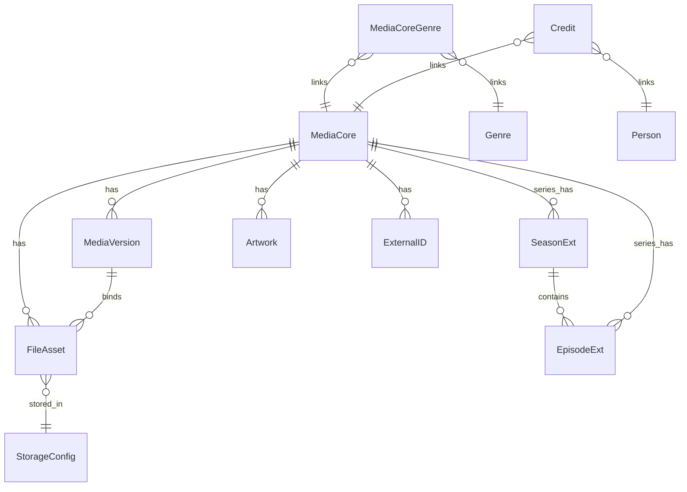

# 概览
- 范围：基于当前后端的“媒体相关模型”，覆盖作品层、版本层、文件层、季/集层、图片与外部ID、演职员、流派与扫描任务。
- 目标：提供完整的 ER 图与逐实体字段意义说明，便于前端卡片与详情查询设计。

# 实体列表与字段要点
## MediaCore（作品层，统一抽象）
- 关键字段：`id`、`user_id`、`kind`（movie|tv_series|tv_season|tv_episode）、`title`、`original_title`、`year`、`group_key`、`canonical_tmdb_id`、`created_at`、`updated_at`
- 作用：卡片统一使用 `movie` 与 `tv_series`；`tv_season`/`tv_episode` 用于层级结构与详情。

## MediaVersion（版本层，文件/季版本）
- 关键字段：`id`、`user_id`、`core_id`（指向电影或季）
- 标识：`tags`、`quality`、`source`、`edition`
- 扩展：`scope`（movie_single|season_group|series_group）、`variant_fingerprint`（唯一聚合指纹）、`preferred`（默认版本）、`primary_file_asset_id`（仅电影版本）
- 作用：电影以单文件为版本；剧集以季为版本；无季剧按剧为单位（series_group，按需）。

## SeasonExt（季层）
- 关键字段：`id`、`user_id`、`core_id`（季 core）
- 关联：`series_core_id`（剧 core）、`season_number`、`episode_count`
- 展示：`aired_date`、`poster_path`、`auto_generated`（无季剧自动季1标记）

## EpisodeExt（集层）
- 关键字段：`id`、`user_id`、`core_id`（集 core）
- 关联：`series_core_id`、`season_core_id`（可空，支持无季剧）、`episode_number`、`season_number`、`absolute_episode_number`
- 展示：`aired_date`、`runtime`、`rating`

## FileAsset（文件层）
- 关键字段：`id`、`user_id`、`storage_id`（→ StorageConfig.id）
- 路径：`full_path`、`filename`、`relative_path`
- 关联：`core_id`（作品或季）、`version_id`（版本）、`episode_core_id`（集）
- 技术：`size`、`mimetype`、`video_codec`、`audio_codec`、`resolution`、`duration`、`etag`
- 扩展：`asset_role`（video|audio|subtitle|nfo|image|other）、`bitrate_kbps`、`hdr`、`audio_channels`、`container`、`asset_fingerprint`

## Artwork（图片）
- 关键字段：`id`、`user_id`、`core_id`（作品关联）
- 展示：`type`（poster|fanart|...）、`remote_url`、`local_path`、`width`、`height`、`provider`、`language`、`preferred`

## ExternalID（外部ID）
- 关键字段：`id`、`user_id`、`core_id`、`source`（tmdb|imdb|tvdb|douban）、`key`
- 作用：同片聚合与外部检索对齐。

## Genre & MediaCoreGenre（流派与关联）
- `Genre`：`id`、`user_id`、`name`
- `MediaCoreGenre`：`id`、`user_id`、`core_id`、`genre_id`

## Person & Credit（演职员与关联）
- `Person`：`id`、`user_id`、`name`、`tmdb_id`
- `Credit`：`id`、`user_id`、`core_id`、`person_id`、`role`（cast|crew）、`character`、`job`

## ScanJob（扫描任务）
- 关键字段：`id`、`user_id`、`storage_name`、`root_path`、`status`、`total/done/failed`、`cancel_requested`、时间戳与错误信息

## StorageConfig（存储，引用）
- 说明：`FileAsset.storage_id` 外键引用；用于定位具体文件来源（WebDAV/S3 等）。

# 关系总览（ASCII，不依赖渲染）
```
MediaCore(id) ──< MediaVersion(core_id)
MediaCore(id) ──< FileAsset(core_id)
MediaCore(id: tv_series) ──< SeasonExt(series_core_id)
SeasonExt(core_id) ──< EpisodeExt(season_core_id)
MediaCore(id: tv_series) ──< EpisodeExt(series_core_id)
MediaVersion(id) ──< FileAsset(version_id)
MediaCore(id) ──< Artwork(core_id)
MediaCore(id) ──< ExternalID(core_id)
MediaCoreGenre(core_id) ── Genre(id)
Credit(core_id) ── Person(id)
FileAsset(storage_id) ── StorageConfig(id)
```

# ER 图（Mermaid，供支持环境渲染；当前环境可忽略）


# 查询视图（卡片与详情）
- 列表：`MediaCore.kind in ('movie','tv_series')`；电影版本计数 `MediaVersion(scope='movie_single')`；剧集聚合季/集并统计版本（季/剧）。
- 详情：电影版本取 `primary_file_asset_id`；季版本按覆盖率与质量选择 `preferred`；无季剧自动季1沿季逻辑。

# 交付
- 若确认，生成 Markdown 文档至 `docs/media_card_architecture_design.md`，包含上述 ASCII 关系图与 Mermaid 代码块、字段说明与查询指导。