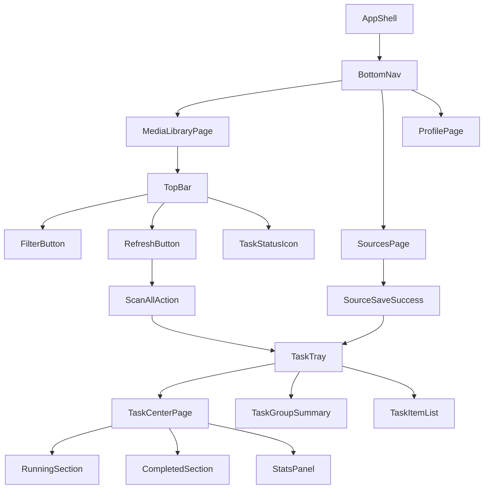
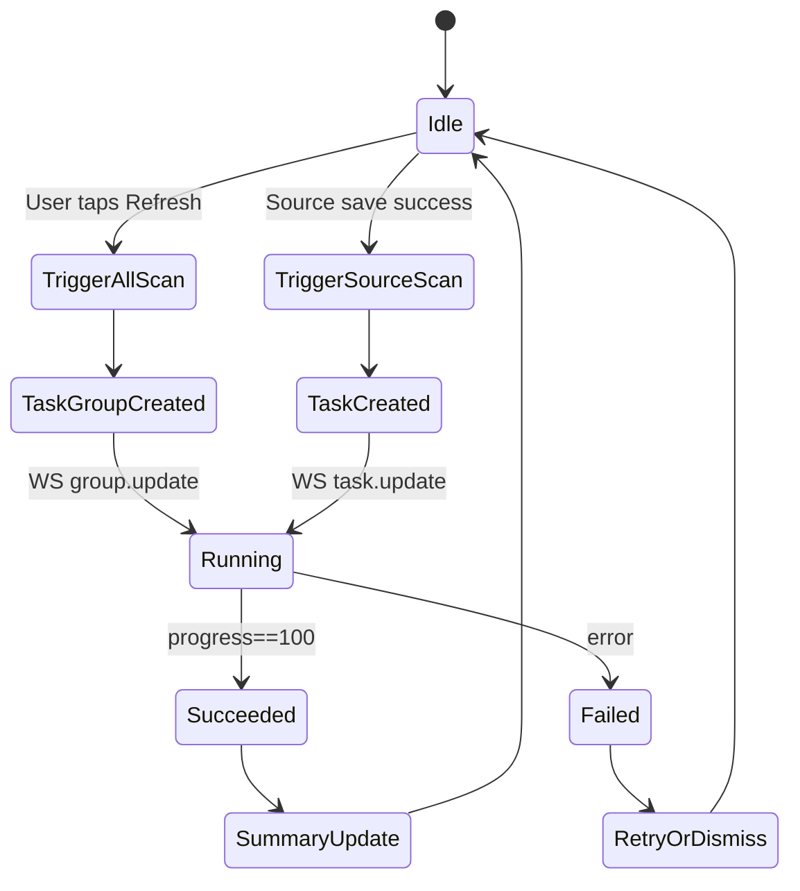
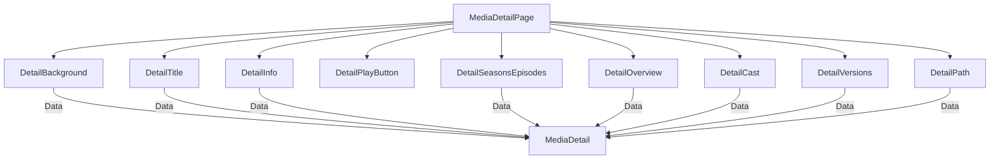

# 移动端媒体客户端设计与规格 v1.0
flutter clean && flutter pub get
flutter analyze
cd media-client && flutter run -d web-server --web-port 5200

/home/meal/Android/Sdk/platform-tools/adb reverse tcp:8000 tcp:8000 && flutter run -d emulator-5554 
## 背景与目标
- 构建跨平台（Android/iOS）媒体客户端，包含“媒体库”“资源库”“个人中心”，播放器为核心能力。
- 端到端流程：注册/登录 → 添加资源源 → 服务端扫描与刮削 → 媒体库展示 → 播放与续播同步。
- 设计不落地实现，输出可执行的架构与接口契约、页面信息架构与模板。

## 技术栈
- Flutter：Dart 3、Flutter 3.x，Material 3 + Cupertino 自适应。
- 路由：go_router（或 AutoRoute，取决于复杂度）。
- 状态管理：Riverpod 2.x（Provider + StateNotifier），不可变模型。
- 网络与序列化：Dio、json_serializable + build_runner、freezed。
- 本地存储与缓存：Isar（或 Hive）、shared_preferences（轻量设置）。
- 权限与文件：permission_handler、path_provider。
- 播放器：media_kit（主选），better_player（备选，移动端简化场景）。
- 质量与观测：flutter_lints、logger、sentry_flutter。
- 国际化与适配：flutter_localizations、intl。

## 架构与分层
- Presentation：UI 组件、页面与路由，含底部导航与页面模板。
- Application：ViewModel/Controller（Riverpod Providers），跨模块用例与状态。
- Domain：实体模型、值对象、领域用例（纯 Dart）。
- Data：API Client、DTO、Repository 实现、缓存与持久化。
- 通信：HTTP+JSON（鉴权、配置、检索），WS/SSE（刮削/扫描进度、播放心跳）。
- 媒体分发：HLS/DASH 优先；直链由服务端签名或代理；云盘令牌统一由服务端管理。

## 模块与功能
### 媒体库
- 首页：类目卡片（类型/标签/专题）、最近观看、电影与剧集瀑布流；顶栏搜索、筛选、刷新。
- 搜索：关键字与过滤（类别、年份、地区、评分、分辨率、字幕可用性、HDR）。
- 详情：海报/背景、评分/时长、简介、演职员、文件版本选择（多源/多码率）、相关推荐、播放/续播。

### 功能用例（进一步细化）
- 浏览：按类型/标签/专题浏览，分页与懒加载；失败重试与离线占位。
- 搜索：输入建议（联想），复合过滤（多选 chips），清空与重置；历史搜索记录。
- 收藏与历史：收藏列表、最近观看；跨设备同步与本地缓存优先。
- 详情：多版本优选（按网络状态与分辨率），外部分享（深链接）。
- 播放：断点续播、字幕/音轨选择、清晰度切换（HLS）、画面缩放与倍速；播放失败回退（直链→HLS 或降码）。

### 资源库
- 首页：已配置源列表（本地下载、WebDAV、SMB、云盘、媒体服务器），状态徽标与更多操作。
- 添加源：类型选择页（本地/网络/云盘/媒体服务器），进入对应表单。
- 源配置页：名称、连接信息、认证、安全策略、扫描策略（手动/定时）、索引范围与排除规则。

### 功能用例（进一步细化）
- 源管理：新增/编辑/删除/启用/停用/重命名；测试连接；查看最近扫描时间与错误详情。
- 扫描策略：立即扫描、定时任务（每日/每周/自定义 cron）；目录白名单/黑名单；文件类型过滤（视频扩展、字幕）。
- 任务观察：实时进度（WS/SSE）、历史任务列表与失败重试；任务取消与并发限制提示。
- 安全：凭据遮盖显示；云盘授权走服务端，客户端仅显示绑定状态与失效提醒。

### 个人中心
- 我的首页：登录卡片（跨设备同步提示）、功能项（福利/帮助与反馈/联系交流/关于）、设置入口。
- 登录页：用户名密码/扫码/第三方（后端发放 OAuth），注册与忘记密码。
- 设置：主题、网络策略（仅 WiFi 播放/下载）、缓存大小、字幕语言优先级、播放器偏好（解码策略/缩放/倍速）。

### 功能用例（进一步细化）
- 账户：注册/登录/登出/找回密码；设备绑定与解除；最近设备列表。
- 偏好：主题、语言、网络策略、字幕语言优先级、默认倍速与缩放、硬解策略优先；缓存清理。
- 反馈：问题上报（包含设备信息与日志指纹）；联系渠道跳转；关于版本信息。

## 路由与导航
- 底部导航：/media/home、/sources/home、/profile/home。
- 详情路由：/media/detail/:id（电影）；/media/detail/:seriesId（剧集）可带 season/episode 参数。
- 辅助：/media/search、/sources/add、/sources/:id/edit、/auth/login、/settings。

## 端到端流程设计
- 启动与鉴权：
  - 首次启动进入 `/auth/login`；成功后持久化 token，拉取用户与设置。
  - 已登录用户直接进入 `/media/home`，并并发请求首页聚合与源列表状态。
- 添加资源源：
  - `/sources/add` 选择类型 → 填写配置 → 测试连接 → 保存。
  - 保存成功后自动调用 `/sources/{id}/scan` 并进入“任务托盘”订阅进度（WS/SSE），返回 `task_id`。
- 扫描与刮削：
  - 服务端扫描文件、解析媒体、触发刮削器入库；任务状态推送到客户端。
  - 完成后客户端刷新 `/library/home` 与 `/media` 缓存，显示新增内容；任务托盘可查看“新增量”与失败数。
- 媒体浏览与搜索：
  - 首页展示类目与推荐；搜索页按 chips 过滤；分页懒加载与骨架占位。
- 播放与续播：
  - 详情页选择版本 → `POST /playback/{id}/start` 返回流地址与字幕/音轨。
  - 播放心跳定时 `progress` 上报；停止时 `stop`，历史写入“最近观看”。
  - 跨设备续播：进入详情页读取 `GET /playback/{session_id}` 或服务端最近记录，定位到断点。

## 数据模型（抽象）
- User：id, username/email, avatar, settings（主题/语言/播放器偏好）。
- Source：id, type（local/webdav/smb/cloud/emby...）, name, credentials（分类型字段）, scan_policy, status。
- MediaItem：id, kind（movie/tv/season/episode/music）, title, original_title, year, genres[], poster, backdrop, rating, runtime, overview, cast[], tags[]。
- MediaFile：id, media_id, source_id, path/url, format, size, resolution, bitrate, hdr, audio_tracks[], subtitles[]。
- ScrapeTask：id, source_id, status（queued/running/succeeded/failed）, progress, last_run, error。
- PlaybackSession：id, media_id, file_id, position, duration, device_id, updated_at。

### 字段补充与约束
- Source.credentials：
  - local：{ directory_path }
  - webdav：{ endpoint, username, password, base_path, tls_verify }
  - smb：{ server, share, username, password, domain?, path }
  - cloud：{ provider, bind_id, drive_id?, root_path? }（provider 由服务端管理授权）
  - emby：{ endpoint, token? }（建议服务端代理并统一出流）
- MediaFile.resolution：示例 "2160p" | "1080p" | "720p"；hdr：boolean 或 "HDR10"/"Dolby Vision"。
- ScrapeTask.progress：0..100；status 状态流转不可逆（failed 可重试生成新任务）。

## 接口细化
### 鉴权
- POST /auth/register
  - Req：{ email, username, password }
  - Res：{ user }
- POST /auth/login
  - Req：{ username, password }
  - Res：{ access_token, refresh_token, user }
- POST /auth/refresh
  - Req：{ refresh_token }
  - Res：{ access_token }
- POST /auth/logout
  - Req：{ access_token }
  - Res：204

### 存储源管理
- GET /sources
  - Query：page, size
  - Res：[{ id, type, name, status, last_scan }]
- POST /sources
  - Req：按 type 校验字段（示例 WebDAV：{ type, name, endpoint, username, password, base_path, scan_policy }）
  - Res：{ id, task_id }（保存成功即触发扫描，返回任务 id）
- GET /sources/{id} / PUT /sources/{id} / DELETE /sources/{id}
- POST /sources/{id}/scan
  - Req：{ mode: manual | schedule }
  - Res：{ task_id }
- POST /sources/{id}/test
  - Req：无或最小连接信息（若为创建前测试）
  - Res：{ ok: boolean, latency_ms?, error? }
- PUT /sources/{id}/enable
  - Req：{ enabled: boolean }
  - Res：{ id, enabled }
- GET /sources/{id}/metrics
  - Res：{ last_scan, media_count, error_count }
- GET /tasks?sources={id}
  - Res：[{ id, source_id, status, progress, started_at, finished_at, error }]
- WS /tasks/stream
  - Event：task.update → { id, status, progress }

### 媒体检索与聚合
- GET /library/home
  - Res：{
    categories: [{ id, name, cover }],
    recent: [MediaItem],
    movies: { total, items: [MediaItem] },
    tv: { total, items: [MediaItem] }
  }
  - 扩展：`scan_summary`（可选）→ { running_tasks, last_global_scan: timestamp, added: count, failed: count }
- GET /media
  - Query：q, kind, genre, year, region, rating_min, resolution, hdr, page, size
  - Res：{ total, items: [MediaItem] }
- GET /media/{id}
  - Res：{ item: MediaItem, versions: [MediaFile], related: [MediaItem] }
- GET /media/{id}/related
  - Res：[MediaItem]

### 播放与分发
- POST /playback/{id}/start
  - Req：{ file_id?, preferred: { protocol: hls|dash|file, resolution }, device_id }
  - Res：{ session_id, stream: { type: hls|dash|file, url }, subtitles: [ { lang, url, type } ], audio_tracks: [ { id, lang, codec } ] }
- POST /playback/{session_id}/progress
  - Req：{ position, buffered, bitrate?, network: { wifi: boolean } }
  - Res：204
- POST /playback/{session_id}/stop
  - Res：204
- GET /stream/file/{file_id}
  - Res：302 → 临时签名直链（或代理）
- GET /stream/hls/{file_id}/master.m3u8
  - Res：HLS Master，变码率列表
- GET /subtitles/{file_id}
  - Res：[{ lang, url, type }]
 - GET /playback/{session_id}
   - Res：{ session_id, media_id, file_id, position, duration, updated_at }
 - WS /playback/stream
   - Event：progress.update → { session_id, position }；device.sync → { session_id, device_id }

### 设置与偏好
- GET /settings / PUT /settings
  - 字段：theme, language, network_policy, subtitle_lang_priority[], player_prefs（decoder, scale, speed 默认）

### 错误码约定
- 1xx：鉴权相关（token 过期/无效）
- 2xx：源配置错误（连接失败/认证失败/路径无效）
- 3xx：扫描与刮削错误（任务队列/解析失败/配额限制）
- 4xx：媒体分发错误（直链失效/签名过期/HLS 构建失败）
- 5xx：客户端请求参数错误（校验失败）
- 错误响应统一：{ code, message, details? }

### 分页约定
- Query：page（从 1 ）, size（默认 20, 最大 100）
- 响应：{ page, size, total, items: [...] }

## 页面设计与模板（无代码）
### 媒体库首页（列表聚合）
- 顶栏：Logo/站点名、搜索、筛选（自定义首页类目顺序）、刷新（手动触发全源扫描+刮削）。
- 区块：
  - 类目卡片（类型/标签/专题），横向滚动，卡片含封面与计数。
  - 最近观看（横向缩略图列，显示进度条与上次观看时间）。
  - 电影与剧集（瀑布流网格，海报、标题、评分、年份）。
- 空状态：引导“去资源库添加源”，按钮直达 `/sources/add`。

### 媒体库引导页（首次使用）
- 视觉：应用图标、欢迎文案、示例截图（静态资源）。
- 引导文案："欢迎来到私人影库！添加视频资源后即可打造"。
- 操作：底部箭头指向“资源库”标签；主按钮“去添加资源”。

### 电影分类列表页
- 顶栏：标题“电影”，右侧更多菜单（排序：时间/评分）。
- 内容：网格卡片 3 列（手机），含海报、片名、评分、年份；支持分页加载与下拉刷新。
- 交互：点击进入详情；长按加入收藏（后续迭代）。

### 搜索页
- 搜索框：placeholder“输入影片名称搜索”，右侧搜索按钮。
- 过滤条：类别（全部/电影/剧集/动漫...）、最新更新、地区、年份、评分、分辨率、HDR。
- 结果：网格卡片；支持分页加载与骨架占位；失败重试。

### 媒体详情页（电影）
- 顶部：海报与背景蒙层，标题、副标题（年份/时长）、评分徽标。
- 主操作：播放/续播按钮；更多菜单（加入收藏、分享、版本信息）。
- 版本选择：按源与清晰度分组，显示大小与分辨率（示例：1.90 GB | 4K）。
- 简介：展开/收起。
- 演职员：头像圆卡横向滚动，进入人物详情（后续迭代）。
- 文件信息：路径/文件名、码率、音轨、字幕。
- 相关推荐：同类型或同演员作品。

#### 组件清单（模板）
- Header：PosterImage、BackdropOverlay、Title、MetaChips（评分/时长/年份）。
- Actions：PrimaryButton("播放"/"续播")、OverflowMenu（收藏/分享/版本）。
- Versions：SegmentedList（源分组）→ VersionCard（清晰度/大小/来源）。
- Overview：ExpandableText。
- Cast：AvatarScrollList。
- Files：FileInfoList（路径/码率/音轨/字幕）。
- Related：MediaGrid。

### 媒体详情页（剧集）
- 顶部：剧名与背景；评分、状态（完结/更新中）。
- 分区：季选择（下拉或分段控件）→ 当前季的剧集缩略卡（标题、时长、进度）。
- 简介与演职员同电影。
- 文件信息与相关推荐同电影。

#### 组件清单（模板）
- Header：SeriesPoster、BackdropOverlay、Title、StatusChip。
- SeasonPicker：Dropdown/SegmentedControl。
- Episodes：EpisodeCardGrid（标题、时长、进度、播放按钮）。
- Overview/Cast/Files/Related：同电影模板。

### 资源库首页
- 列表项：图标（类型，如 WebDAV/SMB/本地）、名称、副标题（域名/路径）、状态（ready/scanning/error）。
- 右上角：新增“+”与定时任务图标（进入任务列表）。
- 更多菜单：编辑、扫描、停用、删除。

### 任务列表页（资源库）
- 顶栏：标题“扫描任务”，刷新与清空按钮。
- 列表项：任务状态（排队/进行中/成功/失败）、进度条、源名称、时间戳、失败原因。
- 操作：取消任务、重试失败任务；并发限制提示与排队顺序展示。

### 任务托盘（全局可见）
- 形态：底部滑出面板或悬浮托盘，显示当前运行的任务摘要（N 个进行中、进度 X%）。
- 入口：媒体库首页刷新后自动展开；资源库保存成功自动提示；顶栏状态图标常驻入口。
- 内容：任务分组（全局扫描 group）与单源任务列表；每项展示源名、进度、状态与错误。
- 操作：展开进入“任务中心”；单项取消/重试；清空已完成；仅当有运行任务时显示红点提醒。

### 任务中心页
- 顶栏：搜索/筛选（按源/状态）、“全部取消”与“清空完成”。
- 分区：
  - 进行中：分组显示全局扫描与单源任务，进度条与剩余时间估算。
  - 已完成：成功与失败分栏；失败项显示错误详情与重试按钮。
- 统计：本次新增数、失败数、耗时；点击某源进入该源任务历史。

#### 组件清单（模板）
- SourceCard：Icon（类型）、Title、Subtitle（域名/路径）、StatusBadge（ready/scanning/error）、MoreMenu。
- Toolbar：AddButton、TaskButton（进入任务列表）、Search（后续迭代）。

### 添加文件源
- 分区：本地存储（本地目录）、网络存储（WebDAV/SMB）、云盘（阿里/百度/115/天翼/移动/联通/123...）、媒体服务器（Emby）。
- 进入配置页：根据类型呈现不同字段模板。

#### 字段模板
- 本地：directory_path。
- WebDAV：endpoint、username、password、base_path、tls_verify。
- SMB：server、share、username、password、domain、path。
- 云盘：provider（枚举）、绑定状态（只读）、根路径可选。
- 媒体服务器：endpoint、api_key/token（若服务端代理则只显示绑定状态）。

### 源配置页（模板）
- 通用：名称（必填）、类型（只读）、备注（可选）。
- 连接：
  - WebDAV：endpoint、username、password、base_path、TLS 选项。
  - SMB：server、share、username、password、domain、path。
  - 本地：directory_path（通过文件选择器）。
  - 云盘：选择云盘类型 → 走服务端 OAuth/授权 → 返回绑定信息（只读）。
  - 媒体服务器：endpoint、api_key 或服务端代理凭证。
- 扫描策略：手动/定时（cron 表达式或简化规则）、索引范围、排除规则。
- 操作区：保存、测试连接、立即扫描开关。

#### 交互流程
- 保存成功后返回源列表并 toast；若“立即扫描”为开则调用 `/sources/{id}/scan` 并跳转任务页。
- 测试连接失败显示错误详情并允许重试；凭据遮盖显示支持“查看/隐藏”。

### 个人中心首页
- 登录卡片：显示跨设备同步能力说明与“登录”按钮。
- 功能列表：福利、帮助与反馈、联系交流、关于、设置。

#### 组件清单（模板）
- LoginCard：Avatar、Description、LoginButton；已登录时显示用户名与同步状态。
- MenuList：ListItem(福利/帮助/联系/关于)、SettingsLink。

### 登录页
- 切换：账号密码/扫码登录/第三方授权（服务端发起，客户端配合回调）。
- 表单校验与错误提示；登录成功返回上一页并刷新“我的”与媒体库。

#### 交互流程
- 账号密码：输入 → 校验 → 提交 → 成功写入 token 并刷新；失败显示错误文案。
- 扫码登录：打开扫一扫页面，等待服务端确认后写入 token 并返回。
- 第三方授权：跳转服务端授权页 → 回调写入绑定信息 → 刷新账户状态。

### 空状态页（资源库）
- 图标与文案：“还没有资源哦，添加视频资源后即可打造私人影库，随时随地观看”。
- 主按钮：“＋添加资源”（跳转 `/sources/add`）。

## 播放器规范
- 支持：HLS/DASH/直链文件（mp4/mkv/ts 等），软/硬解自动；后台继续、画中画；断点续播。
- UI 控件：播放/暂停、进度条、倍速、画面缩放（填充/原比例/裁剪）、清晰度选择（HLS 码率）、音轨切换、字幕选择与样式。
- 字幕：内嵌与外挂（srt/ass/vtt），语言优先级设置；延时校准。
- 心跳与续播：启动会话时生成 session_id，定时上报进度；跨设备根据最后一次位置续播。
- 投屏：DLNA/媒体服务器生态可后续迭代；需鉴权下发投屏用临时 URL。

### UI 模板（播放器）
- 控制层：Play/Pause、Seek、TimeLabels（当前/总时长）、SpeedSelector、ScaleSelector、QualitySelector（HLS）、AudioTrackSelector、SubtitleSelector。
- 信息层：BufferingIndicator、NetworkBadge（WiFi/Cellular）、ErrorBanner（可重试）。
- 手势：单击显示/隐藏控制层；双击快退/快进；上下滑调亮度/音量（可选）。
- 设置持久化：倍速、缩放、字幕语言优先级；播放结束写入历史并更新“最近观看”。

## 性能与缓存
- 列表与详情本地缓存（Isar/Hive）；先读本地再读远端；分页与骨架屏。
- 图片缓存：LRU 与预取；详情页预取背景与海报。
- 播放：HLS 自适应码率；弱网自动降码；缓冲策略可调。
- 启动优化：延迟初始化非关键 Provider；鉴权守卫只做 token 校验与刷新。

## 安全与权限
- JWT：短期 access 与长期 refresh；自动刷新；登出清理本地与内存状态。
- 云盘与媒体服务器：授权由服务端完成，客户端不保存长期令牌；仅接收临时签名 URL 或代理地址。
- 设备权限：仅在访问本地源时申请读取；严格最小化权限范围。
- 传输：HTTPS 强制；HLS 与直链使用短期签名与来源限制。

## 错误处理与可观测性
- 统一 Result<T, Failure> 抽象；错误码映射到可读文案与重试策略。
- UI：关键操作提供重试与离线提示；扫描任务失败提示原因与建议。
- 观测：sentry_flutter 崩溃与性能；播放失败日志包含源类型与分发方式。

## 版本规划（建议）
- v0：鉴权、资源库配置与扫描触发、媒体库首页与详情基础、播放直链/HLS、进度同步。
- v1：搜索与高级过滤、字幕与音轨完整、缓存与弱网适配、云盘源授权接入。
- v2：投屏、下载管理、多人设备同步、专题与收藏、个人设置完善。

## 下一步建议（落地实施）
- 将“统一扫描任务”契约并入后端 OpenAPI，生成客户端 API SDK，避免参数歧义。
- 在客户端创建“任务托盘/任务中心”路由与组件草图，并定义 `TasksState` 与事件总线（订阅 WS）。
- 定义 `settings.home_sections_order` 与 `settings.home_sections_visibility` 的数据结构与存储策略（Isar/Hive），并在登录后同步。
- 实现媒体库首页“刷新”到“全局扫描”接口的触发防抖与进行中提示，避免重复触发。
- 在资源库保存成功后统一走“任务托盘”提示与跳转逻辑，减少分散入口带来的认知负担。
- 为任务中心设计失败重试与错误详情弹窗的统一文案与错误码映射规则。
- 建立基础埋点：刷新触发次数、任务成功/失败比、平均耗时、页面停留与交互；用于后续性能与体验优化。

## Provider 与 ApiClient 模块详解（现实现）

### 总览
- 状态管理采用 Riverpod：`Provider` 提供只读依赖（如 `ApiClient`），`StateNotifierProvider` 管理可变状态（列表页、源管理、任务托盘）。
- 数据访问统一通过 `ApiClient`，封装鉴权、请求头、URL 拼接、错误处理与本地持久化（Hive）。

### ApiClient
- 定位：`lib/core/api_client.dart`
- 关键职责：
  - 鉴权令牌管理：`setToken`、`setRefreshToken`、`setTokenType`、`setTokenExpiresIn`；持久化到 `Hive` 的 `auth` box；`_isTokenValid` 判断登录状态。
  - 请求封装：`_u(path)` 统一拼接 `AppConfig.baseUrl`；`_headers` 自动附加 `Authorization`；提供 `authHeaders()` 供需要裸 headers 的场景。
  - 领域接口：
    - 媒体库：`getLibraryHome()` 拉取首页卡片并组合“最近观看”；`getMediaDetail(id)` 拉取详情；`searchMedia()` 卡片搜索；`getRecent`/`getRecentRaw` 最近观看列表。
    - 播放：`getPlayUrl(fileId)`、`refreshPlayUrl(fileId)`、`reportPlaybackProgress(...)`、`deletePlaybackProgress(fileId)`。
    - 源管理：`getSources()`、`getSource(id)`、`getStorageDetail(id)`、`createSource(payload)`、`updateSource(id,payload)`、`toggleSource(id,enabled)`、`deleteSource(id)`、`testStorageConnection(id)`。
    - 任务与扫描：`scanAll({sourceIds})`、`getGroup(groupId)`。
    - 用户：`loginWithEmail(email,password)`、`getCurrentUser()`、`refreshToken()`、`logout()`。
- Provider 输出：
  - `apiClientProvider`：`Provider<ApiClient>`，在 `ProviderScope` 中全局注入，页面/状态通过 `ref.watch(apiClientProvider)` 获取。
  - `authUserProvider`：`FutureProvider<Map<String,dynamic>?>`，基于当前 token 拉取用户信息，Profile 页直接 `ref.watch(authUserProvider)`。

### Provider 模块
- 媒体库状态：`lib/media_library/media_provider.dart`
  - `MediaHomeNotifier`：加载首页数据并写入缓存；`mediaHomeProvider` 自动 load；错误态与加载态通过 `MediaHomeState` 暴露。
  - 依赖：`apiClientProvider` 获取 `ApiClient`；页面通过 `ref.watch(mediaHomeProvider)` 获取状态。
- 源管理状态：`lib/source_library/sources_provider.dart`
  - `SourcesNotifier`：加载源列表、节流刷新连接状态；`sourcesProvider` 自动 load；
  - `libraryReadyProvider`：组合 `apiClientProvider.isLoggedIn` 与 `sourcesProvider` 的数据判断首页是否就绪（用于显示 AppBar/内容）。
- 任务托盘与扫描：`lib/source_library/tasks/task_provider.dart`
  - `TasksNotifier`：启动全局扫描、WebSocket 订阅任务进度、定时刷新；`tasksProvider` 暴露托盘状态（进行中/已完成/当前组）。
  - 与路由配合：媒体库首页的 `TaskTray` 依赖 `tasksProvider` 显示进度；顶部“刷新”按钮触发 `triggerGlobalScan()` 并自动建立 WS 订阅。

### 页面与流程串联
- 入口：`lib/main.dart` 初始化 Hive 与 MediaKit，`ProviderScope` 包裹应用；`lib/app.dart` 配置主题与 `routerConfig`。
- 路由：`lib/router.dart` 使用 `GoRouter` 与 `StatefulShellRoute`，三分区（媒体库/资源库/个人中心）通过 `AppShell` 导航栏切换。
- 媒体库首页：`MediaLibraryHomePage` 依赖 `settingsProvider`（顺序与显示）、`mediaHomeProvider`（数据），点击卡片进入 `detail` 或 `play`。
- 详情页：`detail_page.dart` 使用 `FutureProvider.family` 拉取 `MediaDetail`，在 TV 分支实现季/集选择与进度读取；播放按钮使用 `context.push('/media/play/:id', extra: {...})` 传入候选 assets。
- 播放页：`play_page.dart` 结合 `source_adapter.dart` 解析传入的 `detail/asset/candidates`，必要时回退扫描版本或季集，调用 `ApiClient.getPlayUrl` 获取播放地址并启动播放器。
- 资源库：`sources_home_page.dart` 依赖 `sourcesProvider` 显示源列表，入口到添加/编辑表单页；触发扫描后托盘实时显示。
- 个人中心：`profile_home_page.dart` 依赖 `authUserProvider` 显示登录信息；设置页与登录页通过路由导航进入。

### 关键约定与最佳实践
- Provider 只承载状态与用例，不直接做 UI；UI 仅监听状态并渲染。
- ApiClient 统一出入口，避免在页面中写原始 HTTP 调用；鉴权头自动附加。
- 本地缓存使用 Hive 的 `auth` box 存储令牌；页面不直接操作 Hive。
- 路由传参使用 `GoRouter` 的 `extra` 传递对象，播放页面需兼容 Map 或对象两类结构。
- 错误处理：Provider 捕获异常写入 `error` 字段，页面显示占位与重试按钮。

### 模块关系概览
- `main.dart` → `ProviderScope` → `app.dart`(MaterialApp.router) → `router.dart`(GoRouter) → 页面
- 页面 → `ref.watch(apiClientProvider)` 获取 API → Provider（StateNotifier）执行业务逻辑 → 更新状态 → UI 订阅刷新
- 播放流程：详情 → 候选 asset → `ApiClient.getPlayUrl` → `MediaKit` 播放 → `ApiClient.reportPlaybackProgress`

### 扩展建议
- 将 ApiClient 的错误码规范映射为统一异常类型（如 Unauthorized/NotFound/ServerError），Provider 端按类型处理（登出/重试/提示）。
- 为任务托盘增加自动隐藏策略与错误聚合展示；WS 重连与退避策略。
- 对 `getLibraryHome` 增加本地缓存读取优先与过期策略，启动时体验更流畅。
- 对搜索页追加分页与骨架屏，统一 `PagedResult` 使用。

（本节为现有实现的讲解，方便理解与后续维护。）

## OpenAPI 草案（v0.1 供实现参考）

```yaml
openapi: 3.0.3
info:
  title: MediaCMN Mobile API
  version: 0.1.0
servers:
  - url: https://api.example.com
tags:
  - name: Auth
  - name: Sources
  - name: Scan
  - name: Library
  - name: Media
  - name: Playback
  - name: Settings
security:
  - bearerAuth: []
components:
  securitySchemes:
    bearerAuth:
      type: http
      scheme: bearer
      bearerFormat: JWT
  schemas:
    Error:
      type: object
      properties:
        code: { type: string }
        message: { type: string }
        details: { type: object }
    User:
      type: object
      properties:
        id: { type: string }
        username: { type: string }
        email: { type: string }
        avatar: { type: string, nullable: true }
        settings: { $ref: '#/components/schemas/Settings' }
    Settings:
      type: object
      properties:
        theme: { type: string, enum: [system, light, dark], default: system }
        language: { type: string }
        network_policy: { type: string, enum: [wifi_only, any] }
        subtitle_lang_priority:
          type: array
          items: { type: string }
        player_prefs:
          type: object
          properties:
            decoder: { type: string, enum: [auto, hardware, software], default: auto }
            scale: { type: string, enum: [contain, cover, fill, fit_width, fit_height], default: contain }
            speed: { type: number, default: 1.0 }
        home_sections_order:
          type: array
          items: { type: string }
        home_sections_visibility:
          type: object
          additionalProperties: { type: boolean }
    Source:
      type: object
      properties:
        id: { type: string }
        type: { type: string, enum: [local, webdav, smb, cloud, emby] }
        name: { type: string }
        status: { type: string, enum: [ready, scanning, error, disabled] }
        last_scan: { type: string, format: date-time, nullable: true }
        enabled: { type: boolean, default: true }
        credentials: { type: object }
    SourceCreate:
      type: object
      required: [type, name]
      properties:
        type: { type: string, enum: [local, webdav, smb, cloud, emby] }
        name: { type: string }
        endpoint: { type: string }
        username: { type: string }
        password: { type: string }
        base_path: { type: string }
        scan_policy: { type: object }
    SourceMetrics:
      type: object
      properties:
        last_scan: { type: string, format: date-time }
        media_count: { type: integer }
        error_count: { type: integer }
    ScanTask:
      type: object
      properties:
        id: { type: string }
        source_id: { type: string }
        status: { type: string, enum: [queued, running, succeeded, failed, cancelled] }
        progress: { type: integer, minimum: 0, maximum: 100 }
        started_at: { type: string, format: date-time, nullable: true }
        finished_at: { type: string, format: date-time, nullable: true }
        error: { type: string, nullable: true }
    ScanGroup:
      type: object
      properties:
        group_id: { type: string }
        status: { type: string, enum: [queued, running, succeeded, failed] }
        progress: { type: integer }
        tasks:
          type: array
          items: { $ref: '#/components/schemas/ScanTask' }
    MediaItem:
      type: object
      properties:
        id: { type: string }
        kind: { type: string, enum: [movie, tv, season, episode, music] }
        title: { type: string }
        original_title: { type: string }
        year: { type: integer }
        genres: { type: array, items: { type: string } }
        poster: { type: string }
        backdrop: { type: string }
        rating: { type: number }
        runtime: { type: integer }
        overview: { type: string }
        cast: { type: array, items: { type: string } }
        tags: { type: array, items: { type: string } }
    MediaFile:
      type: object
      properties:
        id: { type: string }
        media_id: { type: string }
        source_id: { type: string }
        path: { type: string }
        url: { type: string }
        format: { type: string }
        size: { type: integer }
        resolution: { type: string }
        bitrate: { type: integer }
        hdr: { type: string, nullable: true }
        audio_tracks: { type: array, items: { type: object } }
        subtitles: { type: array, items: { $ref: '#/components/schemas/Subtitle' } }
    Subtitle:
      type: object
      properties:
        lang: { type: string }
        url: { type: string }
        type: { type: string, enum: [srt, ass, vtt] }
    PlaybackSession:
      type: object
      properties:
        id: { type: string }
        media_id: { type: string }
        file_id: { type: string }
        position: { type: number }
        duration: { type: number }
        device_id: { type: string }
        updated_at: { type: string, format: date-time }
    LoginRequest:
      type: object
      required: [username, password]
      properties:
        username: { type: string }
        password: { type: string }
    LoginResponse:
      type: object
      properties:
        access_token: { type: string }
        refresh_token: { type: string }
        user: { $ref: '#/components/schemas/User' }
paths:
  /auth/register:
    post:
      tags: [Auth]
      requestBody:
        required: true
        content:
          application/json:
            schema:
              type: object
              required: [email, username, password]
              properties:
                email: { type: string }
                username: { type: string }
                password: { type: string }
      responses:
        '200': { description: OK, content: { application/json: { schema: { $ref: '#/components/schemas/User' } } } }
        '400': { description: Bad Request, content: { application/json: { schema: { $ref: '#/components/schemas/Error' } } } }
  /auth/login:
    post:
      tags: [Auth]
      requestBody:
        required: true
        content:
          application/json:
            schema: { $ref: '#/components/schemas/LoginRequest' }
      responses:
        '200': { description: OK, content: { application/json: { schema: { $ref: '#/components/schemas/LoginResponse' } } } }
        '401': { description: Unauthorized }
  /auth/refresh:
    post:
      tags: [Auth]
      requestBody:
        required: true
        content:
          application/json:
            schema:
              type: object
              required: [refresh_token]
              properties:
                refresh_token: { type: string }
      responses:
        '200': { description: OK, content: { application/json: { schema: { type: object, properties: { access_token: { type: string } } } } } }
  /auth/logout:
    post:
      tags: [Auth]
      responses:
        '204': { description: No Content }

  /sources:
    get:
      tags: [Sources]
      parameters:
        - in: query
          name: page
          schema: { type: integer, default: 1 }
        - in: query
          name: size
          schema: { type: integer, default: 20 }
      responses:
        '200': { description: OK, content: { application/json: { schema: { type: array, items: { $ref: '#/components/schemas/Source' } } } } }
    post:
      tags: [Sources]
      requestBody:
        required: true
        content:
          application/json:
            schema: { $ref: '#/components/schemas/SourceCreate' }
      responses:
        '200':
          description: Created
          content:
            application/json:
              schema:
                type: object
                properties:
                  id: { type: string }
                  task_id: { type: string }
  /sources/{id}:
    get:
      tags: [Sources]
      parameters:
        - in: path
          name: id
          required: true
          schema: { type: string }
      responses:
        '200': { description: OK, content: { application/json: { schema: { $ref: '#/components/schemas/Source' } } } }
    put:
      tags: [Sources]
      parameters:
        - in: path
          name: id
          required: true
          schema: { type: string }
      requestBody:
        required: true
        content:
          application/json:
            schema: { $ref: '#/components/schemas/SourceCreate' }
      responses:
        '200': { description: OK }
    delete:
      tags: [Sources]
      parameters:
        - in: path
          name: id
          required: true
          schema: { type: string }
      responses:
        '204': { description: No Content }
  /sources/{id}/scan:
    post:
      tags: [Sources]
      parameters:
        - in: path
          name: id
          required: true
          schema: { type: string }
      requestBody:
        content:
          application/json:
            schema:
              type: object
              properties:
                mode: { type: string, enum: [manual, schedule], default: manual }
      responses:
        '200': { description: OK, content: { application/json: { schema: { type: object, properties: { task_id: { type: string } } } } } }
  /sources/{id}/test:
    post:
      tags: [Sources]
      parameters:
        - in: path
          name: id
          required: true
          schema: { type: string }
      responses:
        '200': { description: OK, content: { application/json: { schema: { type: object, properties: { ok: { type: boolean }, latency_ms: { type: integer }, error: { type: string, nullable: true } } } } } }
  /sources/{id}/enable:
    put:
      tags: [Sources]
      parameters:
        - in: path
          name: id
          required: true
          schema: { type: string }
      requestBody:
        required: true
        content:
          application/json:
            schema: { type: object, properties: { enabled: { type: boolean } } }
      responses:
        '200': { description: OK }
  /sources/{id}/metrics:
    get:
      tags: [Sources]
      parameters:
        - in: path
          name: id
          required: true
          schema: { type: string }
      responses:
        '200': { description: OK, content: { application/json: { schema: { $ref: '#/components/schemas/SourceMetrics' } } } }

  /scan/all:
    post:
      tags: [Scan]
      requestBody:
        content:
          application/json:
            schema: { type: object, properties: { sources: { type: array, items: { type: string } } } }
      responses:
        '200': { description: OK, content: { application/json: { schema: { $ref: '#/components/schemas/ScanGroup' } } } }
  /scan/groups/{group_id}:
    get:
      tags: [Scan]
      parameters:
        - in: path
          name: group_id
          required: true
          schema: { type: string }
      responses:
        '200': { description: OK, content: { application/json: { schema: { $ref: '#/components/schemas/ScanGroup' } } } }

  /library/home:
    get:
      tags: [Library]
      responses:
        '200':
          description: OK
          content:
            application/json:
              schema:
                type: object
                properties:
                  categories: { type: array, items: { type: object } }
                  recent: { type: array, items: { $ref: '#/components/schemas/MediaItem' } }
                  movies: { type: object, properties: { total: { type: integer }, items: { type: array, items: { $ref: '#/components/schemas/MediaItem' } } } }
                  tv: { type: object, properties: { total: { type: integer }, items: { type: array, items: { $ref: '#/components/schemas/MediaItem' } } } }
                  scan_summary: { type: object, properties: { running_tasks: { type: integer }, last_global_scan: { type: string, format: date-time }, added: { type: integer }, failed: { type: integer } } }

  /media:
    get:
      tags: [Media]
      parameters:
        - in: query
          name: q
          schema: { type: string }
        - in: query
          name: kind
          schema: { type: string }
        - in: query
          name: genre
          schema: { type: string }
        - in: query
          name: year
          schema: { type: integer }
        - in: query
          name: region
          schema: { type: string }
        - in: query
          name: rating_min
          schema: { type: number }
        - in: query
          name: resolution
          schema: { type: string }
        - in: query
          name: hdr
          schema: { type: string }
        - in: query
          name: page
          schema: { type: integer, default: 1 }
        - in: query
          name: size
          schema: { type: integer, default: 20 }
      responses:
        '200': { description: OK, content: { application/json: { schema: { type: object, properties: { total: { type: integer }, items: { type: array, items: { $ref: '#/components/schemas/MediaItem' } } } } } } }
  /media/{id}:
    get:
      tags: [Media]
      parameters:
        - in: path
          name: id
          required: true
          schema: { type: string }
      responses:
        '200': { description: OK, content: { application/json: { schema: { type: object, properties: { item: { $ref: '#/components/schemas/MediaItem' }, versions: { type: array, items: { $ref: '#/components/schemas/MediaFile' } }, related: { type: array, items: { $ref: '#/components/schemas/MediaItem' } } } } } } }
  /media/{id}/related:
    get:
      tags: [Media]
      parameters:
        - in: path
          name: id
          required: true
          schema: { type: string }
      responses:
        '200': { description: OK, content: { application/json: { schema: { type: array, items: { $ref: '#/components/schemas/MediaItem' } } } } }

  /playback/{id}/start:
    post:
      tags: [Playback]
      parameters:
        - in: path
          name: id
          required: true
          schema: { type: string }
      requestBody:
        content:
          application/json:
            schema:
              type: object
              properties:
                file_id: { type: string }
                preferred:
                  type: object
                  properties:
                    protocol: { type: string, enum: [hls, dash, file], default: hls }
                    resolution: { type: string }
                device_id: { type: string }
      responses:
        '200': { description: OK, content: { application/json: { schema: { type: object, properties: { session_id: { type: string }, stream: { type: object, properties: { type: { type: string }, url: { type: string } } }, subtitles: { type: array, items: { $ref: '#/components/schemas/Subtitle' } }, audio_tracks: { type: array, items: { type: object } } } } } } }
  /playback/{session_id}/progress:
    post:
      tags: [Playback]
      parameters:
        - in: path
          name: session_id
          required: true
          schema: { type: string }
      requestBody:
        content:
          application/json:
            schema:
              type: object
              properties:
                position: { type: number }
                buffered: { type: number }
                bitrate: { type: integer }
                network: { type: object, properties: { wifi: { type: boolean } } }
      responses:
        '204': { description: No Content }
  /playback/{session_id}/stop:
    post:
      tags: [Playback]
      parameters:
        - in: path
          name: session_id
          required: true
          schema: { type: string }
      responses:
        '204': { description: No Content }
  /playback/{session_id}:
    get:
      tags: [Playback]
      parameters:
        - in: path
          name: session_id
          required: true
          schema: { type: string }
      responses:
        '200': { description: OK, content: { application/json: { schema: { $ref: '#/components/schemas/PlaybackSession' } } } }

  /stream/file/{file_id}:
    get:
      tags: [Playback]
      parameters:
        - in: path
          name: file_id
          required: true
          schema: { type: string }
      responses:
        '302': { description: Redirect to signed URL }
  /stream/hls/{file_id}/master.m3u8:
    get:
      tags: [Playback]
      parameters:
        - in: path
          name: file_id
          required: true
          schema: { type: string }
      responses:
        '200': { description: OK, content: { application/x-mpegURL: { schema: { type: string } } } }
  /subtitles/{file_id}:
    get:
      tags: [Playback]
      parameters:
        - in: path
          name: file_id
          required: true
          schema: { type: string }
      responses:
        '200': { description: OK, content: { application/json: { schema: { type: array, items: { $ref: '#/components/schemas/Subtitle' } } } } }

  /settings:
    get:
      tags: [Settings]
      responses:
        '200': { description: OK, content: { application/json: { schema: { $ref: '#/components/schemas/Settings' } } } }
    put:
      tags: [Settings]
      requestBody:
        required: true
        content:
          application/json:
            schema: { $ref: '#/components/schemas/Settings' }
      responses:
        '200': { description: OK }
```

## 组件树与状态流（任务托盘/任务中心）





## Dart 模型与 Provider 草案（不实现，仅映射）

```dart
// models.dart
// freezed/json_serializable 映射草案

class Settings {
  final String theme; // system|light|dark
  final String language;
  final String networkPolicy; // wifi_only|any
  final List<String> subtitleLangPriority;
  final Map<String, dynamic> playerPrefs; // decoder|scale|speed
  final List<String> homeSectionsOrder;
  final Map<String, bool> homeSectionsVisibility;
  Settings({
    required this.theme,
    required this.language,
    required this.networkPolicy,
    required this.subtitleLangPriority,
    required this.playerPrefs,
    required this.homeSectionsOrder,
    required this.homeSectionsVisibility,
  });
}

class Source {
  final String id;
  final String type; // local|webdav|smb|cloud|emby
  final String name;
  final bool enabled;
  final String status; // ready|scanning|error|disabled
  final DateTime? lastScan;
  final Map<String, dynamic> credentials;
  Source({
    required this.id,
    required this.type,
    required this.name,
    required this.enabled,
    required this.status,
    this.lastScan,
    required this.credentials,
  });
}

class ScanTask {
  final String id;
  final String sourceId;
  final String status; // queued|running|succeeded|failed|cancelled
  final int progress; // 0..100
  final DateTime? startedAt;
  final DateTime? finishedAt;
  final String? error;
  ScanTask({
    required this.id,
    required this.sourceId,
    required this.status,
    required this.progress,
    this.startedAt,
    this.finishedAt,
    this.error,
  });
}

class ScanGroup {
  final String groupId;
  final String status; // queued|running|succeeded|failed
  final int progress;
  final List<ScanTask> tasks;
  ScanGroup({
    required this.groupId,
    required this.status,
    required this.progress,
    required this.tasks,
  });
}

class MediaItem {
  final String id;
  final String kind; // movie|tv|season|episode|music
  final String title;
  final String? originalTitle;
  final int? year;
  final List<String> genres;
  final String? poster;
  final String? backdrop;
  final double? rating;
  final int? runtime;
  final String? overview;
  final List<String> cast;
  final List<String> tags;
  MediaItem({
    required this.id,
    required this.kind,
    required this.title,
    this.originalTitle,
    this.year,
    required this.genres,
    this.poster,
    this.backdrop,
    this.rating,
    this.runtime,
    this.overview,
    required this.cast,
    required this.tags,
  });
}

class MediaFile {
  final String id;
  final String mediaId;
  final String sourceId;
  final String? path;
  final String? url;
  final String? format;
  final int? size;
  final String? resolution; // e.g. 2160p
  final int? bitrate;
  final String? hdr; // HDR10|Dolby Vision|null
  final List<Map<String, dynamic>> audioTracks;
  final List<Map<String, dynamic>> subtitles;
  MediaFile({
    required this.id,
    required this.mediaId,
    required this.sourceId,
    this.path,
    this.url,
    this.format,
    this.size,
    this.resolution,
    this.bitrate,
    this.hdr,
    required this.audioTracks,
    required this.subtitles,
  });
}

class PlaybackSession {
  final String id;
  final String mediaId;
  final String fileId;
  final double position;
  final double duration;
  final String deviceId;
  final DateTime updatedAt;
  PlaybackSession({
    required this.id,
    required this.mediaId,
    required this.fileId,
    required this.position,
    required this.duration,
    required this.deviceId,
    required this.updatedAt,
  });
}
```

```dart
// providers.dart
// Riverpod Provider 草案（关键状态）

class AuthState {
  final String? accessToken;
  final String? refreshToken;
  final Map<String, dynamic>? user;
  AuthState({this.accessToken, this.refreshToken, this.user});
}

class TasksState {
  final List<ScanTask> running;
  final List<ScanTask> completed;
  final List<ScanGroup> groups;
  TasksState({required this.running, required this.completed, required this.groups});
}

class SourcesState {
  final List<Source> items;
  SourcesState({required this.items});
}

class LibraryState {
  final List<MediaItem> movies;
  final List<MediaItem> tv;
  final List<MediaItem> recent;
  final Map<String, dynamic>? scanSummary;
  LibraryState({required this.movies, required this.tv, required this.recent, this.scanSummary});
}

class PlaybackState {
  final PlaybackSession? session;
  final Map<String, dynamic>? preferences;
  PlaybackState({this.session, this.preferences});
}
```

## 客户端 API 调用示例（不实现，仅流程）

```text
1) 登录
  POST /auth/login → 保存 tokens → 拉取 /settings → 设置 Providers

2) 资源库保存成功
  POST /sources → 返回 { id, task_id }
  展开 TaskTray，订阅 WS /scan/stream（task.update） → 更新 TasksState.running

3) 媒体库首页刷新
  POST /scan/all → 返回 { group_id, tasks[] }
  展开 TaskTray，订阅 WS /scan/stream（group.update） → 合并到 TasksState.groups

4) 任务中心查看
  GET /scan/groups/{group_id} → 显示汇总与各任务状态；失败项可重试

5) 首页聚合刷新
  GET /library/home → 显示 scan_summary（running_tasks、last_global_scan、added、failed）

6) 播放会话
  POST /playback/{id}/start → 获取流地址与字幕/音轨
  周期性 POST /playback/{session_id}/progress → 断点续播同步
```

---
本文档为移动端客户端设计总览与规格，后续可拆分为 API 规范（OpenAPI/Swagger）、数据模型（freezed/json_serializable）与 UI 组件清单，直接指导实现阶段。
- 交互：点击进入详情；长按加入收藏（后续迭代）。

### 自定义媒体库首页布局页（筛选按钮）
- 目标：调整首页区块的展示顺序与可见性，不变更数据过滤逻辑。
- 内容：区块列表（类型、最近观看、本地影片、电影、电视剧、动漫、综艺、纪录片、其他等），每项包含“显示/隐藏”开关与拖拽手柄。
- 操作：拖拽排序、批量隐藏、重置默认、保存。
- 持久化：写入用户级设置 `settings.home_sections_order` 与 `settings.home_sections_visibility`；跨设备同步。

### 手动刷新（全源扫描）
- 触发：媒体库首页右上“刷新”按钮。
- 行为：调用“全局扫描”接口，按已启用源创建任务组；返回 `group_id` 与各 `task_id`；显示任务托盘。
- 约束：若已有进行中的全局任务，提示“已在扫描”，可进入任务中心查看详情或追加源。
### 扫描任务（统一）
- POST /scan/all
  - Req：{ sources?: [id] }（为空则对所有已启用源）
  - Res：{ group_id, tasks: [ { source_id, task_id } ] }
- GET /scan/groups/{group_id}
  - Res：{ group_id, status, progress, tasks: [ { task_id, source_id, status, progress, error? } ] }
- WS /scan/stream
  - Event：group.update → { group_id, progress }；task.update → { task_id, status, progress }

# 附加方案：资源库连接状态自动刷新

本节为在原有设计文档基础上的附加实施方案，保留历史内容，并追加如下实现细则：

1. 触发：登录成功或资源列表加载完成后，自动批量测试连接并更新 UI。
2. 并发：一次并发 4 个连接测试，避免请求拥塞。
3. 节流：2 秒节流窗口，防止重复构建导致的多次批量测试。
4. 回写：测试结果通过 `setStatus(id, connected|disconnected)` 写回 `SourcesState.items`。
5. 错误隔离：单项失败不影响其它项，不中断批处理。

关键代码已实现于 `source_library/sources_provider.dart`：


重构前端影片详情页media-client/lib/media_library/detail_page.dart

系列-季-季结构后端详情信息:
```json
{
  "id": 18,
  "title": "长安的荔枝",
  "genres": [
    "剧情"
  ],
  "media_type": "tv",
  "season_count": 1,
  "episode_count": 35,
  "seasons": [
    {
      "id": 19,
      "season_number": 1,
      "title": "Season 1",
      "air_date": "2025-06-07T00:00:00",
      "cover": "https://image.tmdb.org/t/p/w500/q1YTHlOr3PIdGz0BOPTlvhMAX2S.jpg",
      "overview": "大唐年间，李善德（雷佳音 饰）在同僚的欺瞒之下从监事变身“荔枝使”，被迫接下一道为贺贵妃生辰、需从岭南运送新鲜荔枝到长安的“死亡”任务，荔枝“一日色变，两日香变，三日味变”，而岭南距长安五千余里，山水迢迢，这是个不可能完成的任务。为保女儿李袖儿余生安稳，李善德无奈启程前往岭南；与此同时，替左相寻找扳倒右相敛财罪证的郑平安（岳云鹏 饰）已先一步抵达岭南。各自身负重任的郎舅二人在他乡偶遇，意外结识胡商商会会长阿弥塔(那尔那茜 饰)、空浪坊坊主云清(安沺 饰)、胡商苏谅(吕凉 饰)、峒女阿僮(周美君 饰)、峒人阿俊（王沐霖 饰）等人，还遭遇岭南刺史何有光(冯嘉怡 饰)和掌书记赵辛民(公磊 饰)的重重阻拦。双线纠缠之下任务难度飙升，他们将如何打破死局、寻觅一线生机？",
      "rating": 0,
      "cast": [
        {
          "name": "雷佳音",
          "character": "Li Shande",
          "tmdbid": null,
          "image_url": "https://image.tmdb.org/t/p/w185/wjDzXeAycQj01k40oXigRgJCPRr.jpg"
        },
        {
          "name": "岳云鹏",
          "character": "Zheng Pingan",
          "tmdbid": null,
          "image_url": "https://image.tmdb.org/t/p/w185/eROIOhIu51llWLlITz8GGNZ9MEa.jpg"
        },
       
      ],
      "runtime": 48,
      "runtime_text": null,
      "episodes": [
        {
          "id": 20,
          "episode_number": 1,
          "title": "李善德被做局接运荔枝死差",
          "still_path": "https://image.tmdb.org/t/p/w500/cYkgj88MbQy4FDuIikWDd9t9z19.jpg",
          "assets": [
            {
              "file_id": 14,
              "path": "/dav/302/133quark302/test/长安的荔枝.The.Litchi.Road.S01.2025.2160p.IQ.WEB-DL.H265.AAC-BlackTV/The.Litchi.Road.S01E01.2025.2160p.IQ.WEB-DL.H265.AAC-BlackTV.mkv",
              "type": "video",
              "size": 1046607836,
              "size_text": "998.12 MB",
              "language": null,
              "storage": {
                "id": 1,
                "name": "test",
                "type": "webdav"
              }
            }
          ]
        },
        {
          "id": 21,
          "episode_number": 2,
          "title": "李善德贷款买房当房奴",
          "still_path": "https://image.tmdb.org/t/p/w500/pq1XIu0kQpLT5C3cVrEyQeUKhG8.jpg",
          "assets": [
            {
              "file_id": 15,
              "path": "/dav/302/133quark302/test/长安的荔枝.The.Litchi.Road.S01.2025.2160p.IQ.WEB-DL.H265.AAC-BlackTV/The.Litchi.Road.S01E02.2025.2160p.IQ.WEB-DL.H265.AAC-BlackTV.mkv",
              "type": "video",
              "size": 1130517473,
              "size_text": "1.05 GB",
              "language": null,
              "storage": {
                "id": 1,
                "name": "test",
                "type": "webdav"
              }
            }
          ]
        }
      ]
    }
  ],
  "directors": null,
  "writers": null
}
```

电影详情后端返回数据结构
```json
{
  "id": 17,
  "title": "西游记之大圣归来",
  "poster_path": "https://image.tmdb.org/t/p/w500/gYYtHnUw2UyADX1WVXIuA4G8M9j.jpg",
  "backdrop_path": "https://image.tmdb.org/t/p/w1280/xESy6kg2k4JsGzHU0ILkOL9qYec.jpg",
  "rating": 6.923,
  "release_date": "2015-07-10T00:00:00",
  "overview": "大闹天宫后四百多年，齐天大圣成了一个传说，在山妖横行的长安城，孤儿江流儿（林子杰 配音）与行脚僧法明（吴文伦 配音）相依为命，小小少年常常神往大闹天宫的孙悟空（张磊 配音）。有一天，山妖（吴迪 配音）来劫掠童男童女，江流儿救了一个小女孩，惹得山妖追杀，他一路逃跑，跑进了五行山，盲打误撞地解除了孙悟空的封印。悟空自由之后只想回花果山，却无奈腕上封印未解，又欠江流儿人情，勉强地护送他回长安城。一路上八戒（刘九容 配音）和白龙马也因缘际化地现身，但或落魄或魔性大发，英雄不再。妖王（童自荣 配音）为抢女童，布下夜店迷局，却发现悟空法力尽失，轻而易举地抓走了女童。悟空不愿再去救女童，江流儿决定自己去救。日全食之日，在悬空寺，妖王准备将童男童女投入丹炉中，江流儿却冲进了道场，最后一战开始了……",
  "genres": [
    "奇幻",
    "动画",
    "喜剧"
  ],
  "versions": [
    {
      "id": 8,
      "label": "2160p web",
      "quality": "2160p",
      "source": "web",
      "edition": null,
      "assets": [
        {
          "file_id": 13,
          "path": "/dav/302/133quark302/test/西游记之大圣归来 (2015) 4K 60帧/西游记之大圣归来.Monkey.King.Hero.Is.Back.2015.2160p.WEB-DL.HEVC.60fps.AAC.mp4",
          "type": "video",
          "size": 16688052412,
          "size_text": "15.54 GB",
          "language": null,
          "storage": {
            "id": 1,
            "name": "test",
            "type": "webdav"
          }
        }
      ]
    }
  ],
  "cast": [
    {
      "name": "张磊",
      "character": "孙悟空（配音）",
      "tmdbid": null,
      "image_url": "https://image.tmdb.org/t/p/w185/eCVDOBX3rLdmw5R00sB3z4NcIIh.jpg"
    },
    {
      "name": "林子杰",
      "character": "江流儿（配音）",
      "tmdbid": null,
      "image_url": "https://image.tmdb.org/t/p/w185/vUsYK898Os4DOEamwjF320vj1t3.jpg"
    },
  ], 
  "media_type": "movie",
  "runtime": 89,
  "runtime_text": "1小时 29 分钟",
  "directors": [],
  "writers": []
}
```
详情页可以按功能划分模块,电影和系列唯一不同的是,电影有版本模块,系列有季-集模块。
首先,电影和系列的详情页,有许多相同的部分。第一个是背景构造模块,第二个是名称显示模块。第三个是基本信息显示,包括评分。上映时间。平均时长。类型这些信息。还有播放按钮模块。电影的话有电影版本模块。系列的的话有系列-季-集信息的模块。接下来是简介模块。演员表模块,存储路径信息模块。
我的想法是将这些模块(widget)分别实现,然后在详情页中按顺序调用这些模块。但是,共同模块的数据来源是电影和系列,数据的字段也有差异。我会在实现每个模块时,根据电影和系列的差异,来设计数据模型。
但是有一个流程的差别,电影的详情页是一次就好,而系列的详情页开始默认使用第一季的信息作为详情页的信息来源,用户可以点击季信息,详情页的内容会根据点击的季而变化。

接下来详细说说各个模块的实现。
模块显示的信息是通过参数传入还是说让模块自己从后端返回的信息中获取?
我会选择让模块自己从后端返回的信息中获取。这样可以减少前端的代码量,也可以方便地在后端修改数据模型,而不需要修改前端代码。
1,背景模块
背景模块的实现比较简单,根据电影和系列的差异,来设计数据模型。
电影的话(backdrop_path),背景图片是从tmdb获取的,直接显示即可。
系列的话(当前季的cover字段),背景图片是从tmdb获取的,但是默认使用第一季的背景图片。用户点击季信息后,会根据点击的季,来获取对应的背景图片。
背景模块模糊化图片下边缘,过渡到纯色(来着图片下边缘最多的颜色)填充接下来的整个listview。
2,名称显示模块
名称显示模块的实现也比较简单,根据电影和系列的差异,来设计数据模型。
电影的话(title字段),直接显示即可。
系列的话(系列的title字段+当前季的title字段),但是默认使用第一季的名称。用户点击季信息后,会根据点击的季,来获取对应的名称。
3,基本信息显示模块
基本信息显示模块的实现也比较简单,根据电影和系列的差异,来设计数据模型。
电影的话(rating字段,release_date字段,runtime字段,genres字段),直接显示即可。
系列的话(当前季的rating字段,air_date字段,runtime字段,系列的genres字段),但是默认使用第一季的信息。用户点击季信息后,会根据点击的季,来获取对应的信息。
4,简介模块
简介模块的实现也比较简单,根据电影和系列的差异,来设计数据模型。
电影的话(overview字段),直接显示即可。
系列的话(当前季的overview字段),但是默认使用第一季的简介。用户点击季信息后,会根据点击的季,来获取对应的简介。
5,演员表模块
演员表模块的实现也比较简单,根据电影和系列的差异,来设计数据模型。
电影的话(cast字段),直接显示即可。
系列的话(当前季的cast字段),但是默认使用第一季的演员表。用户点击季信息后,会根据点击的季,来获取对应的演员表。
6,存储路径模块
存储路径模块的实现也比较简单,根据电影和系列的差异,来设计数据模型。
电影的话(versions中的assets字段中的"path"字段和storage中的"name"字段组合,例如:name:path),直接显示即可。
系列的话(当前季的episodes[0]中的versions字段中的assets字段中的"path"字段和storage中的"name"字段组合例如:name:path),但是默认使用第一季的存储路径。用户点击季信息后,会根据点击的季,来获取对应的存储路径。
7,播放按钮模块
播放按钮模块的实现也比较简单,根据电影和系列的差异,来设计数据模型。
白的长条形,中间有播放图标和已播放进度.点击播放会调用后端的播放接口,并将fileid作为参数传入。
电影的话(所选版本的fileid字段),直接显示即可。
系列的话(当前季中所选集的fileid字段),但是默认使用第一季第一集的fileid。
8,电影版本模块
电影版本模块的实现也比较简单,根据电影和系列的差异,来设计数据模型。
电影的话(versions字段),中的assert展示出来
9,系列季-集模块
系列季-集模块的实现也比较简单,根据电影和系列的差异,来设计数据模型。
系列的话(season字段),中的title展示出来。用户点击季信息后,会根据点击的季,替换该详情页的所有内容为本季的详细信息
集的话(episodes字段),中的number+title作为集标题。stillpath为卡片的封面


## 架构设计方案评估

该方案具有很高的可行性，主要体现在以下几点：
1. **模块化设计**: 将详情页拆分为多个独立的 Widget（背景、标题、信息、简介、演员表、路径、播放按钮、版本、季集），每个 Widget 负责自己的 UI 展示和数据逻辑，降低了代码的耦合度，提高了代码的可读性和可维护性。
2. **数据驱动 UI**: 通过 `MediaDetail` 数据模型来驱动 UI 的展示，特别是对于系列（TV Show），通过 `selectedSeasonIndex` 来动态切换季信息，实现了数据与视图的绑定。
3. **差异化处理**: 在每个模块内部处理电影和系列的差异，对外暴露统一的接口，简化了页面组装逻辑。
4. **扩展性强**: 未来如果需要添加新的模块或者修改现有模块，只需要修改对应的 Widget，不会影响到其他模块。

## 实施方案

### 1. 数据模型更新 (`MediaDetail`)
为了支持新的 API 返回结构，需要更新 `MediaDetail` 类，增加以下字段：
- `posterPath`, `backdropPath`: 电影的海报和背景图。
- `rating`, `releaseDate`, `runtime`, `overview`: 电影的基本信息。
- `versions`: 电影的版本信息列表。
- `cast`: 演员表。
- `directors`, `writers`: 导演和编剧信息。

### 2. 模块组件实现 (`detail_widgets.dart`)
创建 `detail_widgets.dart` 文件，实现以下组件：
- `DetailBackground`: 处理背景图显示，支持电影背景和剧集季封面。
- `DetailTitle`: 显示标题。
- `DetailInfo`: 显示评分、日期、时长、类型。
- `DetailOverview`: 显示剧情简介。
- `DetailCast`: 显示演员列表。
- `DetailPath`: 显示存储路径信息。
- `DetailPlayButton`: 播放按钮，处理播放逻辑。
- `DetailVersions`: (电影专用) 显示版本信息。
- `DetailSeasonsEpisodes`: (剧集专用) 显示季选择器和分集列表。

### 3. 页面组装 (`MediaDetailPage`)
重构 `MediaDetailPage`，使用 `CustomScrollView` 和 `SliverList` 来按顺序组装上述模块。
- 使用 `Stack` 将 `DetailBackground` 放在底层。
- 使用 `SafeArea` 包裹内容区域。
- 维护 `_selectedSeasonIndex` 和 `_selectedEpisodeIndex` 状态，用于剧集的季/集切换。
- 通过 `ref.watch` 监听数据变化，并传递给子组件。

## 架构图

