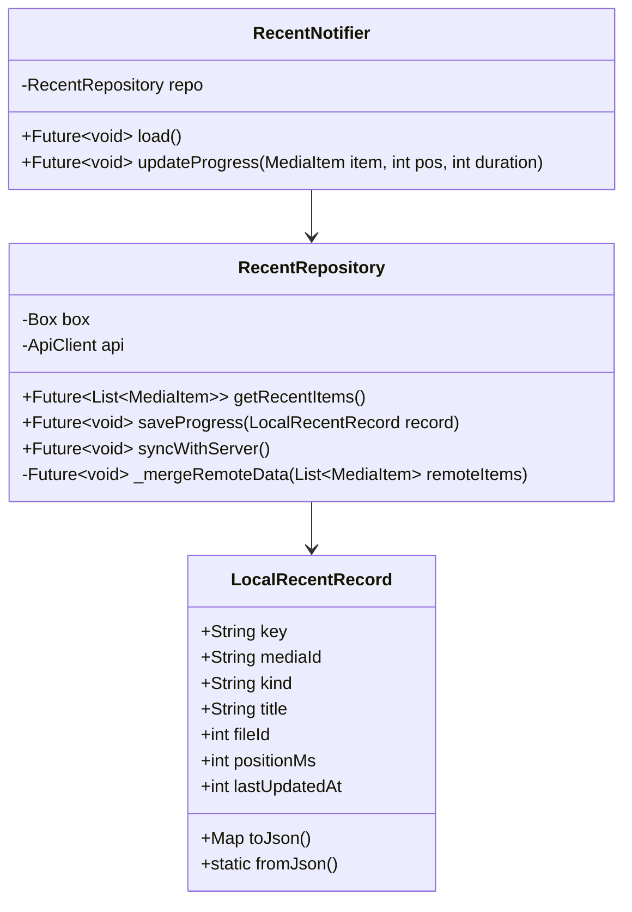
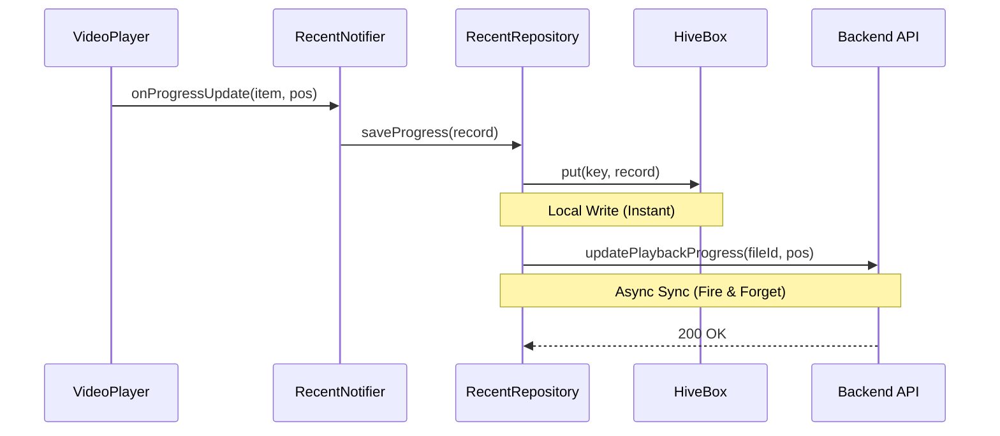

# 架构设计文档：最近观看模块

## 1. 系统架构图 (System Architecture)

```mermaid
graph TD
    UI[UI Layer: RecentSection / MediaPage] --> Notifier[RecentNotifier (Riverpod)]
    Notifier --> Repo[RecentRepository]
    
    subgraph "Data Layer"
        Repo --> Local[Local Data Source (Hive)]
        Repo --> Remote[Remote Data Source (API)]
    end
    
    Local -- Read/Write --> HiveDB[(Hive Box: recent_watch)]
    Remote -- HTTP --> Backend[Backend Server]
    
    %% Sync Flow
    Repo -. Sync Logic .- Backend
```

## 2. 模块详细设计

### 2.1 类图 (Class Diagram)



### 2.2 序列图：播放进度更新 (Update Flow)



### 2.3 序列图：初始化/刷新加载 (Load Flow)

```mermaid
sequenceDiagram
    participant UI as HomePage
    participant Notifier as RecentNotifier
    participant Repo as RecentRepository
    participant Hive as HiveBox
    participant API as Backend API

    UI->>Notifier: load()
    Notifier->>Repo: getRecentItems()
    Repo->>Hive: values.toList()
    Hive-->>Repo: [LocalRecords...]
    Repo-->>Notifier: List&lt;MediaItem&gt; (Local)
    Notifier-->>UI: Update State (Show Local Data)
    
    Note right of Notifier: UI displays instantly
    
    Notifier->>Repo: syncWithServer()
    Repo->>API: getRecent()
    API-->>Repo: [RemoteItems...]
    Repo->>Repo: _mergeRemoteData()
    
    alt Remote is Newer
        Repo->>Hive: put(key, newRecord)
        Repo-->>Notifier: notify new data
        Notifier-->>UI: Update State (Refreshed)
    end
```

## 3. 目录结构规划
```
lib/media_library/
├── recent/
│   ├── models/
│   │   └── local_recent_record.dart  # Hive Model
│   ├── repository/
│   │   └── recent_repository.dart    # Data Logic
│   ├── provider/
│   │   └── recent_provider.dart      # Notifier Refactor
│   └── widgets/
│       └── recent_media_card.dart    # Existing Widget
```
