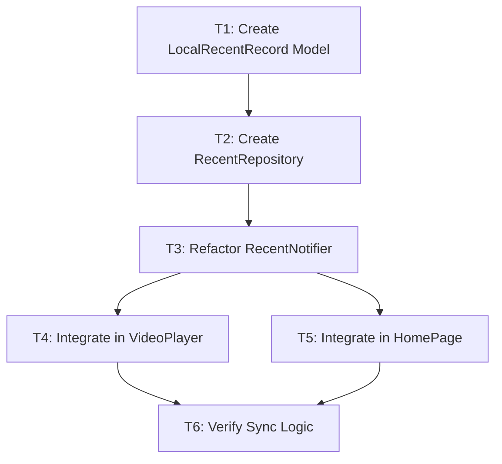

# 原子化任务清单：最近观看模块重构

## 任务依赖图

## 任务列表

### T1: 创建本地存储模型
*   **目标**：定义 `LocalRecentRecord` 类，并配置 Hive Adapter。
*   **输入**：`DESIGN_recent_watch.md` 中的模型定义。
*   **输出**：`lib/media_library/recent/models/local_recent_record.dart`，包含 `g.dart` 生成代码。
*   **验证**：能成功序列化和反序列化 JSON。

### T2: 实现 RecentRepository
*   **目标**：封装 Hive 操作和 API 调用，实现数据合并逻辑。
*   **输入**：`LocalRecentRecord`，`ApiClient`。
*   **输出**：`lib/media_library/recent/repository/recent_repository.dart`。
*   **逻辑**：
    *   `getRecent()`: 先读 Hive，再读 API，Merge 后写回 Hive。
    *   `saveProgress()`: 写 Hive，异步调 API。
*   **验证**：单元测试模拟 API 和 Hive 数据，验证 Merge 逻辑是否正确覆盖。

### T3: 重构 RecentNotifier
*   **目标**：将 `recent_provider.dart` 迁移到新的 Repository 架构。
*   **输入**：`RecentRepository`。
*   **输出**：修改后的 `lib/media_library/recent/provider/recent_provider.dart`。
*   **验证**：应用启动时能通过 Provider 获取到数据。

### T4: 集成到播放器
*   **目标**：在播放器进度回调中调用 `RecentNotifier.updateProgress`。
*   **输入**：现有播放器组件（需定位文件）。
*   **输出**：修改播放器代码，注入 `ref.read(recentProvider.notifier).save(...)`。
*   **验证**：播放视频，退出后检查 Hive 中是否有记录。

### T5: 集成到首页和列表页
*   **目标**：确保首页和 RecentListPage 使用新的 Provider 数据源。
*   **输入**：`RecentWatchSection`, `RecentListPage`。
*   **输出**：修改相关 Widget 适配新状态。
*   **验证**：播放后返回首页，卡片立即刷新。

### T6: 综合验收测试
*   **目标**：验证完整流程（Sync, Offline, UI Update）。
*   **步骤**：
    1.  断网，播放视频，退出，检查首页是否有记录（Local-First 验证）。
    2.  联网，播放视频，检查 API 调用（Sync 验证）。
    3.  多端模拟：手动修改 DB 数据模拟远程更新，刷新首页检查是否同步。
