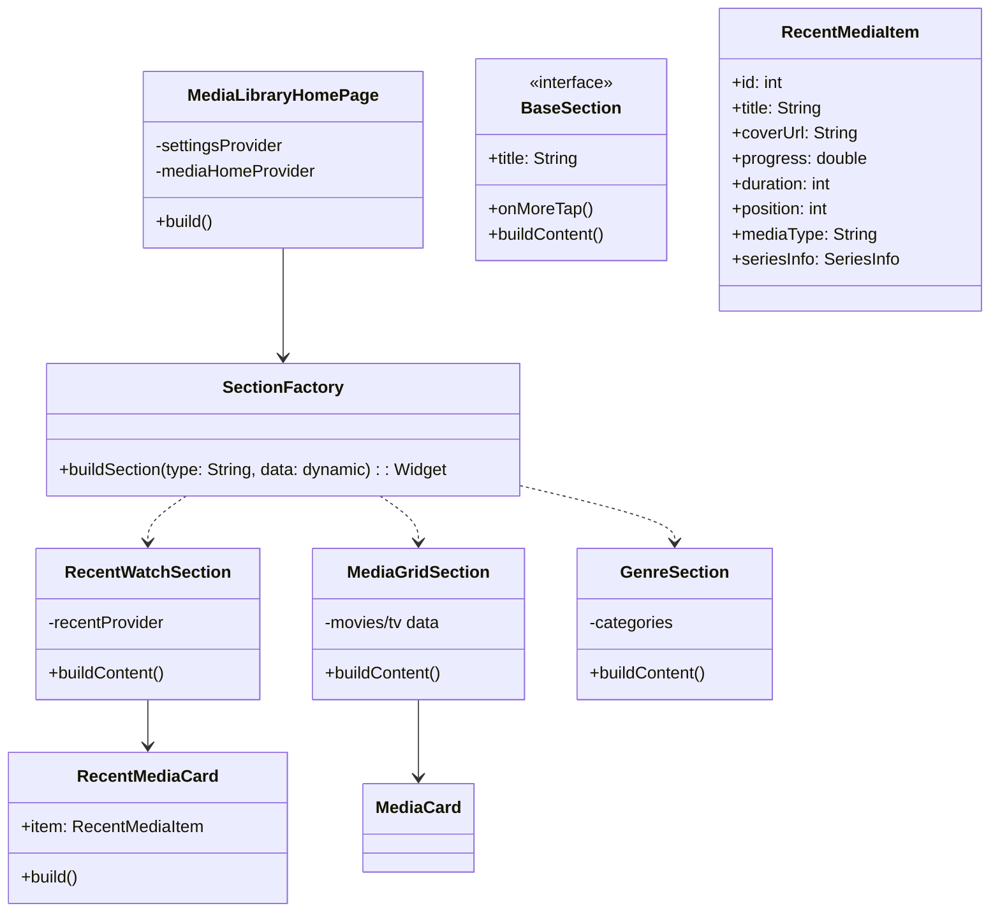

# 6A工作流 - 阶段2: Architect (架构) - 媒体库首页重构

## 1. 系统架构设计



## 2. 模块详细设计

### 2.1 目录结构
```
media-client/lib/media_library/
├── home_sections/
│   ├── section_factory.dart      # 工厂类，根据配置生成 Widget
│   ├── base_section_header.dart  # 通用标题栏
│   ├── recent_section.dart       # 最近观看模块
│   ├── media_list_section.dart   # 电影/电视剧通用列表模块
│   └── genres_section.dart       # 类型模块
├── widgets/
│   ├── recent_media_card.dart    # 新的最近观看卡片
│   └── media_card.dart           # (现有) 普通媒体卡片
└── media_home_page.dart          # (重构) 主入口
```

### 2.2 核心组件契约

#### `SectionFactory`
- **输入**: `sectionName` (String), `data` (MediaHomeState/List), `visibility` (bool).
- **逻辑**:
  1. 检查可见性配置。
  2. 检查数据是否为空。
  3. 如果 `sectionName == '最近观看'`, 返回 `RecentWatchSection`。
  4. 如果 `sectionName == '类型'`, 返回 `GenreSection`.
  5. 其他返回 `MediaGridSection`.

#### `RecentWatchSection`
- **职责**: 独立监听 `recentMediaProvider` (需新建)，确保实时性。
- **状态管理**: 当用户从播放页返回时，触发 `ref.refresh(recentMediaProvider)`.

#### `RecentMediaCard`
- **输入**: `RecentMediaItem` (新模型或扩展现有模型).
- **UI规范**:
  - AspectRatio: 16/9 (视频封面比例).
  - 覆盖层: 渐变阴影底部显示文字。
  - 中心: 播放图标 (Icon: play_circle_outline).
  - 底部左侧: 进度文本 (mm:ss / mm:ss).
  - 底部上方: 标题 (多行处理).

### 2.3 后端接口变更设计

#### `/api/playback/recent` (GET)
- **Response Model**: `HomeCardItem` (扩展)
  - `backdrop_path`: string (新增, 优先用于电影/剧集)
  - `still_path`: string (新增, 优先用于单集)
  - `season_index`: int
  - `episode_index`: int
  - `episode_title`: string
  - `series_name`: string (用于组合标题)

## 3. 兼容性与复用
- 复用 `MediaCard` 用于电影/电视剧列表。
- `RecentListPage` 将重构为使用 `RecentMediaCard` 的 `ListView` 或 `GridView`，保证样式统一。

## 4. 数据流向
1. `MediaLibraryHomePage` 初始化 -> 读取 `SettingsProvider` (Order/Visibility).
2. 遍历 Order 列表 -> 调用 `SectionFactory`.
3. `SectionFactory` -> 检查数据 -> 生成 Widget.
4. 用户点击视频 -> 进入播放 -> 产生进度 -> 调用 `/api/playback/progress`.
5. 用户返回 -> `MediaLibraryHomePage` (或具体 Section) 触发刷新 -> 调用 `/api/playback/recent`.
