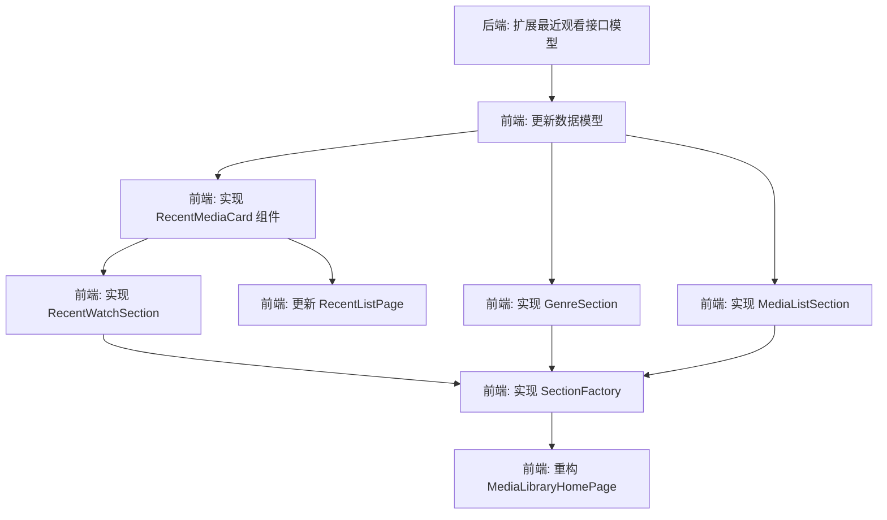

# 6A工作流 - 阶段3: Atomize (原子化) - 媒体库首页重构

## 任务依赖图

## 原子任务清单

### Task 1: 后端接口扩展
- **目标**: 修改后端 `/api/playback/recent` 接口，返回前端所需的封面和标题信息。
- **文件**: 
  - `media-server/schemas/media_serialization.py` (HomeCardItem)
  - `media-server/api/routes_playback.py` (recent_list)
- **要求**:
  - 增加 `backdrop_path`, `still_path`, `season_index`, `episode_index`, `episode_title`, `series_name` 字段。
  - 在 `recent_list` 逻辑中，查询关联的 `MediaCore` / `SeriesExt` / `TVEpisodeExt` 填充这些字段。

### Task 2: 前端模型更新
- **目标**: 更新前端数据模型以匹配新的后端响应。
- **文件**: `media-client/lib/media_library/media_models.dart`
- **要求**: 更新 `MediaItem` 或新建 `RecentMediaItem` 类，包含新增字段。运行 build_runner 生成代码（如果需要）。

### Task 3: 实现 RecentMediaCard 组件
- **目标**: 创建统一的最近观看卡片 UI。
- **文件**: `media-client/lib/media_library/widgets/recent_media_card.dart`
- **要求**:
  - 输入: `MediaItem`.
  - 逻辑:
    - 封面图优先级: still_path > backdrop_path > poster_path.
    - 标题生成逻辑: 电影直接用 title; 剧集用 "Series SxxExx Title".
    - 进度条文本: "mm:ss / mm:ss".
  - UI: 16:9 比例，带圆角，中间播放按钮，底部渐变遮罩文字。

### Task 4: 实现 RecentWatchSection 模块
- **目标**: 独立封装最近观看区域，支持实时刷新。
- **文件**: `media-client/lib/media_library/home_sections/recent_section.dart`
- **要求**:
  - 使用 `ConsumerWidget`.
  - 监听 `mediaHomeProvider` 或新的 `recentProvider`.
  - 如果列表为空，返回 `SizedBox.shrink()`.
  - 包含 "最近观看" 标题和 "全部" 按钮（跳转 `/media/recent`）。

### Task 5: 实现其他 Section 模块
- **目标**: 拆分类型、电影、电视剧模块。
- **文件**: 
  - `media-client/lib/media_library/home_sections/genres_section.dart`
  - `media-client/lib/media_library/home_sections/media_list_section.dart`
  - `media-client/lib/media_library/home_sections/base_section_header.dart` (公共头)
- **要求**: 将原有逻辑迁移到独立 Widget，保持原有样式。

### Task 6: 实现 SectionFactory 与首页重构
- **目标**: 组装所有模块，实现动态排序。
- **文件**: 
  - `media-client/lib/media_library/home_sections/section_factory.dart`
  - `media-client/lib/media_library/media_home_page.dart`
- **要求**:
  - `MediaLibraryHomePage` 读取 `settingsProvider.order`。
  - 遍历 Order 调用 Factory 生成 Widget 列表。
  - 处理刷新逻辑。

### Task 7: 更新 RecentListPage
- **目标**: 确保最近观看列表页样式一致。
- **文件**: `media-client/lib/media_library/recent_list_page.dart`
- **要求**: 将原有的卡片实现替换为 `RecentMediaCard`。

## 验证计划
- 运行后端，访问 `/api/playback/recent` 确认 JSON 结构。
- 运行前端，检查首页各模块显示是否正确。
- 播放视频产生进度，返回首页确认 "最近观看" 模块出现并显示正确信息。
- 调整设置中的模块顺序，确认首页顺序变化。
