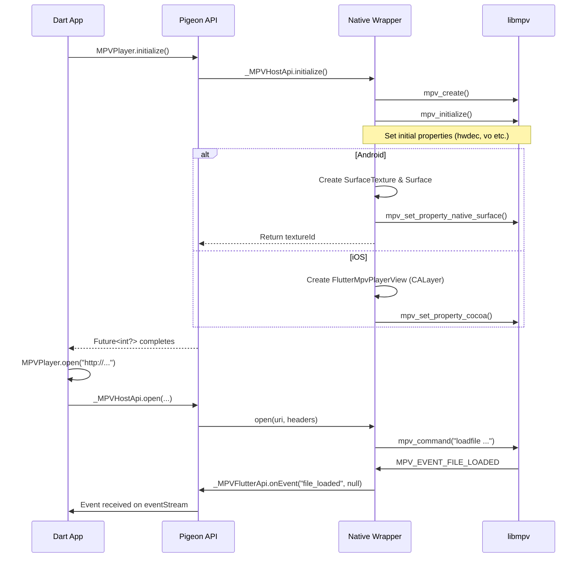
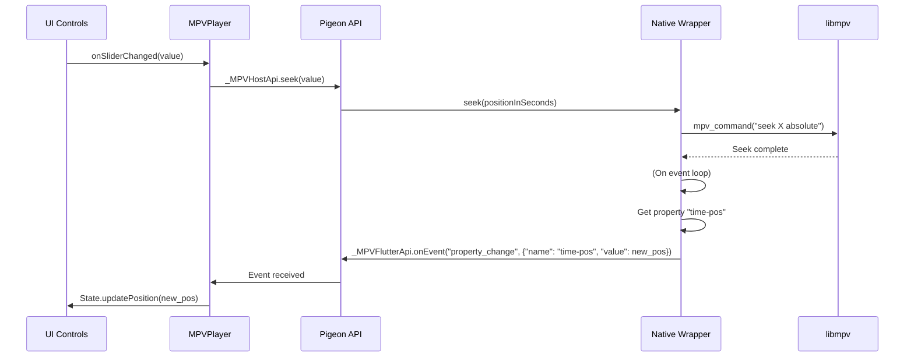

### Flutter使用MPV播放器完整方案

此方案旨在构建一个高性能、高扩展性、跨平台的Flutter播放器核心，通过对原生MPV引擎的深度封装，实现接近原生应用的播放体验。

---

#### 一、 整体架构设计

我们采用分层解耦的架构，将UI、业务逻辑、平台通信和核心引擎完全分离。

```
+-------------------------------------------------------------------+
|                          Dart Application Layer                   |
| (UI Widgets, State Management (Riverpod/Bloc), Business Logic)   |
| - `MPVPlayerWidget` (显示Texture/PlatformView)                  |
| - `ControlsWidget` (控制栏UI)                                    |
| - `PlayerController` (状态管理)                                   |
+-------------------------------------------------------------------+
                                 ^  (Type-safe method calls)
                                 | (Generated by Pigeon)
                                 v
+-------------------------------------------------------------------+
|                          Pigeon Interface Layer                   |
| (Generates type-safe channel code for Dart & Native platforms)   |
| - `HostApi` (Dart -> Native)                                     |
| - `FlutterApi` (Native -> Dart)                                  |
+-------------------------------------------------------------------+
                                 ^  (C Function Calls)
                                 | (FFI/JNI)
                                 v
+-------------------------------------------------------------------+
|                     Native Wrapper Layer                         |
| (Manages MPV instance, view integration, event loop)              |
| - Android (Kotlin/C++): `MpvNativeView.kt`, `MpiWrapper.cpp`     |
| - iOS (Objective-C/Swift): `FlutterMpvPlayer.swift`, `MpiWrapper.m`|
+-------------------------------------------------------------------+
                                 ^  (C API Calls)
                                 | (libmpv.so/dylib)
                                 v
+-------------------------------------------------------------------+
|                          MPV Core Engine                         |
| (Decoding, Rendering, Hardware Acceleration)                      |
+-------------------------------------------------------------------+
```

---

#### 二、 核心模块设计

##### 1. Dart端接口层 (`lib/mpv_player/`)

这是Flutter应用直接交互的API层，设计为简洁的面向对象接口。

**`mpv_player.dart`**
```dart
class MPVPlayer {
  late final _MPVHostApi _hostApi;
  final StreamController<MPVEvent> _eventController = StreamController.broadcast();
  int? _textureId;

  Stream<MPVEvent> get eventStream => _eventController.stream;

  Future<void> initialize() async {
    final FlutterApi api = _MPVFlutterApi(_eventController.add);
    _hostApi = _MPVHostApi(api);
    _textureId = await _hostApi.initialize();
    _hostApi.setEventListener();
  }

  Future<void> open(String uri, {Map<String, String>? headers}) async {
    await _hostApi.open(uri, headers ?? {});
  }

  Future<void> play() => _hostApi.command('play');
  Future<void> pause() => _hostApi.command('pause');
  Future<void> stop() => _hostApi.command('stop');
  Future<void> seek(double positionInSeconds) => _hostApi.seek(positionInSeconds);

  // Properties
  Future<void> setVolume(double volume) => _hostApi.setProperty('volume', (volume * 100).toInt());
  Future<void> setSpeed(double speed) => _hostApi.setProperty('speed', speed);
  Future<void> setMute(bool mute) => _hostApi.setProperty('mute', mute);
  
  // Tracks
  Future<void> setVideoTrack(int trackId) => _hostApi.setProperty('vid', trackId);
  Future<void> setAudioTrack(int trackId) => _hostApi.setProperty('aid', trackId);

  // Advanced
  Future<void> enableHardwareDecoding(String hwdec) => _hostApi.setProperty('hwdec', hwdec);
  Future<void> addSubtitle(String uri) => _hostApi.command(['sub-add', uri]);

  int? get textureId => _textureId;

  Future<void> dispose() async {
    await _hostApi.dispose();
    await _eventController.close();
  }
}

/// Events sent from the native MPV instance
class MPVEvent {
  final String eventId;
  final dynamic data;

  MPVEvent(this.eventId, this.data);
}
```

##### 2. Pigeon接口层 (`pigeon/messages.dart`)

这是Dart与原生通信的契约，Pigeon将据此生成类型安全的代码。

```dart
import 'package:pigeon/pigeon.dart';

// --- Host API: Called from Dart to Native ---

@HostApi()
abstract class _MPVHostApi {
  // Initialize MPV and returns a texture ID for Android
  @async
  int64? initialize();
  
  // Setup a listener for events from Native to Dart
  void setEventListener();

  // Send a generic command to MPV
  @async
  void command(String command);
  
  // Send a command with arguments
  @async
  void commandList(List<String> commandArgs);
  
  // Set a property in MPV
  @async
  void setProperty(String name, Object value);
  
  // Open a media file
  @async
  void open(String uri, Map<String, String> headers);

  // Seek to a specific position
  @async
  void seek(double positionInSeconds);
  
  @async
  void dispose();
}

// --- Flutter API: Called from Native to Dart (for events) ---

@FlutterApi()
abstract class _MPVFlutterApi {
  void onEvent(String eventName, dynamic data);
}
```

运行Pigeon后，它会生成`messages.dart` (Dart), `Messages.m` (iOS) 和 `Messages.java` (Android)。

##### 3. 原生封装层

这是方案最复杂的部分，负责MPV的生命周期和视图集成。

**职责：**
1.  **初始化MPV**：加载`libmpv`库，创建`mpv_handle`实例。
2.  **视图渲染集成**：
    *   **Android**:
        1.  创建一个`TextureLayout` (自定义`ViewGroup`)。
        2.  通过`TextureRegistry.createSurfaceTexture()`获取一个`SurfaceTexture`。
        3.  创建一个`Surface`对象并传递给`mpv`。
        4.  将`SurfaceTexture`的ID返回给Dart端，Dart用`Texture(textureId: id)`来显示。
        5.  MPV直接渲染到这个`Surface`上，效率极高。
    *   **iOS**:
        1.  创建一个`FlutterMpvPlayerView` (继承`FlutterPlatformView`)。
        2.  获取其底层的`CALayer`。
        3.  通过`mpv_set_property_cocoa(mpv, "cocoa-layer", layer_ptr)`将其设置为MPV的渲染目标。
        4.  Dart端通过`UiKitView`显示这个原生视图。
3.  **事件循环**：
    *   启动一个专用线程，运行`mpv_wait_event()`循环。
    *   将MPV事件（如`MPV_EVENT_FILE_LOADED`, `MPV_EVENT_PROPERTY_CHANGE`）转换为`_MPVFlutterApi`的调用，发送回Dart。
4.  **命令/属性处理**：
    *   接收来自`_MPVHostApi`的调用，将其转换为MPV的`mpv_command`或`mpv_set_property`调用。
5.  **生命周期管理**：
    *   在Flutter View的`onCreate`和`onDispose`时，正确地初始化和销毁MPV实例及相关资源。

---

#### 三、 功能模块流程

##### 1. 播放器初始化与视频加载流程



##### 2. 进度拖拽流程



---

#### 四、 接口设计总览

**1. Dart端公共接口 (`MPVPlayer`)**

| 方法/属性                     | 描述                                                                                              |
| ------------------------------ | ------------------------------------------------------------------------------------------------- |
| `Future<void> initialize()`    | 初始化MPV核心，并为Android获取`textureId`。                                                       |
| `Stream<MPVEvent> eventStream` | 监听来自MPV的所有事件流。                                                                         |
| `Future<void> open(...)`       | 加载并打开一个媒体源。支持自定义HTTP头。                                                            |
| `Future<void> play()`           | 开始播放。                                                                                         |
| `Future<void> pause()`          | 暂停播放。                                                                                         |
| `Future<void> stop()`           | 停止播放并清空状态。                                                                               |
| `Future<void> seek(double)`     | 跳转到指定时间点（单位：秒）。                                                                     |
| `Future<void> setVolume(double)` | 设置音量（0.0-1.0）。                                                                               |
| `Future<void> setSpeed(double)` | 设置播放倍速。                                                                                     |
| `Future<void> setMute(bool)`    | 设置静音。                                                                                         |
| `Future<void> setVideoTrack(int)` | 切换视频轨道。                                                                                     |
| `Future<void> setAudioTrack(int)` | 切换音频轨道。                                                                                     |
| `int? get textureId`            | （仅Android）用于在`Texture` widget中显示的ID。                                                   |
| `Future<void> dispose()`        | 释放所有MPV资源，停止事件循环。                                                                     |

**2. 事件模型 (`MPVEvent`)**

| `eventId` (示例)           | `data` (示例)                                             | 描述                                    |
| -------------------------- | --------------------------------------------------------- | --------------------------------------- |
| `file_loaded`              | `null`                                                    | 文件加载完成，可以开始播放。              |
| `property_change`          | `{"name": "time-pos", "value": 12.34}`                    | 某个属性值发生变化（如播放位置、时长）。 |
| `end_of_file`              | `null`                                                    | 播放结束。                              |
| `shutdown`                 | `null`                                                    | MPV已关闭。                              |
| `error`                    | `{"error": "generic error"}`                              | 发生错误。                              |
| `tracks_changed`           | `[{"id": 1, "type": "video", "lang": "eng"}, ...]`       | 音视频/字幕轨道列表发生变化。            |

这个方案通过严格的分层和类型安全的通信，确保了高性能与高可维护性的平衡，为构建专业级Flutter播放应用提供了坚实的基础。