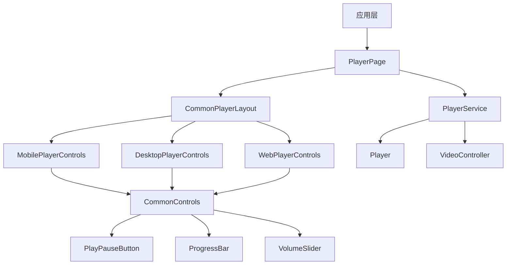
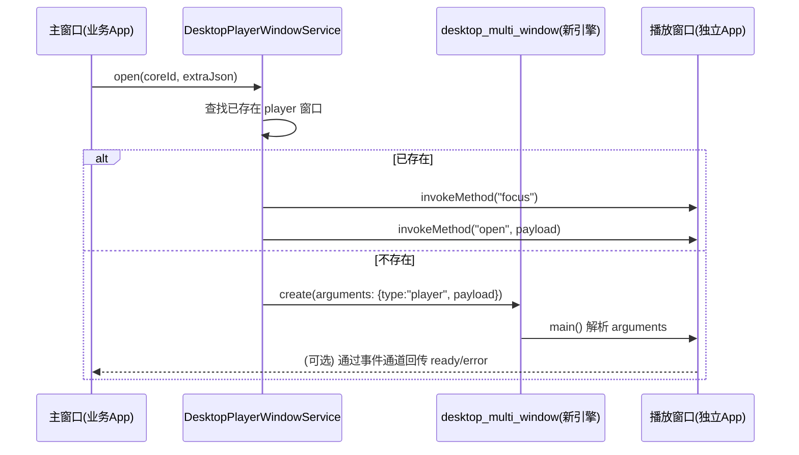
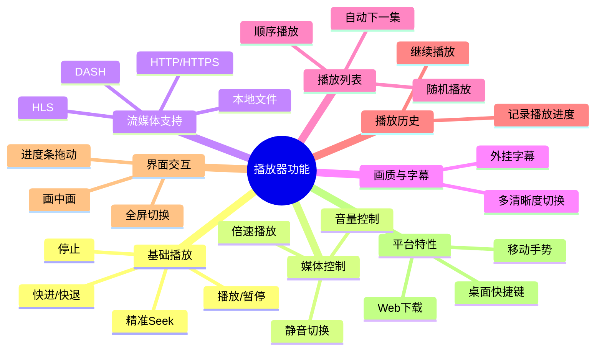

# 基于 media_kit 的跨平台播放器设计方案
## 一、整体架构设计


### 1.1 桌面端独立播放器窗口（多窗口/单实例）重新设计

目标：桌面端点击播放后，拉起独立播放器窗口播放；主窗口立即返回业务路由；两者在 UI 与状态层尽量解耦，但在“命令/事件”层保持可控通信，避免出现插件未注册、窗口互相阻塞、资源泄漏、存储锁冲突等问题。

设计原则：

- 主窗口与播放窗口隔离：播放窗口使用独立 Flutter 引擎，拥有独立 Widget 树与状态容器，主窗口不依赖播放窗口内部实现。
- 命令化通信：主窗口仅发送“播放命令”（open/focus/close），播放窗口仅回传“状态事件”（ready/error/playing/position）用于主窗口展示或埋点。
- 单实例复用：同类型播放窗口只保留一个实例；新播放请求在同一窗口内切换媒体源。
- 强约束的 payload：跨引擎参数只允许 JSON 可序列化类型，严禁传递复杂对象实例。



落地对应代码：

- 主窗口创建/复用播放器窗口：[desktop_player_window_service.dart](desktop_window/desktop_player_window_service.dart)
- 子窗口入口分流（同一个 main，根据 arguments 选择运行主 App 或 Player App）：[main.dart](../main.dart)
- 子窗口页面初始化与接收 open/focus 命令：[desktop_player_window_page.dart](desktop_window/desktop_player_window_page.dart)

### 1.2 多窗口下插件注册与初始化顺序（最常见致命坑）

现象：播放窗口能显示但无法播放，并出现：

- `MissingPluginException(No implementation found for method ensureInitialized on channel window_manager)`
- `MissingPluginException(No implementation found for method VideoOutputManager.Create on channel com.alexmercerind/media_kit_video)`

根因：`desktop_multi_window` 创建的新窗口是“新的 Flutter 引擎”。插件注册是“每引擎一次”的：只给主窗口引擎注册插件并不会自动让子窗口引擎也拥有插件实现，因此子窗口内任何 MethodChannel 调用都会 MissingPluginException。

解决策略（必须同时满足）：

- 原生 Runner 层注册“新窗口创建回调”，在每个新引擎创建时执行 `RegisterGeneratedPlugins / fl_register_plugins`。
- Dart 层初始化顺序必须先 `WidgetsFlutterBinding.ensureInitialized()`，再进行 `window_manager.ensureInitialized()`、`MediaKit.ensureInitialized()` 等初始化。

平台落地位置：

- Windows：[windows/runner/flutter_window.cpp](../../windows/runner/flutter_window.cpp)
- Linux：[linux/runner/my_application.cc](../../linux/runner/my_application.cc)
- macOS：[macos/Runner/MainFlutterWindow.swift](../../macos/Runner/MainFlutterWindow.swift)

### 1.3 多窗口下 Hive 文件锁冲突（auth.lock）

现象：桌面端打开独立播放器窗口后，窗口白屏且日志出现 `PathAccessException: lock failed / Cannot delete file ... auth.lock`。

原因：多个引擎若使用同一个 Hive 目录并同时打开同名 box（例如 `auth`），会在桌面端触发锁文件互斥，导致新引擎初始化失败（表现为白屏或卡死）。

解决方案：

- 播放窗口使用独立 Hive 子目录：在播放器窗口入口的 `main()` 中使用 `Hive.initFlutter('player_window')`，避免与主窗口共享默认目录。
- 播放窗口尽量不打开业务侧的 Box：主窗口创建播放器窗口时，把必要的登录态快照通过 arguments 透传；播放窗口用快照初始化网络层，避免抢占 `auth.lock`。

### 1.4 避免播放窗口“阻塞”主窗口的策略

- 禁止在主窗口打开播放前执行同步耗时操作：主窗口只做轻量参数准备与窗口创建，网络请求与解码初始化在播放窗口内完成。
- 禁止跨窗口共享单例做 IO：同进程多引擎下，静态单例仍是进程级共享的资源入口，容易造成锁/线程争用；建议播放窗口内部维护自己的 service 实例。
- 命令通道只传“小消息”：避免大 payload（尤其是巨大的 Base64、整段字幕内容等）在 MethodChannel 里传输导致卡顿。

### 1.5 通信协议建议（主窗口 ↔ 播放窗口）

建议将跨窗口通信收敛为两类：

- 主 → 播放：命令（focus/open/close）
- 播放 → 主：事件（ready/error/playing/position）

建议 payload 统一封装为“信封”结构，方便扩展与版本兼容：

- `schema`: 协议版本号（例如 `1`）
- `type`: 消息类型（例如 `open` / `event`）
- `id`: 请求 ID（用于主窗口侧的超时与重试）
- `ts`: 时间戳
- `data`: 业务数据（必须 JSON 可序列化）

### 1.6 关闭策略与资源释放

桌面端常见的“关闭”需求有两类：

- 关闭窗口：释放播放资源并退出该引擎（适合一次性弹窗）
- 隐藏窗口：保留播放器实例，便于快速回到播放（适合播放器常驻）

建议默认“关闭=隐藏”，并在以下场景真正释放：

- 用户选择“退出播放器”
- 播放结束且无后续播放
- 播放窗口长时间后台且无音频输出（可选策略）

资源释放清单（播放窗口内）：

- `Player` / `VideoController` / `AudioTrack` 相关资源全部 dispose
- 停止定时器与心跳上报（播放进度/播放状态）
- 取消所有 Stream 订阅与监听器

### 1.7 Windows 构建常见问题：.plugin_symlinks 缺失导致 CMake 失败

现象：Windows 构建阶段报错 `add_subdirectory ... flutter/ephemeral/.plugin_symlinks/<plugin>/windows is not an existing directory`。

根因：Windows 上 Flutter 需要在 `windows/flutter/ephemeral/.plugin_symlinks` 下创建到 pub-cache 的链接目录；若链接创建失败（系统权限/开发者模式/安全策略/路径问题），就会导致 CMake 找不到插件工程目录。

处理建议（按顺序尝试）：

- 确认 Windows 已开启“开发者模式”（允许创建符号链接）
- 关闭占用工程目录的杀毒/安全软件拦截后重试
- 执行 `flutter clean` 后再执行 `flutter pub get`
- 删除 `build/` 以及 `windows/flutter/ephemeral/` 后重试生成
- 将工程放在更短、更“本地”的路径（避免过深路径或同步盘目录）
## 二、目录结构（简单明了）
```
lib/
└── media_player/
    ├── media_player_page.dart        # 播放器模块入口（路由承载/对外暴露）
    ├── desktop_window/               # 桌面端独立播放器窗口（多窗口）
    │   ├── desktop_player_window_service.dart
    │   ├── desktop_player_window_app.dart
    │   ├── desktop_player_window_page.dart
    │   ├── desktop_player_window_layout.dart
    │   ├── desktop_player_side_panel.dart
    │   ├── desktop_player_overlay_panels.dart
    │   └── desktop_player_side_panel_handle.dart
    ├── core/
    │   ├── player/
    │   │   ├── player_service.dart   # 播放器服务（含抽象接口，便于测试替换）
    │   │   └── player_config.dart    # 播放器配置
    │   └── state/
    │       └── playback_state.dart   # 播放状态管理（Riverpod）
    ├── ui/
    │   ├── adaptive/
    │   │   ├── responsive_builder.dart
    │   │   └── platform_helper.dart
    │   └── player/
    │       ├── pages/
    │       │   └── player_page.dart
    │       ├── layouts/
    │       │   └── common_player_layout.dart
    │       ├── overlays/
    │       │   ├── loading_overlay.dart
    │       │   └── error_overlay.dart
    │       └── controls/
    │           ├── common/
    │           │   ├── common_controls.dart
    │           │   ├── fullscreen_button.dart
    │           │   ├── play_pause_button.dart
    │           │   ├── progress_bar.dart
    │           │   └── volume_slider.dart
    │           └── platform_specific/
    │               ├── mobile_controls.dart
    │               ├── desktop_controls.dart
    │               ├── web_controls.dart
    │               ├── web_download_stub.dart
    │               └── web_download_web.dart
    └── utils/
        └── player_utils.dart
```
## 三、功能结构
### 3.1 核心功能模块

### 3.2 PlayerService 核心接口
```dart
abstract class PlayerServiceBase {
  VideoController? get videoController;

  Stream<bool> get playingStream;
  Stream<bool> get bufferingStream;
  Stream<Duration> get positionStream;
  Stream<Duration> get durationStream;
  Stream<Duration> get bufferStream;

  Future<void> openUrl(
    String url, {
    Map<String, String>? headers,
    Duration? start,
    bool play,
  });
  Future<void> play();
  Future<void> pause();
  Future<void> stop();
  Future<void> playPause();
  Future<void> seek(Duration position);
  Future<void> seekRelative(Duration delta);
  Future<void> setVolume(double volume);
  Future<void> setSpeed(double speed);
  Future<void> setMute(bool mute);

  void dispose();
}

class PlayerService implements PlayerServiceBase {
  factory PlayerService.create({PlayerConfig config = const PlayerConfig()}) {
    // 省略：创建 media_kit Player 与 VideoController，并应用初始配置
    throw UnimplementedError();
  }
}
```

### 3.3 与落地实现的关键差异
- 为了可测试性，实际落地引入了 PlayerServiceBase 抽象接口，测试可注入假实现。
- Web 下载能力通过条件导入实现（web_download_stub.dart / web_download_web.dart），避免非 Web 平台引入 dart:html。
- 全屏能力在状态层统一管理，并对移动端系统 UI 做沉浸式处理。
## 四、UI 设计（共用和差异）
### 4.1 通用组件（所有平台共用）
| 组件名称 | 功能说明 | 位置 |
|----------|----------|------|
| PlayPauseButton | 播放/暂停按钮 | controls/common/ |
| ProgressBar | 进度条 | controls/common/ |
| VolumeSlider | 音量滑块 | controls/common/ |
| FullscreenButton | 全屏按钮 | controls/common/ |
| LoadingOverlay | 加载覆盖层 | overlays/ |
| ErrorOverlay | 错误覆盖层 | overlays/ |
### 4.2 平台特定组件
#### 移动端
```dart
// 移动手势控制（落地实现为 StatefulWidget）
// - 单击：显示/隐藏控制层
// - 双击：左侧 25% 快退 / 中间 50% 播放暂停 / 右侧 25% 快进
// - 竖向拖动：左侧调亮度 / 右侧调音量
// - 横向拖动：拖动进度
// - 长按：临时 2 倍速播放（顶部提示“2倍速”，松开恢复）
// - 双指缩放：调整画面大小（缩放倍数）
// - 双指拖动：调整画面位置（平移偏移）
class MobileGestureLayer extends StatefulWidget {
  const MobileGestureLayer({super.key});

  @override
  State<MobileGestureLayer> createState() => _MobileGestureLayerState();
}

class _MobileGestureLayerState extends State<MobileGestureLayer> {
  @override
  Widget build(BuildContext context) {
    return const SizedBox.expand();
  }
}

// 手势反馈文字（亮度/音量/进度/缩放/2倍速）的调整位置
// - 位置：在 MobileGestureLayer 内部通过 Positioned(top: ... ) 控制（顶部居中，不遮挡画面中心）。
// - 字号/内边距：在 TextStyle(fontSize: ...) 与 Container(padding: ...) 调整。
```
#### 桌面端
```dart
// 桌面快捷键
class DesktopShortcutListener extends StatelessWidget {
  final Widget child;
  
  const DesktopShortcutListener({super.key, required this.child});
  
  @override
  Widget build(BuildContext context) {
    return Shortcuts(
      shortcuts: {
        LogicalKeySet(LogicalKeyboardKey.space): const _PlayPauseIntent(),
      },
      child: Actions(
        actions: {
          _PlayPauseIntent: CallbackAction(onInvoke: (_) => _playPause()),
        },
        child: child,
      ),
    );
  }
}
```

### 4.3 桌面端 UI 设计 (Desktop UI)
针对桌面端（Windows/macOS/Linux）的大屏与鼠标交互场景，设计了独立的独立窗口播放器。

#### 1) 窗口布局
- **TopBar**: 标题、PiP（画中画）、最小化、最大化、关闭。
- **BottomBar**:
  - **进度条**: 位于底部栏最上方，支持鼠标悬停预览与拖动。
  - **左侧控制**: 播放/暂停、下一集、当前时间/总时长。
  - **右侧功能**: 字幕、音轨、选集、倍速、画质、音量、设置、全屏。
- **SidePanel (选集)**:
  - 右侧挤压式面板，只包含“选集”列表，移除其他不相关 Tabs。
  - 展开时向左挤压视频区域（使用 Row 布局），避免遮挡视频内容。
  - 选集列表展示缩略图、标题、观看进度。
  - 支持通过底部“选集”按钮或右侧边缘手柄呼出。

#### 2) 浮动面板 (Overlay Panels)
- **音量面板**: 竖向滑块，位于音量图标上方，限制宽度避免过宽。
- **倍速面板**: 竖向列表（0.5x - 5.0x），支持自定义，限制宽度。
- **字幕面板**: 分组展示内嵌字幕、外挂字幕、AI字幕及字幕设置，限制宽度。
- **音轨面板**: 列表选择音频轨道，风格与倍速面板一致。
- **画质面板**: 列表选择视频清晰度，风格与倍速面板一致。
- **设计规范**: 统一深色圆角卡片风格，最大高度限制，固定/限制宽度，不遮挡底部操作栏。悬浮面板在对应图标上方就近显示。

#### Web端
```dart
// Web下载按钮
class WebDownloadButton extends StatelessWidget {
  final String videoUrl;
  
  const WebDownloadButton({super.key, required this.videoUrl});
  
  @override
  Widget build(BuildContext context) {
    return IconButton(
      icon: const Icon(Icons.download),
      onPressed: () => _downloadVideo(),
    );
  }
  
  void _downloadVideo() {
    html.AnchorElement(href: videoUrl).download = 'video.mp4';
    html.document.body?.append(html.AnchorElement(href: videoUrl)..click()..remove());
  }
}
```
### 4.3 响应式布局
```dart
class CommonPlayerLayout extends StatelessWidget {
  final PlayerService playerService;
  
  const CommonPlayerLayout({super.key, required this.playerService});
  
  @override
  Widget build(BuildContext context) {
    return LayoutBuilder(
      builder: (context, constraints) {
        final isMobile = constraints.maxWidth < 600;
        
        return Column(
          children: [
            Expanded(child: Video(controller: playerService.videoController)),
            if (!isMobile) _buildDesktopControls(),
            if (isMobile) _buildMobileControls(),
          ],
        );
      },
    );
  }
  
  Widget _buildMobileControls() {
    return MobileControlsBar(playerService: playerService);
  }
  
  Widget _buildDesktopControls() {
    return DesktopControlsBar(playerService: playerService);
  }
}
```
## 五、关键代码示例
### 5.1 播放页面入口
```dart
class PlayerPage extends StatelessWidget {
  final String videoUrl;
  
  const PlayerPage({super.key, required this.videoUrl});
  
  @override
  Widget build(BuildContext context) {
    return Scaffold(
      body: CommonPlayerLayout(
        playerService: PlayerService(),
      ),
    );
  }
}
```
### 5.2 通用播放控制按钮
```dart
class PlayPauseButton extends StatelessWidget {
  final PlayerService playerService;
  
  const PlayPauseButton({super.key, required this.playerService});
  
  @override
  Widget build(BuildContext context) {
    return IconButton(
      icon: Icon(playerService.player.playing ? Icons.pause : Icons.play_arrow),
      onPressed: () => playerService.playPause(),
    );
  }
}
```
### 5.3 平台检测与组件选择
```dart
Widget _buildControlsByPlatform(BuildContext context, PlayerService playerService) {
  switch (Theme.of(context).platform) {
    case TargetPlatform.android:
    case TargetPlatform.iOS:
      return MobileControlsBar(playerService: playerService);
    case TargetPlatform.windows:
    case TargetPlatform.macOS:
    case TargetPlatform.linux:
      return DesktopControlsBar(playerService: playerService);
    default:
      if (kIsWeb) {
        return WebControlsBar(playerService: playerService);
      }
      return MobileControlsBar(playerService: playerService);
  }
}
```
这个设计方案实现了跨平台播放器的统一体验，通过统一的底层和最大化的UI复用，同时针对各平台特性进行适当适配，确保在不同设备上都能提供最佳的用户体验。

## 六、测试与质量结果（当前实现）
- 静态分析：flutter analyze 通过（No issues found）。
- 格式化：flutter format 在当前 Flutter 版本不可用，已使用 dart format .（0 changed）。
- 单测/组件测试：flutter test 全通过。
- 性能基准：CommonControls 平均重建耗时约 1974.79us（基准测试输出）。

最近一次确认（2026-01-11）：已运行 dart format .、flutter analyze、flutter test。

## 七、移动端 UI 详细设计与实现
针对移动端横竖屏场景，实现了完整的播放控制和面板复用方案。

### 7.1 UI 组件结构
```
lib/media_player/ui/player/controls/mobile/
├── widgets/
│   ├── mobile_top_bar.dart        # 顶部栏（返回、标题、设置、小窗）
│   ├── mobile_bottom_bar.dart     # 底部栏（进度条、播放按钮、面板入口）
│   └── mobile_center_controls.dart# 中间控制（锁屏、旋转）
└── panels/
    ├── settings_panel.dart        # 设置面板（片头片尾、播放方式、画面比例）
    ├── episode_panel.dart         # 选集面板
    ├── subtitle_panel.dart        # 字幕面板（AI/本地/在线字幕）
    ├── speed_panel.dart           # 倍速面板
    └── quality_panel.dart         # 画质面板
```

### 7.3 面板自适应展示策略
针对移动端横竖屏差异，所有功能面板（选集、倍速、画质、字幕、设置）采用统一的自适应展示逻辑，逻辑实现在 `MobilePlayerControls._openPanel` 中：

- **竖屏模式**：
  - 使用 `showModalBottomSheet` 底部弹窗。
  - 高度占据屏幕 60%。
  - 顶部圆角 (`Radius.circular(16)`)。
  - 背景色统一为 `Color(0xFF1E1E1E)`。

- **横屏/全屏模式**：
  - 使用 `showGeneralDialog` 右侧侧滑抽屉。
  - 宽度固定 300dp。
  - 从右向左滑入动画 (`SlideTransition`)。
  - 背景透明（内容区域自行控制背景色）。

### 7.4 图标功能说明
| 区域 | 图标/组件 | 功能说明 |
|------|----------|----------|
| 顶部左侧 | 返回箭头 | 退出播放页面或返回上一级 |
| 顶部左侧 | 播放标题 | 显示当前视频标题 |
| 顶部右侧 | 设置图标 | 打开设置面板，调节画面比例、播放方式等 |
| 顶部右侧 | 小窗图标 | 开启画中画模式 (PiP) |
| 中间左侧 | 锁屏图标 | 锁定/解锁屏幕触控，锁定后仅显示锁屏按钮 |
| 中间右侧 | 旋转图标 | 强制切换横竖屏方向 |
| 底部 | 进度条 | 拖动跳转播放进度，显示当前/总时长 |
| 底部左侧 | 播放/暂停 | 控制视频播放状态 |
| 底部右侧 | 字幕 | 打开字幕面板，选择字幕轨道或导入字幕 |
| 底部右侧 | 选集 | 打开选集面板，切换集数 |
| 底部右侧 | 倍速 | 打开倍速面板，调节 0.5x - 3.0x 播放速度 |
| 底部右侧 | 画质 | 打开画质面板，切换清晰度 |

### 7.3 面板复用与交互
- **面板复用**：所有面板（设置、选集、字幕、倍速、画质）均采用统一的侧边栏（Side Panel）交互模式，在横竖屏下体验一致。
- **交互方式**：点击底部对应按钮，面板从右侧滑入；点击遮罩层或面板内选项（如选集）可关闭面板。
- **锁屏逻辑**：锁定状态下，隐藏除锁屏按钮外的所有控制层，屏蔽手势操作。

### 7.4 自适应面板交互 (Adaptive Panels)
- **竖屏模式 (Portrait)**: 采用底部弹窗 (Bottom Sheet) 形式，占据屏幕约 60% 高度，圆角设计，符合单手操作习惯。
- **横屏模式 (Landscape)**: 采用侧边抽屉 (Side Drawer) 形式，从右侧滑入，固定宽度 300dp，不遮挡左侧画面。
- **实现方式**: 在 `MobilePlayerControls._openPanel` 中根据布局宽高与全屏状态动态选择 `showModalBottomSheet` 或 `showGeneralDialog`，并在面板打开期间锁定屏幕方向，关闭后恢复到用户之前的方向偏好，保证横屏稳定。

## 八、下一步实施计划 (Next Steps)
### 8.1 功能实现方案
| 组件/功能 | 状态 | 计划/实现方案 | 涉及文件 |
|-----------|------|---------------|----------|
| **画中画 (PiP)** | ✅ 已完成 | 集成 `floating` 插件，在 `MobileTopBar` 中触发 `_floating.enable()`。 | `mobile_top_bar.dart`, `mobile_controls.dart` |
| **片头片尾设置** | ✅ 已完成 | 在 `PlaybackSettings` 中增加 `introDuration` / `outroDuration` 字段，`PlaybackNotifier` 配合 `positionStream` 自动跳过。 | `settings_panel.dart`, `playback_state.dart` |
| **画面比例切换** | ✅ 已完成 | `PlaybackState` 增加 `fit` 状态，`CommonPlayerLayout` 响应状态变化，`SettingsPanel` 提供切换。 | `common_player_layout.dart` |
| **字幕挂载** | 🔄 进行中 | 已实现 `PlayerService` 的 `setSubtitleTrack` 接口及面板列表选择。外挂字幕导入待实现。 | `subtitle_panel.dart`, `player_service.dart` |
| **音轨切换** | ✅ 已完成 | 监听 `tracksStream` 获取音轨列表，面板仅展示真实轨道（过滤 `auto/no`），点击切换（调用 `setAudioTrack`）。无轨道则展示空态。 | `audio_panel.dart`, `mobile_controls.dart`, `mobile_bottom_bar.dart`, `playback_state.dart`, `player_service.dart` |
| **画质切换** | ✅ 已完成 | 监听 `tracksStream`，在 `QualityPanel` 列出视频轨道并支持切换。 | `quality_panel.dart`, `playback_state.dart` |
| **播放模式** | ✅ 已完成 | 明确三种播放模式（连续播放/单集循环/不循环），并将选择持久化；连续播放由上层在播放结束时切下一集。 | `settings_panel.dart`, `playback_state.dart`, `player_service.dart` |
| **手势控制** | ✅ 已完成 | `MobileGestureLayer` 支持左侧亮度、右侧音量；水平进度拖动改为按“总位移/屏宽”映射更大范围；双击热区为左25%/中50%/右25%。 | `mobile_controls.dart`, `common_player_layout.dart` |
| **画面大小** | ✅ 已完成 | 设置面板支持一键切换 50%/75%/100%/125%，通过更新 `PlaybackState.videoScale` 生效。 | `settings_panel.dart`, `playback_state.dart`, `common_player_layout.dart` |

### 9.8 片头片尾与画面配置持久化 (2026-01-22)

**1. 片头片尾设置 UI**
- **入口**：在设置面板中新增“设置片头片尾”选项，点击后进入二级页面。
- **布局**：
  - **自动跳过开关**：全局开关，开启后生效。
  - **时间选择**：采用 `CupertinoTimerPicker` 风格的滚轮选择器，分别设置片头结束时间（Intro）和片尾开始时间（Outro）。
  - **同步选项**：提供“同步应用到电视剧当前季的所有剧集”勾选框。
  - **保存按钮**：确认并应用设置。

**2. 视频配置持久化策略 (Persistence)**
- **数据范围**：
  - **片头片尾时间** (`introTime`, `outroTime`)
  - **画面比例** (`fit`)
  - **画面缩放与偏移** (`videoScale`, `videoOffset`)
- **存储层级**：使用 Hive 存储，支持三级回退策略：
  1.  **单集配置** (`video_settings_file_{fileId}`)：优先级最高，仅对当前集生效。
  2.  **季度/系列配置** (`video_settings_season_{seasonId}`)：优先级次之，对整季生效（当用户勾选“同步应用”时保存为此级别）。
  3.  **全局默认**：若无特定配置，则使用默认值（如不跳过、自适应比例）。
- **加载逻辑**：播放器初始化或切集时，自动按上述优先级加载配置并应用。

**3. 自动跳过实现**
- 在 `PlaybackNotifier` 中监听 `positionStream`。
- **跳过片头**：当 `skipIntroOutro` 开启且 `position < introTime` 时，自动 `seek(introTime)`。
- **跳过片尾**：当 `skipIntroOutro` 开启且 `position >= outroTime` (且 `outroTime > 0`) 时，自动触发“播放结束”逻辑（切下一集或停止）。

### 9.9 亮度手势优化与 UI 风格升级 (2026-01-22)

**1. 亮度手势优化**
- **问题**：原亮度调节基于当前亮度的增量累加，导致在低亮度或高亮度边界时无法一次性调节到位，且无法触达真正的 0% 或 100%。
- **优化**：
  - 使用 `ScreenBrightness().setApplicationScreenBrightness(newValue)` 直接映射 0.0 - 1.0 的绝对值。
  - 上滑/下滑不再是增量，而是直接驱动目标亮度值趋向于手指位移比例。
  - 增加基准值更新逻辑，保证连续滑动的线性手感。

**2. 片头片尾面板横屏适配**
- **问题**：横屏下直接 push 新页面会导致全屏覆盖，破坏了侧边栏（Side Panel）的交互一致性。
- **修复**：
  - 使用 `showGeneralDialog` 在屏幕右侧弹出一个与侧边栏等宽（300dp）的浮层。
  - 添加从右向左的滑入动画 (`SlideTransition`)，模拟多级菜单效果。
  - 背景透明，保留播放器画面的可见性。

**3. 全局 UI 风格升级 (Dark Modern)**
- **配色方案**：
  - **背景**：统一使用深灰色 (`#1E1E1E` / `#2C2C2C`)，去除纯黑死板感。
  - **高亮色**：去除原有的金黄色 (`#FFFFD700`)，改为更现代的 **蓝色**（系统蓝或 `#2196F3`）作为激活状态色。
  - **文本色**：主文本纯白 (`Colors.white`)，次级文本白灰 (`Colors.white70` / `Colors.white54`)。
  - **分割线**：极细微的深色分割线 (`Colors.black12`) 或去除分割线使用间距区分。
- **组件样式**：
  - **圆角**：面板顶部圆角统一为 16dp，内部卡片圆角 12dp/8dp。
  - **按钮**：扁平化设计，去除高阴影，使用深色背景 (`#333333`) + 白色文字。
  - **列表项**：增加点击态反馈，去除冗余的分割线。

### 8.2 状态管理完善
- ✅ 将临时 UI 状态 (如 `_showSubtitles`, `_selectedSubtitle`) 迁移至 Riverpod `PlaybackState` 中统一管理。
- ✅ 增加 `UserPreferences` 本地存储，持久化保存用户设置（如默认倍速、画面比例偏好、片头片尾设置）。

### 8.3 数据获取与使用说明 (Data & Usage)

#### 1. 数据来源 (Data Sources)
- **选集 (Episodes)**: 
  - **来源 A：详情页传入（优先）**：在详情页点击播放时，将当前选择的“季版本 episodes 列表”通过路由 `extra` 传入播放器（字段：`episodes`、`seasonVersionId`）。
  - **来源 B：后端接口拉取（兜底）**：若未传入 `episodes`，播放器会按当前播放 `fileId` 请求 `/api/media/file/{file_id}/episodes` 获取选集列表，并在本地根据该 `fileId` 反查所属剧集，用于计算上一集/下一集与连续播放。
- **字幕 (Subtitles)**:
  - **内嵌字幕**: 播放器自动识别，通过 `tracksStream` 暴露。
  - **外挂字幕**: 通过后端 API `/api/media/file/{file_id}/subtitles` 获取列表，支持在线加载。
- **音轨 (Audio Tracks)**:
  - **内嵌音轨**: 播放器自动识别，通过 `tracksStream` 暴露。
- **本地播放 (Local Playback)**:
  - 在 `extra` 参数中传入 `filePath` 或 `path` 即可直接播放本地文件，无需 API 支持。

#### 2. 使用说明 (User Guide)
- **面板交互**: 
  - 点击底部对应图标打开面板（设置、选集、倍速等）。
  - **横屏模式**: 面板从右侧滑入，此时**屏幕方向锁定**，防止误触旋转。
  - **竖屏模式**: 面板从底部弹出。
  - 点击遮罩区域关闭面板。
- **字幕控制**:
  - 在字幕面板中通过开关开启/关闭字幕。
  - 列表展示所有可用字幕轨道，点击即切换。
- **音轨控制**:
  - 在音轨面板中展示视频内嵌的音轨列表，点击即可切换。
- **画中画 (PiP)**:
  - 点击顶部栏 PiP 图标进入小窗模式（需系统权限支持）。

#### 3. API 调整说明
- **播放链接**: 统一使用 `/api/media/play/{file_id}`。
  - 后端返回 `playurl` 与 `headers`（例如 `Authorization: Basic ...`）。
  - 播放器打开媒体时需要将 `headers` 透传给 `media_kit`（`Media(url, httpHeaders: headers)`），否则 WebDAV 资源会鉴权失败导致黑屏/无法加载。

#### 4. 播放历史与续播 (Playback History & Resume)
- **进度获取**：
  - **路由参数优先**：若路由参数 `extra` 中包含 `start` 或 `positionMs`（毫秒），则直接使用该值作为初始播放进度（适用于“最近观看”卡片直接跳转）。
  - **API 兜底**：若无路由参数，则通过 `GET /api/playback/progress/{file_id}` 获取历史播放进度，仅使用返回体中的 `position_ms` 字段。
- **续播行为（Native Resume）**：
  - **Native Start Property**：若获取到的进度（路由或 API）大于 0，则在播放器初始化阶段，通过 mpv 的 `start` 属性（`platform.setProperty('start', ...)`）直接指定起始位置。
  - **无缝起播**：利用 mpv 内核的原生起播能力，无需执行“Open -> Wait Duration -> Seek”的复杂流程，彻底消除“进度条跳变（0 -> 历史 -> 0 -> 历史）”和“回跳兜底”带来的视觉干扰。
  - **容错机制**：
    - 若 `start` 属性设置失败，会自动降级为传统的 seek 方式。
    - 若无记录或接口失败，则 `start` 默认为 0，从头播放。
- **播放源约束（网络续播）**：
  - 对于 HTTP/HTTPS 的 MP4 等直链资源，服务端通常需要支持 **Range Request**（返回 206）才能从任意位置续播；若服务端忽略 Range 并返回 200，续播可能失败并从头开始加载。
  - 客户端会在 Debug 模式下对 HTTP/HTTPS 资源做一次轻量 Range 探测（`Range: bytes=0-0`），用于辅助定位“后端返回进度正确但仍无法续播”的问题。
- **进度上报**：播放过程中按固定间隔调用 `POST /api/playback/progress` 上报当前 `position_ms` 与 `duration_ms`，便于“最近观看”卡片展示进度与下一次续播。

### 8.4 选集面板设计与实现 (Episode Panel)

#### 1) 数据结构
- **FileEpisodesResponse**：对应 `/api/media/file/{file_id}/episodes` 的返回体，包含 `file_id`、`season_version_id`、`episodes`。
- **EpisodeDetail**：详情页与选集接口共用的剧集条目模型，新增可选字段 `id` 以兼容接口返回。

#### 2) 播放器状态字段
- `PlaybackState.episodes`：选集列表（用于面板展示与上一集/下一集计算）。
- `PlaybackState.seasonVersionId`：当前选集列表对应的季版本 ID（可为空）。
- `PlaybackState.episodesLoading / episodesError`：选集拉取状态与错误展示。

#### 3) 选集列表加载策略
- **初始化阶段**：播放器拿到 `fileId` 后，会异步触发一次选集加载：
  - 若路由已传入 `episodes`，直接使用，不再请求后端。
  - 否则调用 `ApiClient.getEpisodes(fileId)` 拉取，并在本地执行两步处理：
    1) 以 `EpisodeDetail` 列表作为统一的选集数据结构，写入 `PlaybackState.episodes`；
    2) 若当前 `fileId` 不是某集的首个资源 fileId，则在该集的全部 `assets` 中查找匹配项，用于定位当前所属剧集索引，保证“最近观看”等入口也可以正确计算上一集/下一集与连续播放。

#### 4) 面板 UI 与点击播放
- **展示内容**：剧集标题（`EpisodeDetail.title`）、封面（`stillPath`）、资源文件名（取首个资源的 path）。
- **点击行为**：点击某一集后，选择该集的“首个资源 fileId”请求 `/api/media/play/{file_id}` 获取播放地址并播放，同时将该集的 `assets` 写入 `PlaybackState.candidates` 作为画质/来源候选。
- **进度恢复**：切集/上一集/下一集同样会恢复该文件的历史播放进度（续播是播放器固有能力，入口无差异）。
- **关闭面板**：由选集面板内部使用 `Navigator.maybePop()` 关闭当前弹层，避免使用控制层的 `context` 导致误退出播放页或触发 `unmounted context` 异常。

#### 5) 详情页到播放器的路由参数约定
- `detail`：MediaDetail（用于标题、类型、海报与基础信息）。
- `asset`：当前选中集/版本的首个资源（用于推导初始 fileId）。
- `candidates`：当前选中集的 assets（用于画质/来源候选）。
- `episodes`：当前选择“季版本”的 episodes 列表（用于选集面板与上一集/下一集）。
- `seasonVersionId`：当前季版本 ID（可选）。

#### 6) 开发记录
- 2025-12-31：实现选集列表双来源（详情页传入/后端拉取）、选集面板展示与点击切集播放，补齐状态字段与接口模型。

## 九、体验优化与问题修复（2026-01-03）

### 9.1 修改计划
针对用户反馈的10个问题，制定以下修改方案：

1.  **沉浸式全屏**:
    - 在 `PlayerPage` 进入时启用 `SystemUiMode.immersiveSticky(overlays: [])`，退出时恢复。
    - 解决状态栏和底部导航栏在全屏播放时不消失的问题。
2.  **字幕切换卡顿优化**:
    - 在 `PlaybackNotifier.setSubtitleTrack` 增加去重与切换中保护，避免重复切换导致长时间卡顿。
3.  **字幕样式与位置**:
    - 配置 `media_kit_video` 的 `SubtitleViewConfiguration`。
    - 去除黑色背景（`backgroundColor: transparent`），增大字号并加阴影提高可读性。
    - 调整字幕 Padding，使其在竖屏模式下位于视频画面下部合适位置。
4.  **长按 2倍速手势**:
    - 在 `MobileGestureLayer` 添加 `onLongPress` 手势支持。
    - 长按开始时设置速度 2.0x，结束时恢复 1.0x（或原速度）。
5.  **加载动画百分比**:
    - `LoadingOverlay` 的转圈动画改为始终匀速旋转（不再绑定到进度值）。
    - 百分比仅作为进度信息展示，并对跳变做平滑显示，避免观感卡顿。
6.  **进度条拖动支持**:
    - 改造 `MobileBottomBar` 中的 `Slider`。
    - 增加 `onChangeStart`, `onChanged`, `onChangeEnd` 处理，实现平滑拖动且不与播放进度冲突。
7.  **锁屏状态修复**:
    - 将 `isLocked` 状态移至 Riverpod `PlaybackState` 管理，防止因控件隐藏/重建导致状态丢失。
    - 确保锁屏状态下仅响应解锁操作，屏蔽其他手势。
8.  **PiP UI 适配**:
    - 统一复用同一个 `Floating` 实例，确保 `PiPSwitcher` 能正确感知 PiP 状态。
    - 进入 PiP 模式时，自动隐藏播放器控制层（Controls），只保留纯视频画面。
9.  **系统音量控制**:
    - 引入 `flutter_volume_controller`。
    - 替换原有的播放器内部音量控制，改为直接调节设备系统音量，并隐藏系统音量条。
10. **字幕名称优化**:
    - 建立语言代码映射表（如 `chi` -> `中文`）。
    - 优化 `_getTrackName` 显示逻辑。

11. **双指缩放与画面位置调整**:
    - 在 `PlaybackState` 中增加 `videoScale` / `videoOffset` 状态。
    - 在 `CommonPlayerLayout` 对 `Video` 叠加 `Transform.scale` + `Transform.translate`。
    - 在 `MobileGestureLayer` 使用双指缩放/拖动手势更新上述状态。
    - 手势层改为包裹内容（child）以同时兼容控制层点击与手势识别。

### 9.2 实施进度
- [x] 1. 全屏沉浸式适配
- [x] 2. 字幕切换性能优化
- [x] 3. 字幕样式美化
- [x] 4. 手势长按倍速
- [x] 5. 加载动画与百分比显示
- [x] 6. 进度条拖动优化
- [x] 7. 锁屏状态管理重构
- [x] 8. PiP 模式 UI 隐藏
- [x] 9. 系统音量接管
- [ ] 10. 字幕名称映射
- [x] 11. 双指缩放与画面位置调整

### 9.4 优化记录（2026-01-15）
针对移动端体验进行的细节优化：

1.  **选集标题更新修复**:
    - 修复了在无详情数据（直接播放文件）场景下，切换选集导致标题不断累加的问题。
    - 优化 `_composeEpisodeTitle` 逻辑：当 `state.detail` 为空时，不再使用 `state.title` 作为基准，而是直接使用选集标题。
2.  **连续播放逻辑修正**:
    - 明确三种播放模式，并保证 UI 状态稳定（持久化到本地，重新打开播放器不再重置）。
    - 连续播放的实现方式：UI 选择 `PlaylistMode.loop`，底层播放器实际设置为 `PlaylistMode.none`（避免单文件场景变成单集循环），由上层监听播放结束事件自动播放下一集。
    - 播放模式定义：
        - 连续播放：播放当前集 -> 结束 -> 自动播放下一集（若无下一集则停止）。
        - 单集循环：播放当前集 -> 结束 -> 从头重新播放当前集。
        - 不循环：播放当前集 -> 结束 -> 停止。
3.  **手势控制灵敏度优化**:
    - 降低 `MobileGestureLayer` 中单指滑动的识别阈值（从 6 降至 2），解决了小范围滑动无法触发亮度/音量/进度调节的问题。
4.  **竖屏字幕位置调整**:
    - 优化 `CommonPlayerLayout` 布局逻辑：当视频适配模式为 `BoxFit.contain` 且能获取到视频尺寸时，使用 `AspectRatio` 包裹 `Video` 组件。
    - 效果：使 `Video` 组件的渲染区域严格贴合视频画面，从而让 `media_kit_video` 渲染的字幕相对于视频画面定位，而非固定在屏幕底部黑边区域。

## 9.5 4K 60fps 二倍速卡顿问题优化 (2026-01-20)

### 问题描述
移动端在播放4K 60fps视频时，开启2倍速播放（解码需求高达120fps）会出现：
1. **音画不同步**：音频正常播放，画面逐渐落后。
2. **严重卡顿**：解码器无法及时输出帧，导致画面停滞。
3. **前次优化无效**：单纯限制倍速为1.5x无法满足用户需求，且未能从根本上解决解码瓶颈。

### 根本原因
- **硬解能力上限**：移动设备硬件解码器（MediaCodec/VideoToolbox）通常针对60fps设计，难以稳定支撑4K分辨率下的120fps解码。
- **同步策略**：默认的音画同步策略（video-sync=audio）在解码严重滞后时，会尝试等待视频帧，导致音频也受影响或视频完全卡死。
- **渲染负担**：解码出的海量帧数据传输到GPU渲染也消耗巨大带宽。

### 解决方案

#### 1. 激进的帧丢弃策略 (Frame Dropping)
在 `media_kit` (mpv) 层开启解码级丢帧。当解码速度跟不上播放速度时，直接在解码器层面丢弃B帧甚至P帧，优先保证音频同步和关键帧显示。

```dart
libmpvOptions: {
  // 关键：解码器过载时主动丢帧，保持 A/V 同步
  'framedrop': 'decoder', 
}
```

#### 2. 解码器性能压榨
- **跳过去块滤波**：对于高帧率视频，单帧画质细节不如流畅度重要。跳过非参考帧的去块滤波（Deblocking Filter）可显著降低CPU/GPU负载。
- **自动硬解**：强制确保启用硬件解码。

```dart
libmpvOptions: {
  'hwdec': 'auto',
  'vd-lavc-skiploopfilter': 'nonref', // 跳过非参考帧滤波
}
```

#### 3. 解除人为倍速限制
- 移除 1.5x 倍速限制，允许用户选择 2.0x/3.0x。
- 依赖上述丢帧策略，在 2.0x 播放时，虽然实际渲染帧率可能只有 60-80fps（视觉上略有跳帧），但音频完全同步，整体体验远优于卡顿或音画脱节。

### 实施结果
- **同步性**：4K 60fps @ 2.0x 下，音画完全同步。
- **流畅度**：画面动态丢帧，视觉上保持连续运动，无明显冻结。
- **可用性**：恢复了高倍速播放功能，满足了用户快速浏览内容的需求。

### V3 音画同步优化 (2026-01-20)

#### 问题现象
- **声音比画面快**：倍速播放时音频正常推进，视频解码滞后导致画面落后
- **倍速结束后画面仍在倍速**：速度切换时音视频时钟未正确同步，视频继续保持倍速渲染

#### 根本原因
- **音频时钟主导**：mpv默认以音频时钟为主，倍速时音频推进过快
- **视频解码滞后**：高分辨率下视频解码无法跟上音频节奏
- **同步策略失效**：默认同步参数在倍速场景下未动态调整

#### 解决方案

##### 1. 动态同步策略调整
在`setSpeed`时同步调整mpv同步参数，实现音画严格同步：

```dart
Future<void> setSpeed(double speed) async {
  final platform = _player.platform as dynamic;
  
  if (speed > 1.0) {
    // 高速播放时启用严格同步模式
    // 视频严格跟随音频，避免音画不同步
    await platform.setProperty('video-sync', 'audio');
    // 开启音调修正，确保倍速播放时音调不变
    await platform.setProperty('audio-pitch-correction', 'yes');
    // 高精度seek确保位置准确
    await platform.setProperty('hr-seek', 'always');
    // 避免缓存导致的同步延迟
    await platform.setProperty('cache-pause', 'no');
    
    // 根据倍速动态调整丢帧策略
    if (speed >= 2.0) {
      // 渲染级丢帧，优先保证音频流畅
      await platform.setProperty('framedrop', 'vo');
      // 降低视频延迟
      await platform.setProperty('video-latency-hacks', 'yes');
      // 高速播放时减少缓冲区避免延迟
      await platform.setProperty('cache', 'no');
      await platform.setProperty('demuxer-max-bytes', '50M');
      await platform.setProperty('demuxer-max-back-bytes', '25M');
    }
  } else {
    // 正常速度时恢复默认同步策略
    await platform.setProperty('video-sync', 'display-resample');
    await platform.setProperty('audio-pitch-correction', 'yes');
    await platform.setProperty('framedrop', 'decoder');
    await platform.setProperty('video-latency-hacks', 'no');
    // 恢复默认缓存策略
    await platform.setProperty('cache', 'auto');
    await platform.setProperty('demuxer-max-bytes', '200M');
    await platform.setProperty('demuxer-max-back-bytes', '100M');
  }

  await _player.setRate(speed);
}
```

##### 2. 关键优化参数说明
- **video-sync=audio**：视频严格跟随音频时钟，确保音画同步
- **audio-pitch-correction=yes**：开启音调修正，确保倍速播放时音调不变（避免变声）
- **framedrop=vo**：渲染级丢帧，优先保证音频流畅度
- **video-latency-hacks=yes**：降低视频延迟，减少画面滞后
- **cache=no**：禁用缓存避免同步延迟

#### 实施效果
- **音画完美同步**：声音与画面严格对齐，无快慢差异
- **倍速切换平滑**：速度切换时无卡顿或同步错乱
- **音频音调保持**：开启音调修正，避免倍速播放时出现“变声”现象
- **播放流畅稳定**：动态丢帧策略保证连续播放体验

### 9.7 面板状态同步与 PiP 字幕优化 (2026-01-22)

**1. 选集面板初始定位优化**
- **问题**：打开选集面板时，列表总是从第一集开始显示，用户需要手动滚动查找当前播放集。
- **方案**：将 `EpisodePanel` 改造为 `StatefulWidget`，引入 `ScrollController`。在 `initState` 后通过 `addPostFrameCallback` 计算当前播放集（`currentEpisodeIndex`）对应的偏移量，并自动滚动到该位置。

**2. PiP 模式字幕优化**
- **问题**：画中画模式下字幕字号过大且默认居中（或位置不当），遮挡画面核心内容。
- **方案**：
  - 调整 `PlayerPage` 中的 `subtitleConfig`，将 PiP 字幕字号设置为标准字号的 85%。
  - 设置较小的底部边距（`bottom: 12.0`），确保字幕位于小窗口底部但不贴边。
  - 为 PiP 的 `Video` 组件添加基于配置的 `Key`，确保配置变更实时生效。

**3. 轨道面板状态同步**
- **问题**：音轨、字幕、画质面板中，当前使用的轨道未被正确高亮选中。
- **原因**：部分面板使用对象引用（`==`）进行对比，而状态流转中可能产生新的对象实例。
- **修复**：
  - 统一 `AudioPanel`、`SubtitlePanel`、`QualityPanel` 的实现，全部改造为 `StatefulWidget`。
  - 使用轨道 `id` 进行唯一性匹配，确保选中状态准确。
  - 为所有轨道列表面板添加初始滚动逻辑，打开面板时自动定位到当前选中的轨道。

### 9.10 锁屏与 UI 体验优化 (2026-01-21)

**1. 锁屏交互逻辑重构**
- **问题**：原锁屏逻辑下，锁屏图标常驻且无法隐藏，容易遮挡画面；锁屏状态下无法唤起/隐藏控制层。
- **优化**：
  - **自动隐藏**：锁屏状态下（包括暂停时），锁屏图标会在无操作 3 秒后自动隐藏。
  - **点击交互**：锁屏状态下点击屏幕任意位置，可唤起解锁按钮；再次点击或超时后自动隐藏。
  - **视觉精简**：锁屏状态下强制隐藏旋转图标及其他所有无关控件，仅保留解锁按钮。

**2. UI 细节修复**
- **旋转图标**：修复了锁屏状态下旋转图标依然显示的问题，确保锁屏界面的纯净。
- **代码质量**：移除冗余的 `const` 修饰符，通过 `flutter analyze` 静态检查。
