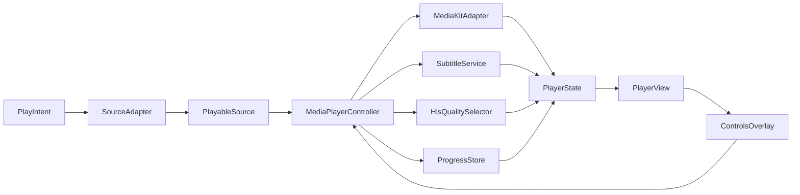

# 媒体播放器模块设计（v1.0）

## 目标与原则
- 高性能：硬件解码、零拷贝渲染、快速起播与稳定 Seek。
- 多平台：Android/iOS/Web/桌面统一接口，移动端体验优先。
- 可扩展：清晰分层与可插拔适配器，支持后续 DRM/自定义头/清晰度策略。
- 一致体验：统一控制层与 UI 模式（倍速、清晰度、缩放、全屏、进度恢复）。
- 与现有工程对齐：Riverpod 状态、`ApiClient` 网络、Hive 本地存储、`media_kit` 引擎。

## 技术选型
- 播放引擎：`media_kit` + `media_kit_video` + `media_kit_libs_video`（已在 `pubspec.yaml` 引入）
  - 优点：跨平台封装 MPV/FFmpeg 能力，支持 HLS/直链/多轨道，性能稳定。
  - Web 限制：浏览器受限于自定义头；通过后端签名 URL 与 Basic Auth 注入（见“网络与安全”）。
- 状态与路由：Riverpod + GoRouter。
- 本地存储：Hive（进度、用户设置）。
- UI：Material3 自定义控件层，手势与控制条与截图一致。

## 模块分层与目录
- 核心控制层
  - `MediaPlayerController`：统一控制 API（open/play/pause/seek/speed/scale/track/fullscreen）。
  - `PlayerState`：可观察状态（position/duration/buffering/error/tracks/subtitle/audio/quality/fullscreen）。
  - `PlayerEvents`：事件回调（onReady/onError/onComplete/onTrackChanged）。
- 引擎适配层
  - `MediaKitAdapter`：桥接 `media_kit` 引擎，封装 `open(Media)`、速率、轨道枚举与切换、事件订阅。
  - `HeadersInterceptor`：直链/HLS 请求头策略（平台差异化处理）。
- 数据服务层
  - `ProgressStore`：Hive 持久化播放进度与设置，支持心跳上报。
  - `SubtitleService`：外挂字幕与后端字幕加载，选择/偏移。
  - `HlsQualitySelector`：HLS 变体分析与清晰度切换（尽量无重开保留进度）。
- UI 表现层
  - `PlayerView`：画布与控件组合（`Video(controller)` + Overlay）。
  - `ControlsOverlay`：交互控件（倍速/清晰度/进度条/锁屏/缩放/列表/音量/字幕）。
- 集成层
  - `PlayIntent`：播放入口模型（`fileId?`, `playurl?`, `path?`, `sourcePath?`, `title?`, `headers?`）。
  - `SourceAdapter`：播放源解析（统一从后端生成可播 URL）。
  - `play_route.dart`：统一路由入口（接管播放页）。

现有文件参考：
- `lib/media_player/source_adapter.dart:1-179` 已具备默认源解析与后端 `getPlayUrl` 集成。
- `lib/media_player/playable_source.dart:1-16` 已定义统一源模型。
- `lib/media_player/player_core.dart:1-26` 已封装基本 `open/play/seek`。
- `lib/media_player/play_page.dart:1-206` 已演示最小 `Video(controller)` 集成与心跳上报。

## 架构图


## 播放流程（端到端）
- 入口：页面或详情调用 `PlayIntent`（推荐仅传 `fileId`）。
- 源解析：`SourceAdapter.resolve(intent, api)` 向后端请求 `getPlayUrl(fileId)`，返回 `PlayableSource`。
- 打开媒体：`MediaPlayerController.open(source)`，引擎加载并起播，应用初始设置（倍速/缩放/音量）。
- 轨道与清晰度：解析音/视频/字幕轨与 HLS 变体，填充状态供 UI 切换。
- 进度上报：每 10 秒心跳与退出时上报；同时本地 Hive 保存最近一次进度。
- 续播：再次打开时读取后端或本地最新进度，Seek 后起播。

## 接口设计
### 入口模型
```dart
class PlayIntent {
  final int? fileId;
  final String? playurl;
  final String? path;
  final String? sourcePath;
  final String? title;
  final Map<String, String>? headers;
  const PlayIntent({this.fileId, this.playurl, this.path, this.sourcePath, this.title, this.headers});
}
```

### 播放源与控制器
```dart
class PlayableSource {
  final String uri;
  final Map<String, String>? headers;
  final String? format; // e.g. hls/mp4
  final DateTime? expiresAt;
  final int? fileId;
  final int? startPositionMs;
  const PlayableSource({required this.uri, this.headers, this.format, this.expiresAt, this.fileId, this.startPositionMs});
}

class MediaPlayerController {
  Future<void> initialize();
  Future<void> open(PlayableSource source);
  Future<void> play();
  Future<void> pause();
  Future<void> stop();
  Future<void> seek(Duration position);
  Future<void> setSpeed(double speed);
  Future<void> setScale(String mode); // fit|fill|crop|16:9|4:3...
  Future<void> setVolume(double volume);
  Future<void> setMute(bool mute);
  Future<void> setFullscreen(bool fullscreen);
  Future<void> setOrientationLock(bool locked);
  Future<void> setAudioTrack(int id);
  Future<void> setVideoTrack(int id);
  Future<void> setSubtitleTrack(int id);
  Future<void> addExternalSubtitle(String uri);
  Future<void> setHlsQuality(String id); // 变体ID或带宽标识
  Stream<PlayerState> watch(); // Riverpod 封装后提供状态订阅
}
```

### 状态模型
```dart
class PlayerState {
  final bool ready;
  final bool playing;
  final bool buffering;
  final Duration position;
  final Duration duration;
  final double speed;
  final String scale;
  final double volume;
  final bool muted;
  final bool fullscreen;
  final bool orientationLocked;
  final List<Track> videoTracks;
  final List<Track> audioTracks;
  final List<Track> subtitleTracks;
  final Track? currentVideo;
  final Track? currentAudio;
  final Track? currentSubtitle;
  final List<HlsVariant> variants;
  final HlsVariant? currentVariant;
  final String? error;
  const PlayerState({...});
}
class Track { final int id; final String? lang; final String? name; const Track(this.id,{this.lang,this.name}); }
class HlsVariant { final String id; final int? bandwidth; final String? resolution; const HlsVariant(this.id,{this.bandwidth,this.resolution}); }
```

### 源解析接口
```dart
abstract class SourceAdapter {
  Future<PlayableSource> resolve(PlayIntent intent, ApiClient api);
}
```
默认实现策略：
- 优先使用 `fileId` 请求后端播放接口生成预签名 URL。
- 返回 `PlayableSource(uri, headers, format, expiresAt, fileId, startPositionMs)`。
- Web 平台对 Basic Auth 头进行 URL 注入以兼容浏览器限制。

## UI/交互方案
- 顶部：返回、标题、设置入口。
- 中部：加载环形与进度、双击快退/快进、单击显示/隐藏控件。
- 底部控制条（与截图一致）：
  - 进度条：拖拽、显示当前时间与总时长。
  - 播放/暂停按钮（中间居中）。
  - 倍速切换（0.5x/0.75x/1.0x/1.25x/1.5x/2.0x）。
  - 清晰度选择（原画/1080p/720p…，与 HLS 变体或后端直链分辨率对应）。
  - 缩放模式（原画/等比/裁剪/充满）。
  - 锁屏/方向锁、全屏切换。
  - 字幕与音轨选择、外挂字幕加载。
  - 播放列表/剧集选择入口（弹层）。

## 与后端集成
- 获取播放链接：`ApiClient.getPlayUrl(fileId)` 返回 `playurl/headers/format/expires_at`。
- 进度心跳与停止上报：`ApiClient.reportPlaybackProgress`（已在 `lib/media_player/play_page.dart:108-190` 使用）。
- 字幕接口：按 `file_id` 拉取字幕列表与资源。
- 清晰度策略：后端返回 HLS Master 或多清晰度直链，前端列出选择。

## 网络与安全
- Web 平台无法设置任意自定义请求头；采用：
  - 后端生成带签名与鉴权的播放 URL，尽量无须额外头。
  - 若使用 Basic Auth，解析 `Authorization: Basic` 注入为 URL `userInfo`（见 `source_adapter.dart` 中 kIsWeb 处理）。
  - 避免浏览器 `Referer` 受限的源；必要时通过后端中转或 CDN 防盗链策略。
- 移动端可注入自定义头；`MediaKitAdapter` 传递 `httpHeaders`。

## 性能与稳定性
- 硬件解码优先；异常回落到软件解码。
- 断网与超时重试、过期链接自动刷新（依据 `expiresAt`）。
- Seek 对齐关键帧；HLS 质量切换尽量平滑保留进度。
- 进入播放即锁住亮屏（`wakelock_plus`），退出释放。

## 错误与边界处理
- 打开失败：显示错误提示与重试；记录日志。
- 无轨道/无时长：显示基本控件并允许重试解析。
- 清晰度/字幕空列表：控件禁用态。
- 退出前强制上报最后进度与状态。

## 测试与验证
- 单元：SourceAdapter 解析与 Basic Auth 注入、ProgressStore 读写。
- 集成：打开 → 起播 → Seek → 切清晰度/字幕 → 上报心跳 → 退出。
- 兼容：Android/iOS/Web 三端起播与控件一致性。
- 质量：`flutter analyze`、运行真实媒体源、弱网模拟。

## 实施计划（概要）
- 控制层与适配层抽象：`MediaPlayerController` + `MediaKitAdapter`。
- 源解析与后端对齐：完善 `SourceAdapter` 与播放心跳。
- UI 控件层实现：`PlayerView` + `ControlsOverlay` 手势与控件。
- 字幕与清晰度：变体枚举与切换、外挂字幕加载。
- 进度与设置：Hive 持久化、启动续播。
- Web 兼容与安全策略：后端签名 URL、必要的中转策略。
- 联调与验收：三端测试与细节优化。

