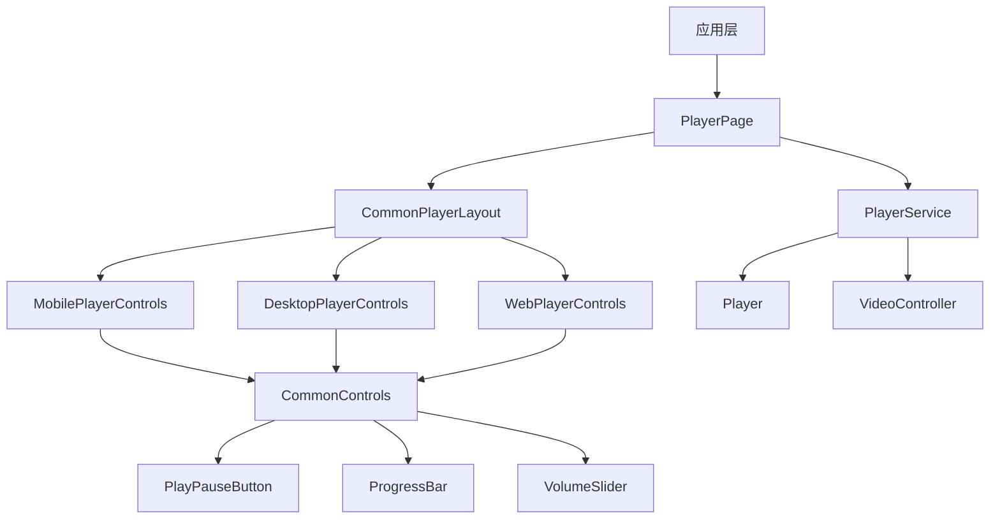
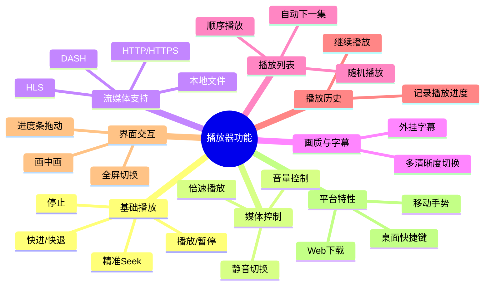

# 基于 media_kit 的跨平台播放器设计方案
## 一、整体架构设计


### 1.1 桌面端独立播放器窗口（多窗口/单实例）

桌面端进入播放页时，不在主窗口内直接播放，而是拉起独立播放器窗口，并立即返回主路由；重复进入时复用已存在的播放器窗口。

```mermaid
graph TD
  A[主窗口 PlayerPage] -->|检测桌面平台| B[DesktopPlayerWindowService.open]
  B -->|找到已存在窗口| C[WindowController.invokeMethod(open)]
  B -->|不存在| D[WindowController.create(arguments)]
  D --> E[新引擎 main() 解析 arguments]
  E --> F[DesktopPlayerWindowApp]
  F --> G[DesktopPlayerWindowPage]
  G -->|reload(coreId, extra)| H[PlaybackNotifier]
  H --> I[DesktopPlayerWindowLayout]
  I --> J[Video + 侧边栏 + 悬浮面板]
```

关键点：

- 参数传递：通过 `WindowConfiguration(arguments: json)` 传入 `{ type: 'player', payload: { coreId, extra } }`，新引擎启动后在 `main()` 中解析并选择运行 `DesktopPlayerWindowApp`。
- 单实例策略：创建窗口前先遍历 `WindowController.getAll()`，按 `arguments.type == 'player'` 查找已存在窗口，存在则 `focus/open` 下发新的播放 payload。
- payload 可序列化：`extra` 可能包含 `MediaDetail/EpisodeDetail/AssetItem` 等模型对象，创建窗口前需要将其转换成 `Map/List/num/bool/String`，避免新引擎无法反序列化导致白屏。
- PiP 兼容：`floating` 插件在桌面端没有实现，桌面端播放入口不初始化 PiP 轮询逻辑，从而避免 `MissingPluginException`。

### 1.2 多窗口下 Hive 文件锁冲突（auth.lock）

现象：桌面端打开独立播放器窗口后，窗口白屏且日志出现 `PathAccessException: lock failed / Cannot delete file ... auth.lock`。

原因：`desktop_multi_window` 会启动新的 Flutter 引擎；Hive 的 box 在桌面端通过锁文件（例如 `auth.lock`）实现进程级互斥。多个引擎如果使用同一个 Hive 目录并同时打开同名 box（如 `auth`），就会在 Windows 上触发锁冲突，导致新引擎初始化失败（表现为白屏）。

解决方案：

- 新窗口使用独立 Hive 子目录：在桌面播放器窗口入口的 `main()` 中使用 `Hive.initFlutter('player_window')`，避免与主窗口共享默认目录。
- 新窗口不再打开 `auth` box：主窗口在创建播放器窗口时，将 token/refresh_token/token_type/expires_in 通过窗口 arguments 透传；新窗口使用透传的登录态初始化 `ApiClient`，从而不需要再去抢占 `auth.lock`。
## 二、目录结构（简单明了）
```
lib/
└── media_player/
    ├── media_player_page.dart        # 播放器模块入口（路由承载/对外暴露）
    ├── desktop_window/               # 桌面端独立播放器窗口（多窗口）
    │   ├── desktop_player_window_service.dart
    │   ├── desktop_player_window_app.dart
    │   ├── desktop_player_window_page.dart
    │   ├── desktop_player_window_layout.dart
    │   ├── desktop_player_side_panel.dart
    │   ├── desktop_player_overlay_panels.dart
    │   └── desktop_player_side_panel_handle.dart
    ├── core/
    │   ├── player/
    │   │   ├── player_service.dart   # 播放器服务（含抽象接口，便于测试替换）
    │   │   └── player_config.dart    # 播放器配置
    │   └── state/
    │       └── playback_state.dart   # 播放状态管理（Riverpod）
    ├── ui/
    │   ├── adaptive/
    │   │   ├── responsive_builder.dart
    │   │   └── platform_helper.dart
    │   └── player/
    │       ├── pages/
    │       │   └── player_page.dart
    │       ├── layouts/
    │       │   └── common_player_layout.dart
    │       ├── overlays/
    │       │   ├── loading_overlay.dart
    │       │   └── error_overlay.dart
    │       └── controls/
    │           ├── common/
    │           │   ├── common_controls.dart
    │           │   ├── fullscreen_button.dart
    │           │   ├── play_pause_button.dart
    │           │   ├── progress_bar.dart
    │           │   └── volume_slider.dart
    │           └── platform_specific/
    │               ├── mobile_controls.dart
    │               ├── desktop_controls.dart
    │               ├── web_controls.dart
    │               ├── web_download_stub.dart
    │               └── web_download_web.dart
    └── utils/
        └── player_utils.dart
```
## 三、功能结构
### 3.1 核心功能模块

### 3.2 PlayerService 核心接口
```dart
abstract class PlayerServiceBase {
  VideoController? get videoController;

  Stream<bool> get playingStream;
  Stream<bool> get bufferingStream;
  Stream<Duration> get positionStream;
  Stream<Duration> get durationStream;
  Stream<Duration> get bufferStream;

  Future<void> openUrl(
    String url, {
    Map<String, String>? headers,
    Duration? start,
    bool play,
  });
  Future<void> play();
  Future<void> pause();
  Future<void> stop();
  Future<void> playPause();
  Future<void> seek(Duration position);
  Future<void> seekRelative(Duration delta);
  Future<void> setVolume(double volume);
  Future<void> setSpeed(double speed);
  Future<void> setMute(bool mute);

  void dispose();
}

class PlayerService implements PlayerServiceBase {
  factory PlayerService.create({PlayerConfig config = const PlayerConfig()}) {
    // 省略：创建 media_kit Player 与 VideoController，并应用初始配置
    throw UnimplementedError();
  }
}
```

### 3.3 与落地实现的关键差异
- 为了可测试性，实际落地引入了 PlayerServiceBase 抽象接口，测试可注入假实现。
- Web 下载能力通过条件导入实现（web_download_stub.dart / web_download_web.dart），避免非 Web 平台引入 dart:html。
- 全屏能力在状态层统一管理，并对移动端系统 UI 做沉浸式处理。
## 四、UI 设计（共用和差异）
### 4.1 通用组件（所有平台共用）
| 组件名称 | 功能说明 | 位置 |
|----------|----------|------|
| PlayPauseButton | 播放/暂停按钮 | controls/common/ |
| ProgressBar | 进度条 | controls/common/ |
| VolumeSlider | 音量滑块 | controls/common/ |
| FullscreenButton | 全屏按钮 | controls/common/ |
| LoadingOverlay | 加载覆盖层 | overlays/ |
| ErrorOverlay | 错误覆盖层 | overlays/ |
### 4.2 平台特定组件
#### 移动端
```dart
// 移动手势控制（落地实现为 StatefulWidget）
// - 单击：显示/隐藏控制层
// - 双击：左侧 25% 快退 / 中间 50% 播放暂停 / 右侧 25% 快进
// - 竖向拖动：左侧调亮度 / 右侧调音量
// - 横向拖动：拖动进度
// - 长按：临时 2 倍速播放（顶部提示“2倍速”，松开恢复）
// - 双指缩放：调整画面大小（缩放倍数）
// - 双指拖动：调整画面位置（平移偏移）
class MobileGestureLayer extends StatefulWidget {
  const MobileGestureLayer({super.key});

  @override
  State<MobileGestureLayer> createState() => _MobileGestureLayerState();
}

class _MobileGestureLayerState extends State<MobileGestureLayer> {
  @override
  Widget build(BuildContext context) {
    return const SizedBox.expand();
  }
}

// 手势反馈文字（亮度/音量/进度/缩放/2倍速）的调整位置
// - 位置：在 MobileGestureLayer 内部通过 Positioned(top: ... ) 控制（顶部居中，不遮挡画面中心）。
// - 字号/内边距：在 TextStyle(fontSize: ...) 与 Container(padding: ...) 调整。
```
#### 桌面端
```dart
// 桌面快捷键
class DesktopShortcutListener extends StatelessWidget {
  final Widget child;
  
  const DesktopShortcutListener({super.key, required this.child});
  
  @override
  Widget build(BuildContext context) {
    return Shortcuts(
      shortcuts: {
        LogicalKeySet(LogicalKeyboardKey.space): const _PlayPauseIntent(),
      },
      child: Actions(
        actions: {
          _PlayPauseIntent: CallbackAction(onInvoke: (_) => _playPause()),
        },
        child: child,
      ),
    );
  }
}
```

### 4.3 桌面端 UI 设计 (Desktop UI)
针对桌面端（Windows/macOS/Linux）的大屏与鼠标交互场景，设计了独立的独立窗口播放器。

#### 1) 窗口布局
- **TopBar**: 标题、PiP（画中画）、最小化、最大化、关闭。
- **BottomBar**:
  - **进度条**: 位于底部栏最上方，支持鼠标悬停预览与拖动。
  - **左侧控制**: 播放/暂停、下一集、当前时间/总时长。
  - **右侧功能**: 字幕、音轨、选集、倍速、画质、音量、设置、全屏。
- **SidePanel (选集)**:
  - 右侧挤压式面板，只包含“选集”列表，移除其他不相关 Tabs。
  - 展开时向左挤压视频区域（使用 Row 布局），避免遮挡视频内容。
  - 选集列表展示缩略图、标题、观看进度。
  - 支持通过底部“选集”按钮或右侧边缘手柄呼出。

#### 2) 浮动面板 (Overlay Panels)
- **音量面板**: 竖向滑块，位于音量图标上方，限制宽度避免过宽。
- **倍速面板**: 竖向列表（0.5x - 5.0x），支持自定义，限制宽度。
- **字幕面板**: 分组展示内嵌字幕、外挂字幕、AI字幕及字幕设置，限制宽度。
- **音轨面板**: 列表选择音频轨道，风格与倍速面板一致。
- **画质面板**: 列表选择视频清晰度，风格与倍速面板一致。
- **设计规范**: 统一深色圆角卡片风格，最大高度限制，固定/限制宽度，不遮挡底部操作栏。悬浮面板在对应图标上方就近显示。

#### Web端
```dart
// Web下载按钮
class WebDownloadButton extends StatelessWidget {
  final String videoUrl;
  
  const WebDownloadButton({super.key, required this.videoUrl});
  
  @override
  Widget build(BuildContext context) {
    return IconButton(
      icon: const Icon(Icons.download),
      onPressed: () => _downloadVideo(),
    );
  }
  
  void _downloadVideo() {
    html.AnchorElement(href: videoUrl).download = 'video.mp4';
    html.document.body?.append(html.AnchorElement(href: videoUrl)..click()..remove());
  }
}
```
### 4.3 响应式布局
```dart
class CommonPlayerLayout extends StatelessWidget {
  final PlayerService playerService;
  
  const CommonPlayerLayout({super.key, required this.playerService});
  
  @override
  Widget build(BuildContext context) {
    return LayoutBuilder(
      builder: (context, constraints) {
        final isMobile = constraints.maxWidth < 600;
        
        return Column(
          children: [
            Expanded(child: Video(controller: playerService.videoController)),
            if (!isMobile) _buildDesktopControls(),
            if (isMobile) _buildMobileControls(),
          ],
        );
      },
    );
  }
  
  Widget _buildMobileControls() {
    return MobileControlsBar(playerService: playerService);
  }
  
  Widget _buildDesktopControls() {
    return DesktopControlsBar(playerService: playerService);
  }
}
```
## 五、关键代码示例
### 5.1 播放页面入口
```dart
class PlayerPage extends StatelessWidget {
  final String videoUrl;
  
  const PlayerPage({super.key, required this.videoUrl});
  
  @override
  Widget build(BuildContext context) {
    return Scaffold(
      body: CommonPlayerLayout(
        playerService: PlayerService(),
      ),
    );
  }
}
```
### 5.2 通用播放控制按钮
```dart
class PlayPauseButton extends StatelessWidget {
  final PlayerService playerService;
  
  const PlayPauseButton({super.key, required this.playerService});
  
  @override
  Widget build(BuildContext context) {
    return IconButton(
      icon: Icon(playerService.player.playing ? Icons.pause : Icons.play_arrow),
      onPressed: () => playerService.playPause(),
    );
  }
}
```
### 5.3 平台检测与组件选择
```dart
Widget _buildControlsByPlatform(BuildContext context, PlayerService playerService) {
  switch (Theme.of(context).platform) {
    case TargetPlatform.android:
    case TargetPlatform.iOS:
      return MobileControlsBar(playerService: playerService);
    case TargetPlatform.windows:
    case TargetPlatform.macOS:
    case TargetPlatform.linux:
      return DesktopControlsBar(playerService: playerService);
    default:
      if (kIsWeb) {
        return WebControlsBar(playerService: playerService);
      }
      return MobileControlsBar(playerService: playerService);
  }
}
```
这个设计方案实现了跨平台播放器的统一体验，通过统一的底层和最大化的UI复用，同时针对各平台特性进行适当适配，确保在不同设备上都能提供最佳的用户体验。

## 六、测试与质量结果（当前实现）
- 静态分析：flutter analyze 通过（No issues found）。
- 格式化：flutter format 在当前 Flutter 版本不可用，已使用 dart format .（0 changed）。
- 单测/组件测试：flutter test 全通过。
- 性能基准：CommonControls 平均重建耗时约 1974.79us（基准测试输出）。

最近一次确认（2026-01-11）：已运行 dart format .、flutter analyze、flutter test。

## 七、移动端 UI 详细设计与实现
针对移动端横竖屏场景，实现了完整的播放控制和面板复用方案。

### 7.1 UI 组件结构
```
lib/media_player/ui/player/controls/mobile/
├── widgets/
│   ├── mobile_top_bar.dart        # 顶部栏（返回、标题、设置、小窗）
│   ├── mobile_bottom_bar.dart     # 底部栏（进度条、播放按钮、面板入口）
│   └── mobile_center_controls.dart# 中间控制（锁屏、旋转）
└── panels/
    ├── settings_panel.dart        # 设置面板（片头片尾、播放方式、画面比例）
    ├── episode_panel.dart         # 选集面板
    ├── subtitle_panel.dart        # 字幕面板（AI/本地/在线字幕）
    ├── speed_panel.dart           # 倍速面板
    └── quality_panel.dart         # 画质面板
```

### 7.2 图标功能说明
| 区域 | 图标/组件 | 功能说明 |
|------|----------|----------|
| 顶部左侧 | 返回箭头 | 退出播放页面或返回上一级 |
| 顶部左侧 | 播放标题 | 显示当前视频标题 |
| 顶部右侧 | 设置图标 | 打开设置面板，调节画面比例、播放方式等 |
| 顶部右侧 | 小窗图标 | 开启画中画模式 (PiP) |
| 中间左侧 | 锁屏图标 | 锁定/解锁屏幕触控，锁定后仅显示锁屏按钮 |
| 中间右侧 | 旋转图标 | 强制切换横竖屏方向 |
| 底部 | 进度条 | 拖动跳转播放进度，显示当前/总时长 |
| 底部左侧 | 播放/暂停 | 控制视频播放状态 |
| 底部右侧 | 字幕 | 打开字幕面板，选择字幕轨道或导入字幕 |
| 底部右侧 | 选集 | 打开选集面板，切换集数 |
| 底部右侧 | 倍速 | 打开倍速面板，调节 0.5x - 3.0x 播放速度 |
| 底部右侧 | 画质 | 打开画质面板，切换清晰度 |

### 7.3 面板复用与交互
- **面板复用**：所有面板（设置、选集、字幕、倍速、画质）均采用统一的侧边栏（Side Panel）交互模式，在横竖屏下体验一致。
- **交互方式**：点击底部对应按钮，面板从右侧滑入；点击遮罩层或面板内选项（如选集）可关闭面板。
- **锁屏逻辑**：锁定状态下，隐藏除锁屏按钮外的所有控制层，屏蔽手势操作。

### 7.4 自适应面板交互 (Adaptive Panels)
- **竖屏模式 (Portrait)**: 采用底部弹窗 (Bottom Sheet) 形式，占据屏幕约 60% 高度，圆角设计，符合单手操作习惯。
- **横屏模式 (Landscape)**: 采用侧边抽屉 (Side Drawer) 形式，从右侧滑入，固定宽度 300dp，不遮挡左侧画面。
- **实现方式**: 在 `MobilePlayerControls._openPanel` 中根据布局宽高与全屏状态动态选择 `showModalBottomSheet` 或 `showGeneralDialog`，并在面板打开期间锁定屏幕方向，关闭后恢复到用户之前的方向偏好，保证横屏稳定。

## 八、下一步实施计划 (Next Steps)
### 8.1 功能实现方案
| 组件/功能 | 状态 | 计划/实现方案 | 涉及文件 |
|-----------|------|---------------|----------|
| **画中画 (PiP)** | ✅ 已完成 | 集成 `floating` 插件，在 `MobileTopBar` 中触发 `_floating.enable()`。 | `mobile_top_bar.dart`, `mobile_controls.dart` |
| **片头片尾设置** | ✅ 已完成 | 在 `PlaybackSettings` 中增加 `introDuration` / `outroDuration` 字段，`PlaybackNotifier` 配合 `positionStream` 自动跳过。 | `settings_panel.dart`, `playback_state.dart` |
| **画面比例切换** | ✅ 已完成 | `PlaybackState` 增加 `fit` 状态，`CommonPlayerLayout` 响应状态变化，`SettingsPanel` 提供切换。 | `common_player_layout.dart` |
| **字幕挂载** | 🔄 进行中 | 已实现 `PlayerService` 的 `setSubtitleTrack` 接口及面板列表选择。外挂字幕导入待实现。 | `subtitle_panel.dart`, `player_service.dart` |
| **音轨切换** | ✅ 已完成 | 监听 `tracksStream` 获取音轨列表，面板仅展示真实轨道（过滤 `auto/no`），点击切换（调用 `setAudioTrack`）。无轨道则展示空态。 | `audio_panel.dart`, `mobile_controls.dart`, `mobile_bottom_bar.dart`, `playback_state.dart`, `player_service.dart` |
| **画质切换** | ✅ 已完成 | 监听 `tracksStream`，在 `QualityPanel` 列出视频轨道并支持切换。 | `quality_panel.dart`, `playback_state.dart` |
| **播放模式** | ✅ 已完成 | 支持单曲循环、列表循环、不循环，状态同步至 `media_kit`。 | `settings_panel.dart`, `player_service.dart` |
| **手势控制** | ✅ 已完成 | `MobileGestureLayer` 支持左侧亮度、右侧音量；水平进度拖动改为按“总位移/屏宽”映射更大范围；双击热区为左25%/中50%/右25%。 | `mobile_controls.dart`, `common_player_layout.dart` |
| **画面大小** | ✅ 已完成 | 设置面板支持一键切换 50%/75%/100%/125%，通过更新 `PlaybackState.videoScale` 生效。 | `settings_panel.dart`, `playback_state.dart`, `common_player_layout.dart` |

### 8.2 状态管理完善
- ✅ 将临时 UI 状态 (如 `_showSubtitles`, `_selectedSubtitle`) 迁移至 Riverpod `PlaybackState` 中统一管理。
- ⏳ 增加 `UserPreferences` 本地存储，持久化保存用户设置（如默认倍速、画面比例偏好）。

### 8.3 数据获取与使用说明 (Data & Usage)

#### 1. 数据来源 (Data Sources)
- **选集 (Episodes)**: 
  - **来源 A：详情页传入（优先）**：在详情页点击播放时，将当前选择的“季版本 episodes 列表”通过路由 `extra` 传入播放器（字段：`episodes`、`seasonVersionId`）。
  - **来源 B：后端接口拉取（兜底）**：若未传入 `episodes`，播放器会按当前播放 `fileId` 请求 `/api/media/file/{file_id}/episodes` 获取选集列表。
- **字幕 (Subtitles)**:
  - **内嵌字幕**: 播放器自动识别，通过 `tracksStream` 暴露。
  - **外挂字幕**: 通过后端 API `/api/media/file/{file_id}/subtitles` 获取列表，支持在线加载。
- **音轨 (Audio Tracks)**:
  - **内嵌音轨**: 播放器自动识别，通过 `tracksStream` 暴露。
- **本地播放 (Local Playback)**:
  - 在 `extra` 参数中传入 `filePath` 或 `path` 即可直接播放本地文件，无需 API 支持。

#### 2. 使用说明 (User Guide)
- **面板交互**: 
  - 点击底部对应图标打开面板（设置、选集、倍速等）。
  - **横屏模式**: 面板从右侧滑入，此时**屏幕方向锁定**，防止误触旋转。
  - **竖屏模式**: 面板从底部弹出。
  - 点击遮罩区域关闭面板。
- **字幕控制**:
  - 在字幕面板中通过开关开启/关闭字幕。
  - 列表展示所有可用字幕轨道，点击即切换。
- **音轨控制**:
  - 在音轨面板中展示视频内嵌的音轨列表，点击即可切换。
- **画中画 (PiP)**:
  - 点击顶部栏 PiP 图标进入小窗模式（需系统权限支持）。

#### 3. API 调整说明
- **播放链接**: 统一使用 `/api/media/play/{file_id}`。
  - 后端返回 `playurl` 与 `headers`（例如 `Authorization: Basic ...`）。
  - 播放器打开媒体时需要将 `headers` 透传给 `media_kit`（`Media(url, httpHeaders: headers)`），否则 WebDAV 资源会鉴权失败导致黑屏/无法加载。

#### 4. 播放历史与续播 (Playback History & Resume)
- **进度获取**：
  - **路由参数优先**：若路由参数 `extra` 中包含 `start` 或 `positionMs`（毫秒），则直接使用该值作为初始播放进度（适用于“最近观看”卡片直接跳转）。
  - **API 兜底**：若无路由参数，则通过 `GET /api/playback/progress/{file_id}` 获取历史播放进度，仅使用返回体中的 `position_ms` 字段。
- **续播行为（关键实现）**：
  - 若获取到的进度（路由或 API）大于 0，则在 `PlayerService.openUrl` 时以对应毫秒数作为 `start` 参数，实现自动续播。
  - **Open(paused) -> Seek -> Play**：当 `start > 0` 时，播放器会先以暂停状态打开媒体，再等待时长（duration）就绪后执行 seek，并通过 position 流确认位置到达目标；确认成功后再开始播放。
  - **重试策略**：如果第一次 seek 未能确认到达目标位置，会延迟 250ms 再重试一次，以提升不同设备/协议下的续播成功率。
  - **回跳兜底**：少量播放源在 seek 成功后，开始播放阶段可能触发底层解码管线重建，导致 position 短暂回到 0 并从头播放。播放器会在“确认到达目标位置”后，在开始播放后的短窗口内检测“位置回跳到开头”的情况，并自动再执行一次 seek 兜底。
  - **MediaCodec 重建说明**：Android 日志中看到的 MediaCodec RELEASING/UNINITIALIZED/INITIALIZING 可能发生在 open/切源/部分 seek 过程中，属于底层解码管线的正常重建行为；是否成功续播应以“seek 后 position 是否达到目标”来判定，而不是以 codec 是否重建来判定。
  - 若无记录或接口失败，则从 0 开始播放。
- **播放源约束（网络续播）**：
  - 对于 HTTP/HTTPS 的 MP4 等直链资源，服务端通常需要支持 **Range Request**（返回 206）才能从任意位置续播；若服务端忽略 Range 并返回 200，续播可能失败并从头开始加载。
  - 客户端会在 Debug 模式下对 HTTP/HTTPS 资源做一次轻量 Range 探测（`Range: bytes=0-0`），用于辅助定位“后端返回进度正确但仍无法续播”的问题。
- **进度上报**：播放过程中按固定间隔调用 `POST /api/playback/progress` 上报当前 `position_ms` 与 `duration_ms`，便于“最近观看”卡片展示进度与下一次续播。

### 8.4 选集面板设计与实现 (Episode Panel)

#### 1) 数据结构
- **FileEpisodesResponse**：对应 `/api/media/file/{file_id}/episodes` 的返回体，包含 `file_id`、`season_version_id`、`episodes`。
- **EpisodeDetail**：详情页与选集接口共用的剧集条目模型，新增可选字段 `id` 以兼容接口返回。

#### 2) 播放器状态字段
- `PlaybackState.episodes`：选集列表（用于面板展示与上一集/下一集计算）。
- `PlaybackState.seasonVersionId`：当前选集列表对应的季版本 ID（可为空）。
- `PlaybackState.episodesLoading / episodesError`：选集拉取状态与错误展示。

#### 3) 选集列表加载策略
- **初始化阶段**：播放器拿到 `fileId` 后，会异步触发一次选集加载：
  - 若路由已传入 `episodes`，直接使用，不再请求后端。
  - 否则调用 `ApiClient.getEpisodes(fileId)` 拉取，按“每集首个资源 fileId”等键去重后写入 `PlaybackState.episodes`。

#### 4) 面板 UI 与点击播放
- **展示内容**：剧集标题（`EpisodeDetail.title`）、封面（`stillPath`）、资源文件名（取首个资源的 path）。
- **点击行为**：点击某一集后，选择该集的“首个资源 fileId”请求 `/api/media/play/{file_id}` 获取播放地址并播放，同时将该集的 `assets` 写入 `PlaybackState.candidates` 作为画质/来源候选。
- **进度恢复**：切集/上一集/下一集同样会恢复该文件的历史播放进度（续播是播放器固有能力，入口无差异）。
- **关闭面板**：由选集面板内部使用 `Navigator.maybePop()` 关闭当前弹层，避免使用控制层的 `context` 导致误退出播放页或触发 `unmounted context` 异常。

#### 5) 详情页到播放器的路由参数约定
- `detail`：MediaDetail（用于标题、类型、海报与基础信息）。
- `asset`：当前选中集/版本的首个资源（用于推导初始 fileId）。
- `candidates`：当前选中集的 assets（用于画质/来源候选）。
- `episodes`：当前选择“季版本”的 episodes 列表（用于选集面板与上一集/下一集）。
- `seasonVersionId`：当前季版本 ID（可选）。

#### 6) 开发记录
- 2025-12-31：实现选集列表双来源（详情页传入/后端拉取）、选集面板展示与点击切集播放，补齐状态字段与接口模型。

## 九、体验优化与问题修复（2026-01-03）

### 9.1 修改计划
针对用户反馈的10个问题，制定以下修改方案：

1.  **沉浸式全屏**:
    - 在 `PlayerPage` 进入时启用 `SystemUiMode.immersiveSticky(overlays: [])`，退出时恢复。
    - 解决状态栏和底部导航栏在全屏播放时不消失的问题。
2.  **字幕切换卡顿优化**:
    - 在 `PlaybackNotifier.setSubtitleTrack` 增加去重与切换中保护，避免重复切换导致长时间卡顿。
3.  **字幕样式与位置**:
    - 配置 `media_kit_video` 的 `SubtitleViewConfiguration`。
    - 去除黑色背景（`backgroundColor: transparent`），增大字号并加阴影提高可读性。
    - 调整字幕 Padding，使其在竖屏模式下位于视频画面下部合适位置。
4.  **长按 2倍速手势**:
    - 在 `MobileGestureLayer` 添加 `onLongPress` 手势支持。
    - 长按开始时设置速度 2.0x，结束时恢复 1.0x（或原速度）。
5.  **加载动画百分比**:
    - `LoadingOverlay` 的转圈动画改为始终匀速旋转（不再绑定到进度值）。
    - 百分比仅作为进度信息展示，并对跳变做平滑显示，避免观感卡顿。
6.  **进度条拖动支持**:
    - 改造 `MobileBottomBar` 中的 `Slider`。
    - 增加 `onChangeStart`, `onChanged`, `onChangeEnd` 处理，实现平滑拖动且不与播放进度冲突。
7.  **锁屏状态修复**:
    - 将 `isLocked` 状态移至 Riverpod `PlaybackState` 管理，防止因控件隐藏/重建导致状态丢失。
    - 确保锁屏状态下仅响应解锁操作，屏蔽其他手势。
8.  **PiP UI 适配**:
    - 统一复用同一个 `Floating` 实例，确保 `PiPSwitcher` 能正确感知 PiP 状态。
    - 进入 PiP 模式时，自动隐藏播放器控制层（Controls），只保留纯视频画面。
9.  **系统音量控制**:
    - 引入 `flutter_volume_controller`。
    - 替换原有的播放器内部音量控制，改为直接调节设备系统音量，并隐藏系统音量条。
10. **字幕名称优化**:
    - 建立语言代码映射表（如 `chi` -> `中文`）。
    - 优化 `_getTrackName` 显示逻辑。

11. **双指缩放与画面位置调整**:
    - 在 `PlaybackState` 中增加 `videoScale` / `videoOffset` 状态。
    - 在 `CommonPlayerLayout` 对 `Video` 叠加 `Transform.scale` + `Transform.translate`。
    - 在 `MobileGestureLayer` 使用双指缩放/拖动手势更新上述状态。
    - 手势层改为包裹内容（child）以同时兼容控制层点击与手势识别。

### 9.2 实施进度
- [x] 1. 全屏沉浸式适配
- [x] 2. 字幕切换性能优化
- [x] 3. 字幕样式美化
- [x] 4. 手势长按倍速
- [x] 5. 加载动画与百分比显示
- [x] 6. 进度条拖动优化
- [x] 7. 锁屏状态管理重构
- [x] 8. PiP 模式 UI 隐藏
- [x] 9. 系统音量接管
- [ ] 10. 字幕名称映射
- [x] 11. 双指缩放与画面位置调整

### 9.3 开发记录
- 2026-01-03：修复沉浸式全屏（进入播放页即开启 immersiveSticky），字幕样式配置生效并增大字号（当前字幕字号为 34）；字幕切换增加去重与切换中保护；恢复长按 2 倍速手势；移动端控制层支持 3 秒自动隐藏，且 UI 显示时不会禁用手势；锁屏状态改为由 `PlaybackState.isLocked` 统一管理并强制显示解锁按钮；PiP 增加 Manifest 配置并复用 Floating 实例；系统音量隐藏音量条并对音量设置做节流。
