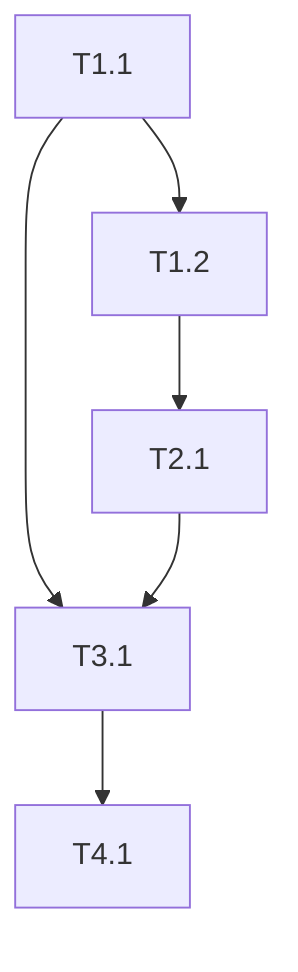

# ATOMIZE: 任务清单

## 1. 基础设施实现
- **Task 1.1**: 创建 `services/common/event_bus.py`。
    - 实现 `EventBus` 类（subscribe, publish）。
    - 定义 `Event` 基类。
- **Task 1.2**: 定义业务事件 `services/scan/events.py`。
    - 定义 `ScanCompletedEvent` 数据类。

## 2. 处理器实现
- **Task 2.1**: 创建 `services/task/handlers.py`。
    - 实现 `MetadataEnrichmentHandler`：接收 `ScanCompletedEvent`，检查参数，创建元数据任务。
    - 实现 `DeleteSyncHandler`：接收 `ScanCompletedEvent`，检查参数，创建删除同步任务。
    - 注意：需要注入 `TaskQueueService`。

## 3. 调度器改造
- **Task 3.1**: 修改 `services/task/unified_task_scheduler.py`。
    - 在 `__init__` 中初始化 `EventBus` 并注册 Handlers。
    - 修改 `_execute_scan_task`（或 `_handle_scan_completion`），移除原有的 `TaskType.METADATA_FETCH` 和 `TaskType.DELETE_SYNC` 创建代码。
    - 在扫描完成后，构建并发布 `ScanCompletedEvent`。

## 4. 验证与清理
- **Task 4.1**: 编写单元测试 `tests/services/test_event_decoupling.py`。
    - 模拟扫描完成，验证 Handlers 是否被调用。
    - 验证任务是否被正确加入队列。
- **Task 4.2**: 清理无用代码和导入。

## 依赖关系图

