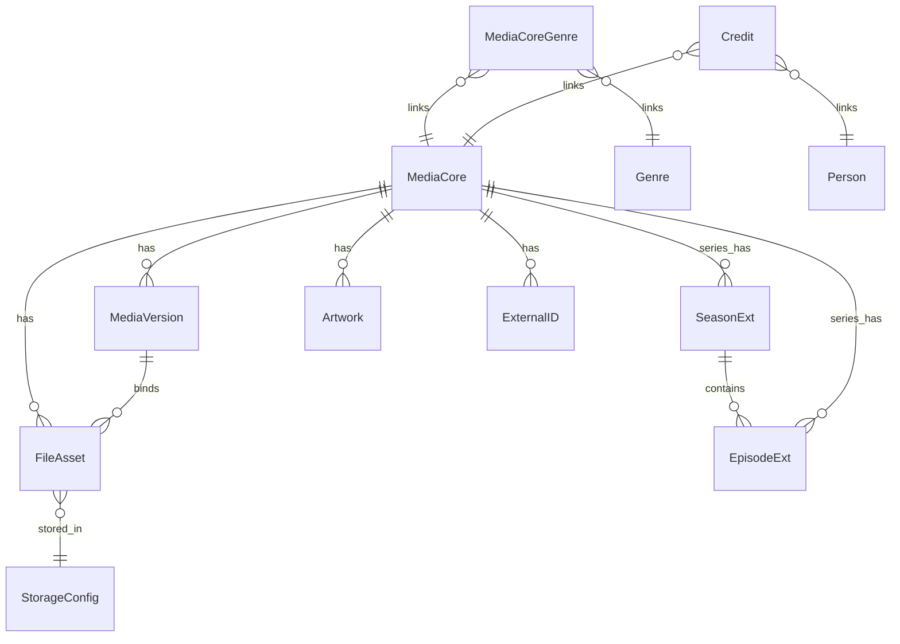
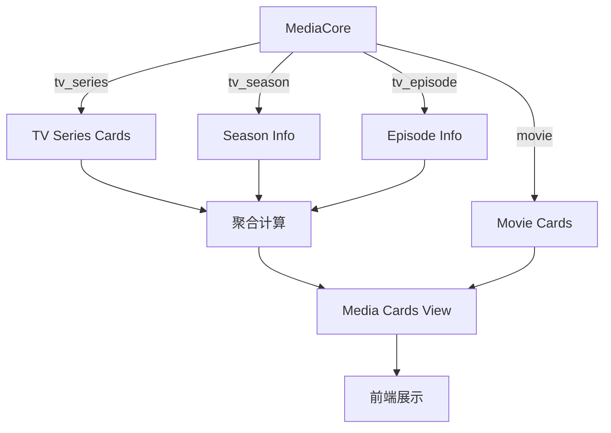

# 媒体卡片系统数据库架构设计方案（统一作品层 + 季/文件版本）

## 1. 概览与设计原则

### 1.1 统一抽象与版本单位
- 作品层统一：前端卡片仅展示 `movie` 与 `tv_series`（作品级）。
- 版本单位：
  - 电影以“单文件”为版本（`movie_single`）。
  - 剧集以“季”为版本（`season_group`）。
  - 无季剧默认自动生成季1（`SeasonExt.auto_generated=True`，以季为版本）。
- 详情层：`tv_season` / `tv_episode` 用于层级结构与版本/文件归属。

### 1.2 解析数据流对齐
- 扫描阶段：轻量解析，建立 `FileAsset` 基础信息与技术参数。
- 刮削阶段：深度解析，归一化作品/季，生成版本指纹与文件指纹，完成版本归属与默认版本选择。

### 1.1 当前架构概述
现有系统采用分层媒体模型架构：
- **MediaCore**: 核心媒体实体，包含基础信息
- **MovieExt**: 电影扩展信息
- **TVSeriesExt/SeasonExt/EpisodeExt**: 电视剧分层扩展信息
- **FileAsset**: 文件资源管理
- **Artwork**: 艺术作品管理

### 1.2 卡片展示需求

#### 核心需求
1. **电影卡片**：单卡片展示，如"七月与安生"
2. **电视剧卡片**：聚合展示，如"权力的游戏"（包含所有季信息）
3. **季集信息**：电视剧卡片需展示季和集的统计信息
4. **性能要求**：支持大量媒体文件的高效查询
5. **用户体验**：快速响应，支持分页和筛选

#### 展示层级
```
电影层级：
- 七月与安生 → [单卡片展示]

电视剧层级：
- 权力的游戏 → [聚合卡片]
  ├── 第一季
  │   ├── 第1集
  │   ├── 第2集
  │   └── ...
  ├── 第二季
  │   ├── 第1集
  │   └── ...
  └── ...
```

## 2. 实体模型与字段说明（逐表）

> 下列字段行号参考：`media-server/models/media_models.py`

### 2.1 MediaCore（作品层 36-61）
- `kind`: `movie|tv_series|tv_season|tv_episode` - 作品/层级类型，卡片统一使用 movie/tv_series。
- `title` / `original_title` / `year`: 标题、原始标题、年份。
- `group_key`: 作品分组键（用于同片聚合与去重）。
- `canonical_tmdb_id`: 规范化 TMDB ID（外部主源对齐）。
- `created_at` / `updated_at`: 创建与更新时间。

### 2.2 MediaVersion（版本层 63-77 扩展）
- `core_id`: 指向电影 core（movie）或季 core（tv_season）。
- `tags`: 版本标签文本（兼容旧字段）。
- `quality` / `source` / `edition`: 清晰度/来源/版别（如 4K、WEB-DL、导演剪辑）。
- `scope`: `movie_single|season_group|series_group` - 版本作用域。
- `variant_fingerprint`: 唯一规范化指纹（quality+source+edition+container+video_codec+audio_codec+hdr）。
- `preferred`: 是否为默认首选版本（卡片/详情默认展示与播放）。
- `primary_file_asset_id`: 电影版本主视频文件 ID（仅 `movie_single`）。

### 2.3 SeasonExt（季层 125-145 扩展）
- `series_core_id`: 指向剧 core（tv_series）。
- `season_number`: 季序号。
- `episode_count`: 本季集数。
- `aired_date`: 播出日期。
- `poster_path`: 季海报路径。
- `auto_generated`: 是否系统自动生成的季（无季剧默认季1）。

### 2.4 EpisodeExt（集层 147-169 扩展）
- `series_core_id`: 指向剧 core（tv_series）。
- `season_core_id`: 指向季 core（tv_season），无季剧可为空。
- `episode_number` / `season_number`: 集序与所属季序。
- `absolute_episode_number`: 绝对集序（番剧/国产剧支持）。
- `aired_date` / `runtime` / `rating`: 播出日期、时长、评分。

### 2.5 FileAsset（文件层 171-205 扩展）
- 关联：
  - `core_id`: 可指向作品/季，用于资源归属。
  - `version_id`: 指向版本，用于版本聚合与筛选。
  - `episode_core_id`: 指向集，用于剧集文件定位。
- 路径与基础：`full_path`、`filename`、`relative_path`、`storage_id`（→ StorageConfig）、`size`、`mimetype`。
- 技术参数：`video_codec`、`audio_codec`、`resolution`、`duration`、`etag`。
- 新增技术扩展：`asset_role`（video|audio|subtitle|nfo|image|other）、`bitrate_kbps`、`hdr`、`audio_channels`、`container`、`asset_fingerprint`（索引）。

### 2.6 Artwork（图片层 209-215 扩展）
- `type`: `poster|fanart|banner|cover|folder`。
- `remote_url` / `local_path` / `width` / `height`。
- `provider` / `language` / `preferred`: 图片来源、语言、首选标记。

### 2.7 外部与标签/演职员
- `ExternalID`: `source`（tmdb|imdb|tvdb|douban）与 `key`，用于外部对齐与聚合。
- `Genre` / `MediaCoreGenre`: 流派与作品关联。
- `Person` / `Credit`: 人员与演职员关联。
- `ScanJob`: 扫描任务模型（任务状态与进度追踪）。

## 3. 关系与ER图

### 3.1 ASCII 关系图（稳定可视）

```
MediaCore(id) ──< MediaVersion(core_id)
MediaCore(id) ──< FileAsset(core_id)
MediaCore(id: tv_series) ──< SeasonExt(series_core_id)
SeasonExt(core_id) ──< EpisodeExt(season_core_id)
MediaCore(id: tv_series) ──< EpisodeExt(series_core_id)
MediaVersion(id) ──< FileAsset(version_id)
MediaCore(id) ──< Artwork(core_id)
MediaCore(id) ──< ExternalID(core_id)
MediaCoreGenre(core_id) ── Genre(id)
Credit(core_id) ── Person(id)
FileAsset(storage_id) ── StorageConfig(id)
```

### 3.2 Mermaid ER 图（供支持环境渲染）



## 4. 列表与详情查询映射

- 列表（卡片）：`SELECT * FROM MediaCore WHERE kind IN ('movie','tv_series') ORDER BY updated_at DESC`。
  - 电影版本计数：`COUNT(MediaVersion WHERE core_id=movie_core AND scope='movie_single')`。
  - 剧集聚合：季数与集数来自 `SeasonExt/EpisodeExt`；版本计数来自季版本（`season_group`），无季剧视为季1。
- 详情：
  - 电影版本：`MediaVersion(scope='movie_single')`，取 `primary_file_asset_id` 获取主视频文件。
  - 季版本：`MediaVersion(scope='season_group')`；集文件按所选版本优先匹配，缺集回退。
  - 无季剧：自动季1，逻辑同季。

## 5. 索引与性能建议

- `MediaVersion(core_id, scope)`、`MediaVersion(core_id, preferred)`、`MediaVersion(variant_fingerprint)`。
- `FileAsset(episode_core_id, version_id)`、`FileAsset(storage_id, full_path)`、`FileAsset(asset_fingerprint)`。
- `SeasonExt(series_core_id, season_number)`、`EpisodeExt(season_core_id, episode_number)`。
- `Artwork(core_id, type, preferred)`。

## 6. 迁移与一致性校验

- 字段灰度新增（可空）；分批计算 `variant_fingerprint` 与 `asset_fingerprint` 并回填。
- 无季剧自动生成季1（`auto_generated=True`），迁移 `EpisodeExt.season_core_id`。
- 默认版本 `preferred`：电影按质量/来源，季按覆盖率与质量优先。
- 验收：卡片统一展示；版本与文件归属完整；无约束冲突；分页性能基线达标。

## 7. 风险与缓解

- 季1自动生成需审慎：建议影子记录+回滚计划，分批校验。
- 电影版本唯一文件约束在应用层保证，避免复杂数据库约束。

### 2.1 方案对比矩阵

| 方案 | 实时性 | 性能 | 复杂度 | 维护成本 | 适用场景 |
|------|--------|------|--------|----------|----------|
| 视图层聚合 | 高 | 中 | 低 | 低 | 中等数据量 |
| 聚合表+触发器 | 中 | 高 | 中 | 中 | 大数据量 |
| 应用层聚合 | 高 | 低 | 高 | 高 | 业务复杂 |
| 混合方案 | 高 | 高 | 高 | 高 | 企业级应用 |

### 2.2 推荐方案：视图层聚合

**选择理由：**
1. **实时性强**：数据变更立即反映在卡片展示中
2. **实现简单**：无需额外的数据同步机制
3. **维护成本低**：数据库自动维护视图一致性
4. **灵活性高**：易于调整聚合逻辑
5. **性能可接受**：通过合理索引优化，可满足性能需求

## 3. 数据库架构设计

### 3.1 核心设计思想

采用**视图层聚合**策略，保持现有表结构不变，通过数据库视图实现卡片聚合逻辑：



### 3.2 数据库视图设计

#### 3.2.1 主卡片视图 (media_cards)
```sql
CREATE OR REPLACE VIEW media_cards AS
SELECT 
    -- 基础信息
    mc.user_id,
    mc.id as core_id,
    mc.kind as media_type,
    
    -- 卡片展示标题
    CASE 
        WHEN mc.kind = 'movie' THEN mc.title
        WHEN mc.kind = 'tv_series' THEN mc.title
        WHEN mc.kind = 'tv_season' THEN (
            SELECT title FROM media_core 
            WHERE id = ts.series_core_id AND kind = 'tv_series'
        )
        WHEN mc.kind = 'tv_episode' THEN (
            SELECT title FROM media_core 
            WHERE id = ep.series_core_id AND kind = 'tv_series'
        )
    END as card_title,
    
    mc.original_title,
    mc.year,
    mc.rating,
    mc.plot,
    
    -- 聚合统计信息
    CASE 
        WHEN mc.kind = 'movie' THEN 1
        WHEN mc.kind = 'tv_series' THEN COALESCE(ts.episode_count, 0)
        ELSE 0
    END as total_episodes,
    
    CASE 
        WHEN mc.kind = 'tv_series' THEN COALESCE(ts.season_count, 0)
        WHEN mc.kind IN ('tv_season', 'tv_episode') THEN (
            SELECT COUNT(DISTINCT season_number) FROM tv_season_ext 
            WHERE series_core_id = COALESCE(ts.series_core_id, ss.series_core_id, ep.series_core_id)
        )
        ELSE 0
    END as total_seasons,
    
    -- 最新季集信息
    CASE 
        WHEN mc.kind = 'tv_series' THEN (
            SELECT MAX(season_number) FROM tv_season_ext 
            WHERE series_core_id = ts.core_id
        )
    END as latest_season,
    
    CASE 
        WHEN mc.kind = 'tv_series' THEN (
            SELECT MAX(episode_number) FROM tv_episode_ext ep2
            JOIN tv_season_ext ss2 ON ep2.season_core_id = ss2.core_id
            WHERE ss2.series_core_id = ts.core_id
            AND ss2.season_number = (
                SELECT MAX(season_number) FROM tv_season_ext 
                WHERE series_core_id = ts.core_id
            )
        )
    END as latest_episode,
    
    -- 海报路径（优先级：电视剧海报 > 季海报 > 电影海报）
    COALESCE(
        ts.poster_path,
        ss.poster_path,
        mc.poster_path
    ) as poster_path,
    
    -- 文件存在状态
    EXISTS (
        SELECT 1 FROM file_asset fa 
        WHERE fa.core_id = mc.id AND fa.exists = true
    ) as has_files,
    
    -- 时间戳
    mc.created_at,
    mc.updated_at,
    
    -- 排序权重（用于智能排序）
    CASE 
        WHEN mc.kind = 'movie' THEN 1
        WHEN mc.kind = 'tv_series' THEN 2
        ELSE 3
    END as sort_weight

FROM media_core mc
LEFT JOIN tv_series_ext ts ON mc.id = ts.core_id AND mc.kind = 'tv_series'
LEFT JOIN tv_season_ext ss ON mc.id = ss.core_id AND mc.kind = 'tv_season'  
LEFT JOIN tv_episode_ext ep ON mc.id = ep.core_id AND mc.kind = 'tv_episode'
WHERE mc.kind IN ('movie', 'tv_series');
```

#### 3.2.2 电视剧详情视图 (tv_series_details)
```sql
CREATE OR REPLACE VIEW tv_series_details AS
SELECT 
    mc.user_id,
    mc.id as series_id,
    mc.title as series_title,
    mc.year,
    mc.rating,
    ts.poster_path,
    ts.season_count,
    ts.episode_count,
    ts.status,
    
    -- 每季详情
    json_agg(
        json_build_object(
            'season_number', se.season_number,
            'episode_count', se.episode_count,
            'aired_date', se.aired_date,
            'poster_path', se.poster_path
        ) ORDER BY se.season_number
    ) as seasons_info,
    
    -- 最新更新信息
    MAX(fa.updated_at) as last_updated,
    COUNT(DISTINCT fa.id) as file_count

FROM media_core mc
JOIN tv_series_ext ts ON mc.id = ts.core_id
LEFT JOIN tv_season_ext se ON se.series_core_id = mc.id
LEFT JOIN file_asset fa ON fa.core_id IN (mc.id, se.core_id)
WHERE mc.kind = 'tv_series'
GROUP BY mc.user_id, mc.id, mc.title, mc.year, mc.rating, 
         ts.poster_path, ts.season_count, ts.episode_count, ts.status;
```

### 3.3 索引优化策略

#### 3.3.1 核心索引
```sql
-- 用户+类型查询优化
CREATE INDEX idx_media_core_user_kind ON media_core(user_id, kind);
CREATE INDEX idx_media_core_user_title ON media_core(user_id, title);

-- 关联查询优化
CREATE INDEX idx_tv_season_series ON tv_season_ext(series_core_id, season_number);
CREATE INDEX idx_tv_episode_season ON tv_episode_ext(season_core_id, episode_number);

-- 文件查询优化
CREATE INDEX idx_file_asset_core_exists ON file_asset(core_id, exists);
CREATE INDEX idx_file_asset_user_status ON file_asset(user_id, status);
```

#### 3.3.2 卡片专用索引
```sql
-- 为视图查询创建物化视图（可选）
CREATE MATERIALIZED VIEW media_cards_mv AS
SELECT * FROM media_cards;

CREATE INDEX idx_media_cards_mv_user_type ON media_cards_mv(user_id, media_type);
CREATE INDEX idx_media_cards_mv_title ON media_cards_mv(card_title);
```

## 4. API接口设计

### 4.1 卡片列表接口
```python
@router.get("/api/cards")
async def get_media_cards(
    user_id: int,
    media_type: Optional[str] = None,
    sort_by: str = "updated_at",
    sort_order: str = "desc",
    page: int = 1,
    page_size: int = 20
) -> CardListResponse:
    """获取用户媒体卡片列表"""
    
    query = """
    SELECT * FROM media_cards 
    WHERE user_id = :user_id 
    AND (:media_type IS NULL OR media_type = :media_type)
    ORDER BY 
        CASE WHEN :sort_by = 'title' THEN card_title END {sort_order},
        CASE WHEN :sort_by = 'year' THEN year END {sort_order},
        CASE WHEN :sort_by = 'rating' THEN rating END {sort_order},
        CASE WHEN :sort_by = 'updated_at' THEN updated_at END {sort_order}
    LIMIT :limit OFFSET :offset
    """
    
    return await execute_paginated_query(query, {
        'user_id': user_id,
        'media_type': media_type,
        'limit': page_size,
        'offset': (page - 1) * page_size
    })
```

### 4.2 卡片详情接口
```python
@router.get("/api/cards/{card_id}")
async def get_card_detail(
    user_id: int,
    card_id: int
) -> CardDetailResponse:
    """获取卡片详细信息"""
    
    # 基础卡片信息
    card_query = "SELECT * FROM media_cards WHERE user_id = :user_id AND core_id = :card_id"
    card = await database.fetch_one(card_query, {'user_id': user_id, 'card_id': card_id})
    
    if not card:
        raise HTTPException(status_code=404, detail="Card not found")
    
    # 如果是电视剧，获取详细信息
    if card['media_type'] == 'tv_series':
        detail_query = "SELECT * FROM tv_series_details WHERE user_id = :user_id AND series_id = :card_id"
        details = await database.fetch_one(detail_query, {'user_id': user_id, 'card_id': card_id})
        card['details'] = details
    
    return card
```

## 5. 性能优化方案

### 5.1 查询优化
1. **分页查询**：使用游标分页避免深度分页性能问题
2. **选择性加载**：根据卡片类型加载不同详细程度的数据
3. **预加载策略**：批量预加载关联数据减少N+1查询

### 5.2 缓存策略
```python
# Redis缓存配置
CACHE_CONFIG = {
    'card_list': {'ttl': 300, 'key_pattern': 'cards:user:{user_id}:type:{media_type}'},
    'card_detail': {'ttl': 600, 'key_pattern': 'card:{card_id}'},
    'tv_series_detail': {'ttl': 900, 'key_pattern': 'tv_series:{series_id}'}
}

# 缓存更新策略
@event.listens_for(MediaCore, 'after_update')
def invalidate_card_cache(mapper, connection, target):
    """媒体信息更新时清除相关缓存"""
    cache.delete_pattern(f"card:{target.id}*")
    cache.delete_pattern(f"cards:user:{target.user_id}*")
```

### 5.3 数据库优化
1. **连接池配置**：合理配置数据库连接池参数
2. **查询超时设置**：防止慢查询影响整体性能
3. **读写分离**：考虑主从复制分担查询压力

## 6. 实施建议

### 6.1 分阶段实施
1. **第一阶段**：实现基础视图层聚合，满足基本展示需求
2. **第二阶段**：添加缓存机制，提升查询性能
3. **第三阶段**：根据实际使用情况优化索引和查询

### 6.2 监控指标
```python
# 关键性能指标
METRICS = {
    'card_query_time': '卡片查询平均响应时间',
    'card_cache_hit_rate': '卡片缓存命中率',
    'view_refresh_time': '视图刷新耗时',
    'concurrent_user_capacity': '并发用户承载能力'
}
```

### 6.3 扩展性考虑
1. **多语言支持**：卡片标题支持多语言展示
2. **智能推荐**：基于用户行为推荐相关卡片
3. **个性化排序**：根据用户偏好调整卡片排序
4. **移动端适配**：优化移动端卡片展示效果

## 7. 风险评估与应对

### 7.1 技术风险
- **视图性能问题**：通过物化视图和索引优化解决
- **缓存一致性**：实现完善的缓存更新机制
- **并发查询压力**：采用读写分离和连接池优化

### 7.2 业务风险
- **数据一致性**：确保聚合逻辑与业务规则一致
- **用户体验**：提供加载状态和错误处理
- **扩展性**：预留接口支持未来功能扩展

## 8. 总结

本方案采用**视图层聚合**策略，在保持现有数据库结构的基础上，通过数据库视图实现高效的卡片聚合展示。方案具有以下优势：

1. **零侵入性**：不改变现有业务逻辑和数据结构
2. **高性能**：通过合理索引和缓存机制保证查询性能
3. **易维护**：视图自动维护，减少开发和运维成本
4. **可扩展**：支持未来业务需求的变化和扩展

实施建议优先采用视图层聚合方案，根据实际运行情况逐步引入缓存和性能优化措施。