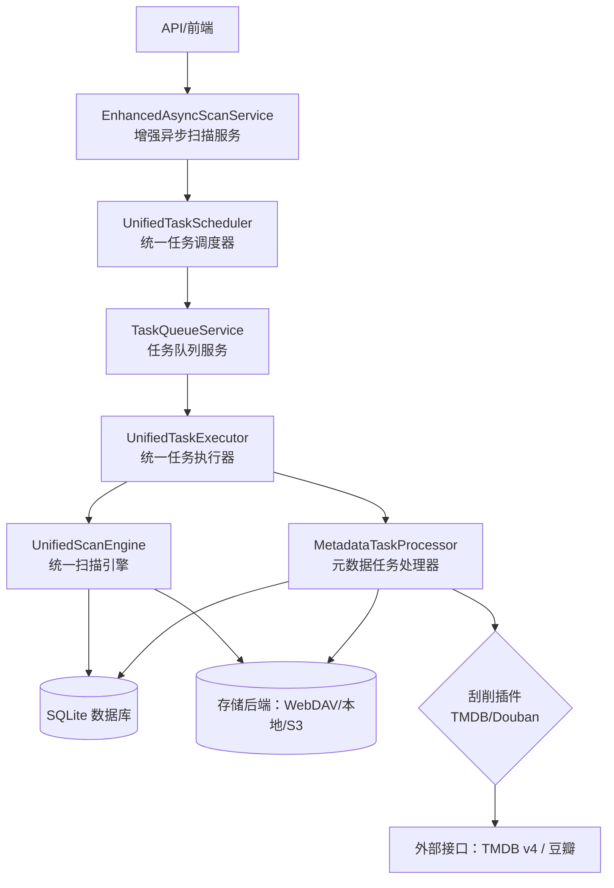
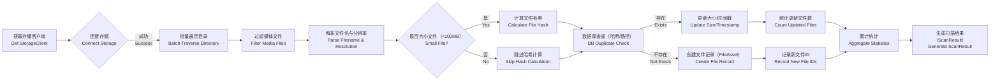
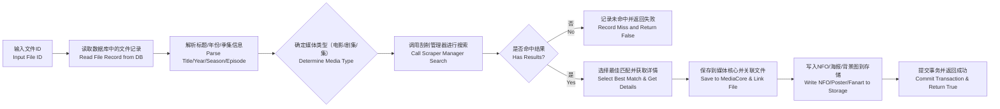
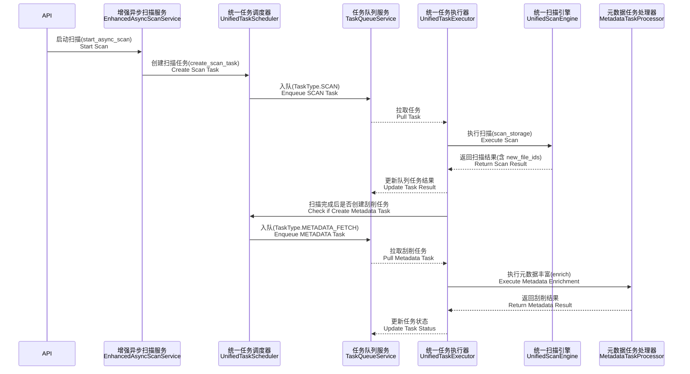
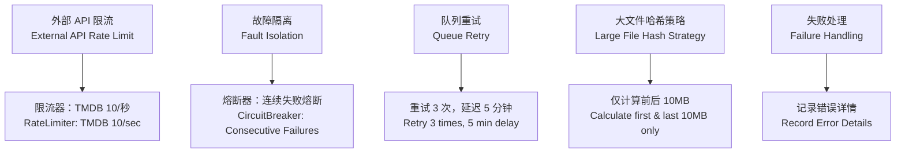

# 扫描与刮削流程图（中英双语版）

## 流程概览

## 扫描流程

## 刮削流程

## 任务生命周期

## 错误与保护

## 关键代码参考

| 功能 | 文件路径 | 行号 | 说明 |
|------|----------|------|------|
| 扫描入口 | `services/scan/unified_scan_engine.py` | 383 | 统一扫描引擎主入口 |
| 单文件处理 | `services/scan/unified_scan_engine.py` | 211 | 处理单个文件的逻辑 |
| 哈希计算与大文件优化 | `services/scan/unified_scan_engine.py` | 166 | 大文件哈希计算优化 |
| 入库逻辑（创建/更新） | `services/scan/unified_scan_engine.py` | 318 | 文件记录创建与更新 |
| 异步任务创建 | `services/scan/enhanced_async_scan_service.py` | 58 | 创建异步扫描任务 |
| 调度器创建扫描任务 | `services/scan/unified_task_scheduler.py` | 99 | 统一任务调度器创建扫描任务 |
| 调度器创建刮削任务（分批） | `services/scan/unified_task_scheduler.py` | 163 | 分批创建元数据任务 |
| 刮削器丰富 | `services/media/metadata_enricher.py` | 32 | 元数据丰富主入口 |
| 侧车写入 | `services/media/metadata_enricher.py` | 211 | 写入NFO、海报等侧车文件 |

## 方法解释（中文）

### 统一扫描引擎（UnifiedScanEngine）
统一扫描引擎是整个系统的核心组件，负责从各种存储后端（WebDAV、本地、S3）中发现和扫描媒体文件。它采用插件化架构，支持多种文件类型的识别和处理。

**主要功能：**
- 连接多种存储后端
- 批量遍历目录结构
- 智能识别媒体文件（视频、音频、图片、字幕）
- 解析文件名提取元数据（标题、年份、季集信息）
- 计算文件哈希用于去重
- 与数据库交互，创建或更新文件记录

**优化策略：**
- 大文件（>100MB）采用前后10MB分段哈希，避免完整读取
- 批量处理减少数据库操作次数
- 增量扫描基于文件大小和时间戳变化

### 统一任务调度器（UnifiedTaskScheduler）
任务调度器负责任务的生命周期管理，协调扫描任务和元数据丰富任务的执行顺序，支持任务依赖和优先级管理。

**核心能力：**
- 创建和管理扫描任务
- 批量创建元数据丰富任务
- 任务状态实时跟踪
- 支持任务优先级（紧急、高、普通、低）
- 任务执行结果统计

**任务协调：**
- 扫描任务完成后自动触发元数据任务
- 支持组合任务（扫描+元数据）
- 任务失败重试机制（3次重试，5分钟间隔）

### 增强异步扫描服务（EnhancedAsyncScanService）
提供对外的异步API接口，封装了任务创建的复杂性，为前端提供简单易用的扫描控制接口。

**API功能：**
- 启动异步扫描任务
- 启动元数据丰富任务
- 查询任务状态
- 获取用户任务列表
- 取消正在执行的任务

**性能特点：**
- 响应时间 <500ms
- 支持批量任务创建
- 提供任务执行时间预估

### 元数据任务处理器（MetadataTaskProcessor）
负责调用外部刮削API（TMDB、豆瓣）获取媒体元数据，并将结果保存到数据库和侧车文件中。

**刮削流程：**
1. 解析文件名提取标题、年份、季集信息
2. 根据媒体类型调用相应的刮削器
3. 搜索最佳匹配结果
4. 获取详细信息（剧情、演员、评分等）
5. 保存到数据库（MediaCore表）
6. 生成NFO文件和下载海报图片

**限流保护：**
- TMDB：10次/秒
- 豆瓣：5次/秒
- 连续失败触发熔断机制
- 支持多种语言（中文、英文等）

### 错误处理与保护机制
系统内置多层保护机制，确保在高并发和外部服务不稳定的情况下仍能稳定运行。

**保护策略：**
- **限流器**：防止对外部API的过度调用
- **熔断器**：连续失败时自动熔断，避免级联故障
- **重试机制**：失败后自动重试，最多3次，间隔5分钟
- **错误记录**：详细记录失败原因，便于排查问题
- **大文件优化**：避免对大文件进行完整哈希计算

这些机制共同保证了系统的稳定性和可靠性，即使在网络不稳定或外部服务暂时不可用的情况下，也能优雅地处理错误并恢复正常运行。