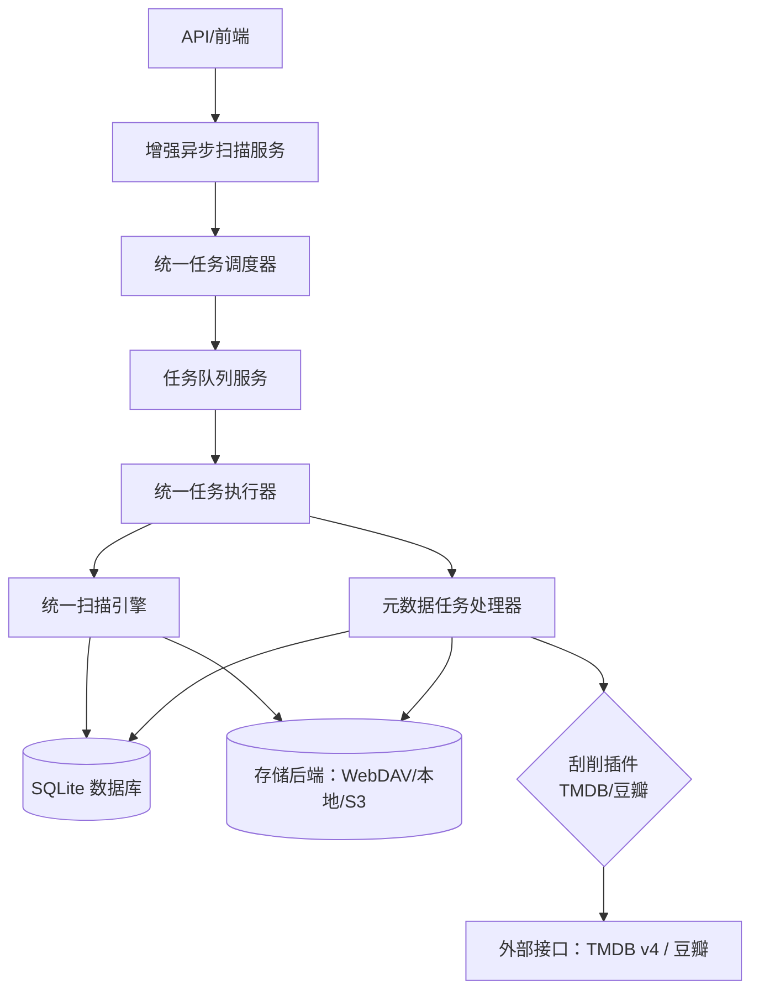
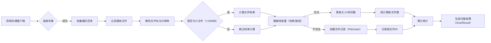
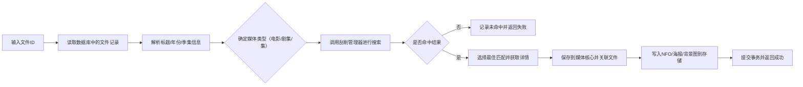
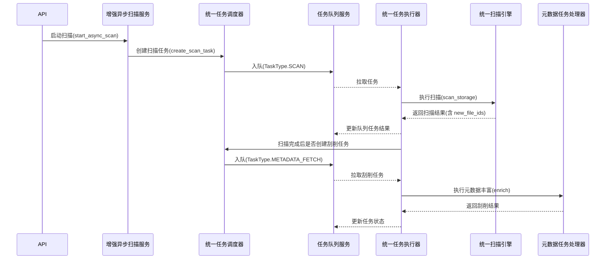
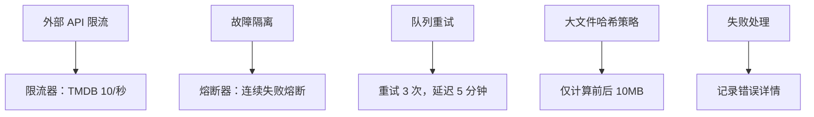

# 扫描与刮削流程图（统一架构）

## 流程概览

## 扫描流程

## 刮削流程

## 任务生命周期

## 错误与保护

## 关键代码参考

- 扫描入口：`services/scan/unified_scan_engine.py:383`
- 单文件处理：`services/scan/unified_scan_engine.py:211`
- 哈希计算与大文件优化：`services/scan/unified_scan_engine.py:166`
- 入库逻辑（创建/更新）：`services/scan/unified_scan_engine.py:318`
- 异步任务创建：`services/scan/enhanced_async_scan_service.py:58`
- 调度器创建扫描任务：`services/scan/unified_task_scheduler.py:99`
- 调度器创建刮削任务（分批）：`services/scan/unified_task_scheduler.py:163`
- 刮削器丰富：`services/media/metadata_enricher.py:32`
- 侧车写入：`services/media/metadata_enricher.py:211`