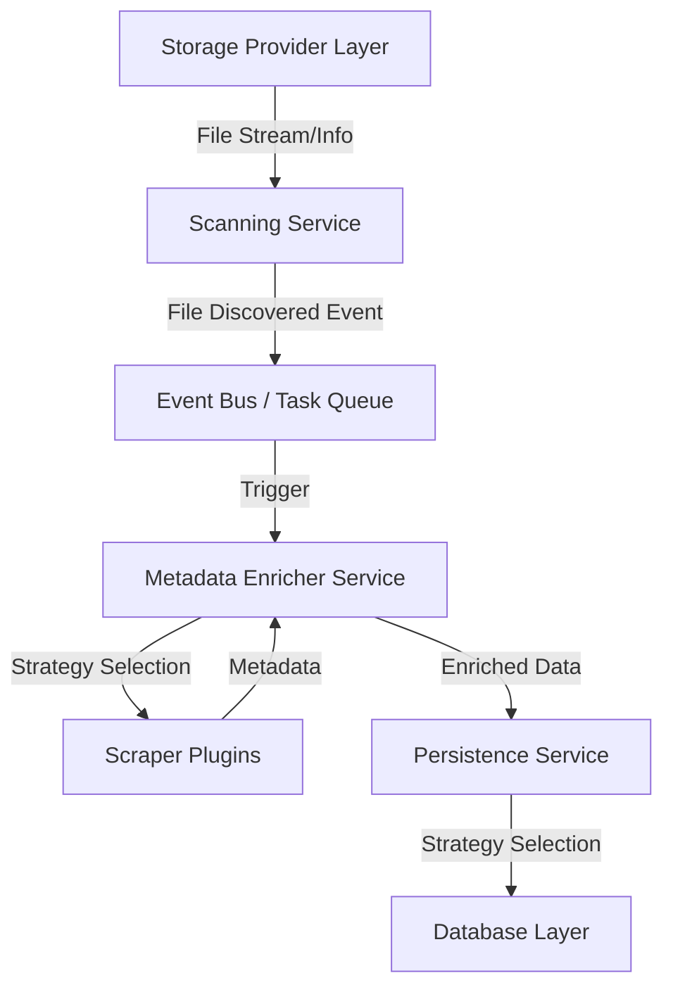

# Media Server Architecture Refactoring Design

## 1. Align (Alignment)

### 1.1 Project Context Analysis
The current backend `media-server` is a Django/FastAPI-like application (Python-based) handling media scanning, metadata enrichment, and persistence.
- **Scanning**: Currently tightly coupled with WebDAV in `enhanced_async_scan_service.py` (implied by user description, though code uses `UnifiedTaskScheduler`).
- **Enrichment**: `metadata_enricher.py` handles metadata fetching but is hardcoded for Movies and TV Series.
- **Persistence**: `metadata_persistence_service.py` and `media_models.py` are also hardcoded for Movies/TV Series.
- **Goal**: Decouple Storage/Scanning, Scanning/Enrichment, Enrichment/Persistence, and make the Database extensible for new media types (Anime, Variety, etc.).

### 1.2 Requirements Confirmation
1.  **Decouple Scanning & Storage**: Support generic storage providers (WebDAV, SMB, Local, Cloud).
2.  **Decouple Scanning & Enrichment**: Asynchronous processing, likely via a message queue or event bus.
3.  **Extensible Enrichment**: Support more media types (Variety, Anime, Music, etc.) without modifying core logic.
4.  **Extensible Database**: Flexible schema to support diverse media metadata.
5.  **Extensible Persistence**: Plugin-based or strategy-based persistence logic.

### 1.3 Decisions
- **Storage**: Use an abstract `StorageProvider` interface.
- **Event Bus**: Use a lightweight in-process event bus (e.g., `blinker` or custom asyncio-based) or a task queue (Celery/RQ - but sticking to existing `UnifiedTaskScheduler` is better if it exists). The user mentioned `enhanced_async_scan_service.py` uses `UnifiedTaskScheduler`.
- **Architecture**: Clean Architecture / Hexagonal Architecture principles.
- **Database**: Use `JSONB` (if PostgreSQL) or a flexible `EAV` (Entity-Attribute-Value) pattern, or inheritance with a `MediaCore` base and specialized extension tables (already partially implemented).

---

## 2. Architect (Architecture)

### 2.1 High-Level Architecture

### 2.2 Detailed Design

#### 2.2.1 Storage & Scanning Decoupling
**Current**: `enhanced_async_scan_service.py` likely calls a specific WebDAV client.
**Proposed**:
- Interface `IStorageProvider`:
    - `list_files(path)`
    - `get_file_info(path)`
    - `open_file(path)`
- Implementations: `WebDAVStorage`, `SMBStorage`, `LocalStorage`.
- `ScanService` accepts a `storage_provider` instance.

#### 2.2.2 Scanning & Enrichment Decoupling
**Current**: `enhanced_async_scan_service.py` calls `enable_metadata_enrichment` logic directly or via tight task coupling.
**Proposed**:
- **Producer**: `ScanService` publishes `FileDiscovered` events or pushes `MetadataTask` to a queue.
- **Consumer**: `EnrichmentWorker` listens for events/tasks.
- **Benefit**: Scanning is fast; enrichment (slow) happens asynchronously and can be scaled.

#### 2.2.3 Enrichment Extensibility
**Current**: `MetadataEnricher` has hardcoded `if type == MOVIE ... elif type == TV`.
**Proposed**:
- **Strategy Pattern**: `IMetadataStrategy`.
- **Registry**: `MetadataStrategyFactory`.
- **Strategies**: `MovieStrategy`, `TVSeriesStrategy`, `VarietyStrategy`, `AnimeStrategy`.
- `MetadataEnricher` determines type (via `FilenameParser` or user hint) -> gets Strategy -> `strategy.enrich(file)`.

#### 2.2.4 Database Extensibility
**Current**: `MediaCore` + `MovieExt` / `TVSeriesExt`.
**Proposed**:
- Keep `MediaCore` for common fields (title, year, plot).
- Use `MediaExtension` table (Polymorphic) or `JSON` field in `MediaCore` for flexible attributes.
- Or, formalized Extension Tables: `VarietyExt`, `AnimeExt`.
- **Recommendation**: Hybrid. `MediaCore` + `ExtensionTable` (for indexable structured data) + `extra_data` JSON field (for unstructured/changing data).

#### 2.2.5 Persistence Extensibility
**Current**: `metadata_persistence_service.py` has big `if/else` blocks.
**Proposed**:
- **Data Mappers**: `MovieMapper`, `SeriesMapper`.
- `PersistenceService` delegates to `Mapper` based on data type.

---

## 3. Atomize (Task Breakdown)

1.  **Storage Abstraction**: Define `StorageProvider` protocol and implement `WebDAV`, `Local` (Skeleton).
2.  **Scan Service Refactor**: Update `ScanService` to use `StorageProvider`.
3.  **Event/Queue Mechanism**: Define `FileDiscoveredEvent` and `EnrichmentTask`.
4.  **Enrichment Strategy**: Create `IMetadataStrategy` and refactor `MetadataEnricher` to use it.
5.  **Database Schema Update**: Design `VarietyExt` and `AnimeExt` (or generic approach).
6.  **Persistence Refactor**: Create `PersistenceStrategy` and refactor `MetadataPersistenceService`.

---

## 4. Documentation Generation (Output)
I will generate the design document in `media-server/docs/DESIGN_REFACTORING_2025.md`.

媒体服务器架构重构设计

1. 对齐 (需求分析)

1.1 项目背景分析

当前后端 media-server 是一个基于 Django/FastAPI 的应用（Python），负责媒体扫描、元数据丰富化和持久化。
• 扫描：当前与 WebDAV 紧密耦合在 enhanced_async_scan_service.py 中。

• 丰富化：metadata_enricher.py 处理元数据获取，但硬编码支持电影和电视剧。

• 持久化：metadata_persistence_service.py 和 media_models.py 同样硬编码支持电影/电视剧。

• 目标：解耦存储/扫描、扫描/丰富化、丰富化/持久化，并使数据库可扩展以支持新媒体类型（动漫、综艺等）。

1.2 需求确认

1.  解耦扫描与存储：支持通用存储提供商（WebDAV、SMB、本地、云存储）。
2.  解耦扫描与丰富化：通过消息队列或事件总线实现异步处理。
3.  可扩展的丰富化：支持更多媒体类型（综艺、动漫、音乐等），无需修改核心逻辑。
4.  可扩展的数据库：灵活的表结构支持多样化的媒体元数据。
5.  可扩展的持久化：基于插件或策略的持久化逻辑。

1.3 技术决策

• 存储：使用抽象的 StorageProvider 接口。

• 事件总线：使用轻量级进程内事件总线（如 blinker 或基于 asyncio 的自定义实现）或任务队列（Celery/RQ - 但如果现有 UnifiedTaskScheduler 存在则优先使用）。

• 架构：采用整洁架构/六边形架构原则。

• 数据库：使用 JSONB（如 PostgreSQL）或灵活的 EAV（实体-属性-值）模式，或使用继承方式（MediaCore 基类 + 专用扩展表，已部分实现）。

2. 架构设计

2.1 高层架构

graph TD
    A[存储提供商层] -->|文件流/信息| B[扫描服务]
    B -->|文件发现事件| C[事件总线 / 任务队列]
    C -->|触发| D[元数据丰富化服务]
    D -->|策略选择| E[刮削器插件]
    E -->|元数据| D
    D -->|丰富化数据| F[持久化服务]
    F -->|策略选择| G[数据库层]

2.2 详细设计

2.2.1 存储与扫描解耦

当前状态：enhanced_async_scan_service.py 直接调用特定的 WebDAV 客户端。
设计方案：
• 接口 IStorageProvider：

    ◦ list_files(path) - 列出文件

    ◦ get_file_info(path) - 获取文件信息

    ◦ open_file(path) - 打开文件

• 实现类：WebDAVStorage、SMBStorage、LocalStorage。

• ScanService 接收 storage_provider 实例。

2.2.2 扫描与丰富化解耦

当前状态：enhanced_async_scan_service.py 直接或通过紧密的任务耦合调用 enable_metadata_enrichment 逻辑。
设计方案：
• 生产者：ScanService 发布 FileDiscovered 事件或将 MetadataTask 推送到队列。

• 消费者：EnrichmentWorker 监听事件/任务。

• 优势：扫描快速；丰富化（较慢）异步执行且可扩展。

2.2.3 丰富化可扩展性

当前状态：MetadataEnricher 硬编码 if type == MOVIE ... elif type == TV。
设计方案：
• 策略模式：IMetadataStrategy 接口。

• 注册器：MetadataStrategyFactory 工厂类。

• 策略实现：MovieStrategy、TVSeriesStrategy、VarietyStrategy、AnimeStrategy。

• MetadataEnricher 确定类型（通过 FilenameParser 或用户提示）→ 获取策略 → strategy.enrich(file)。

2.2.4 数据库可扩展性

当前状态：MediaCore + MovieExt / TVSeriesExt 扩展表。
设计方案：
• 保留 MediaCore 用于公共字段（标题、年份、剧情）。

• 使用 MediaExtension 表（多态）或 MediaCore 中的 JSON 字段存储灵活属性。

• 或者，规范化的扩展表：VarietyExt、AnimeExt。

• 推荐：混合方案。MediaCore + ExtensionTable（用于可索引的结构化数据）+ extra_data JSON 字段（用于非结构化/变化数据）。

2.2.5 持久化可扩展性

当前状态：metadata_persistence_service.py 包含大量的 if/else 块。
设计方案：
• 数据映射器：MovieMapper、SeriesMapper。

• PersistenceService 根据数据类型委托给对应的 Mapper。

3. 任务分解

1.  存储抽象：定义 StorageProvider 协议并实现 WebDAV、Local 存储（骨架实现）。
2.  扫描服务重构：更新 ScanService 以使用 StorageProvider。
3.  事件/队列机制：定义 FileDiscoveredEvent 和 EnrichmentTask。
4.  丰富化策略：创建 IMetadataStrategy 并重构 MetadataEnricher 以使用该策略。
5.  数据库模式更新：设计 VarietyExt 和 AnimeExt 表（或通用方案）。
6.  持久化重构：创建 PersistenceStrategy 并重构 MetadataPersistenceService。

4. 文档生成

我将把设计文档生成在 media-server/docs/DESIGN_REFACTORING_2025.md 中。