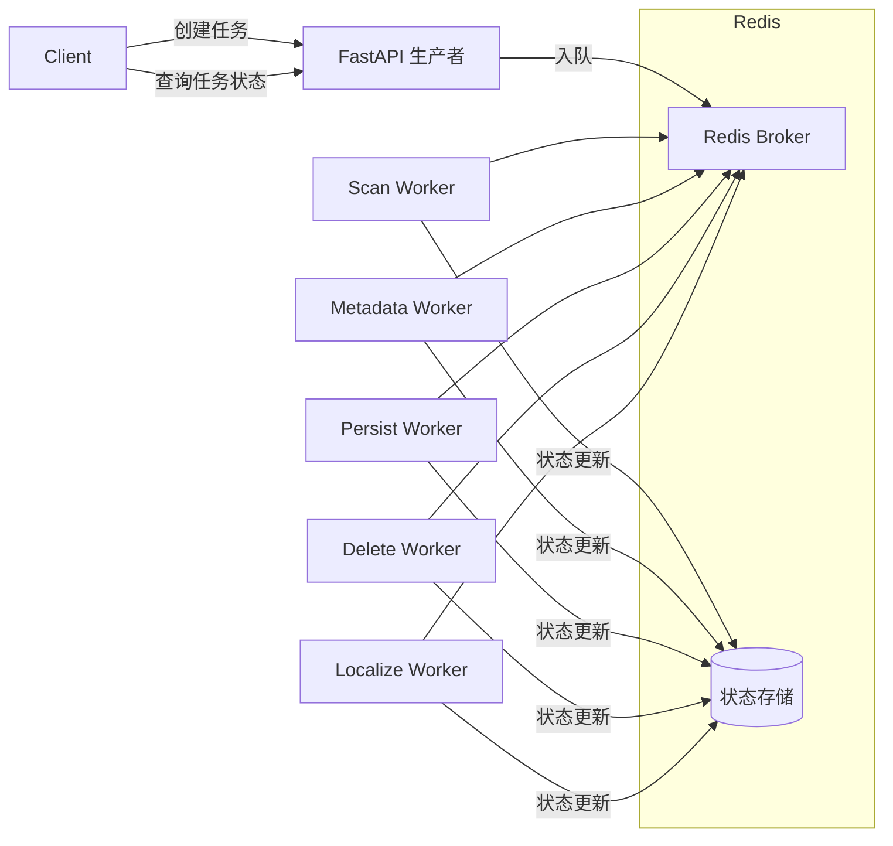
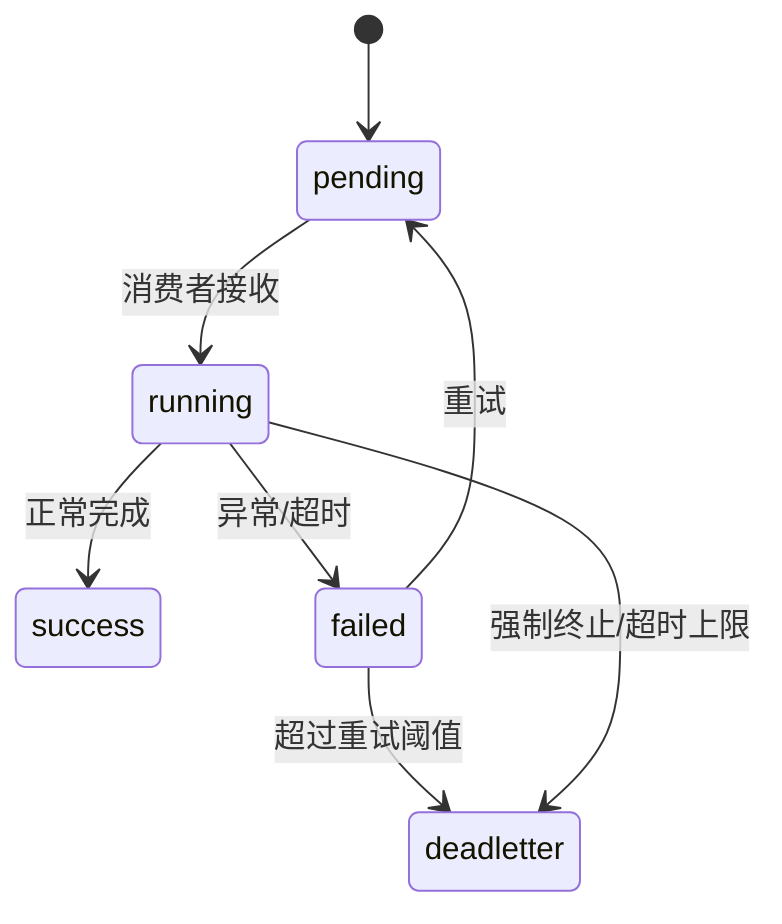
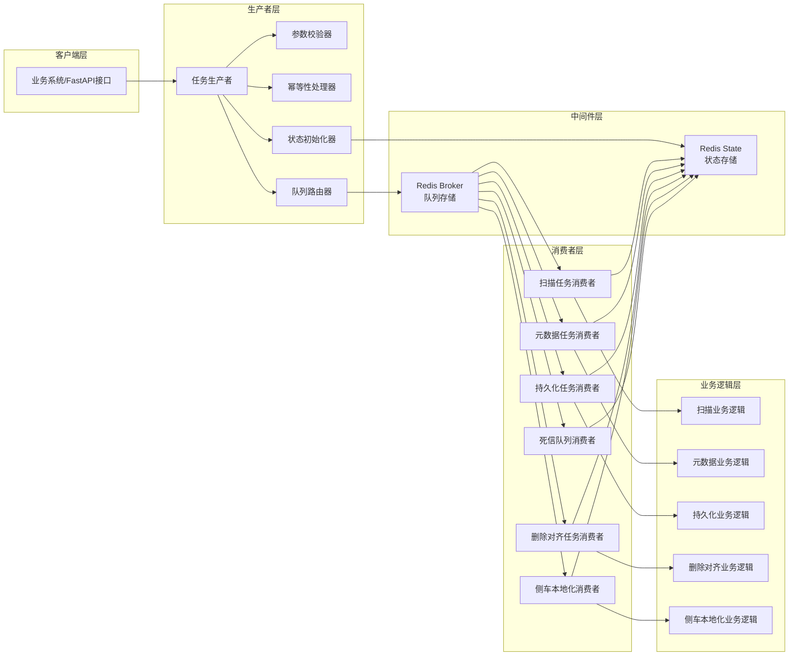
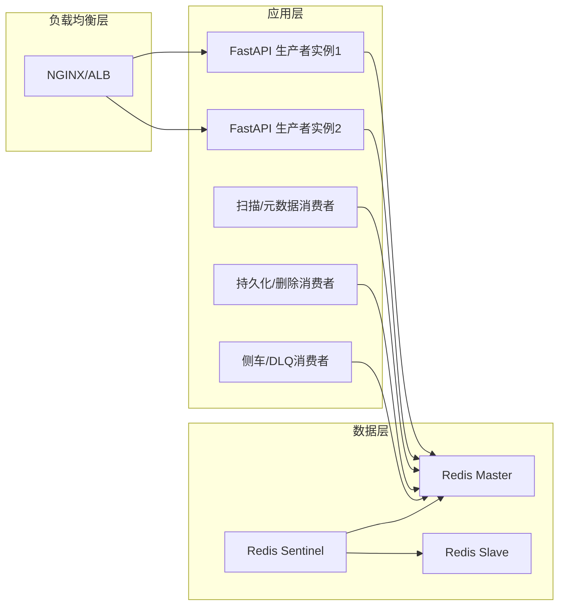

# Dramatiq + Redis 任务队列解耦设计方案

## 目标与核心原则
- 生产者只负责任务创建、参数校验、入队与任务状态初始化；不关心执行细节。
- 消费者独立进程/服务，按队列类型监听并执行任务；负责状态更新与异常处理。
- 状态统一存储在 Redis，以 `task_id` 为唯一关联键，支持查询、重试、DLQ（死信队列）。
- 队列按任务类型隔离，支持优先级与并发独立配置，保证资源与故障域隔离。

## 总体架构


组件说明：
- FastAPI 生产者：对外提供 REST API，校验参数，生成 `task_id`，写入状态初始记录，发布到指定队列。
- Dramatiq 消费者：按队列类型启动独立进程/服务，每类任务一个或多个 Actor，执行业务逻辑并回写状态。
- Redis：同时作为 Dramatiq Broker（消息队列）与状态存储（任务生命周期），支持有界 TTL 与索引集合。

## 任务类型与队列划分
- 队列名称：
  - `scan`（扫描）
  - `metadata`（元数据）
  - `persist`（持久化）
  - `delete`（删除对齐）
  - `localize`（侧车本地化）
- 可选优先级扩展：为每类队列增加 `*-high`、`*-low`，并通过独立消费者并发控制实现优先级。
- 并发与资源配置：每类消费者可独立设置进程数、线程数、预取（prefetch）与超时策略。

## 统一任务参数契约
通用字段（所有任务均包含）：
- `task_id`：系统生成（推荐 ULID），作为 Redis 状态主键与跨系统关联 ID。
- `task_type`：枚举值之一：`scan`|`metadata`|`persist`|`delete`|`localize`。
- `user_id`：发起用户标识（权限与审计）。
- `payload`：JSON 对象，承载类型特定参数。

各任务最小必需参数：
- 扫描 `scan`：`storage_id`、`scan_path`、`user_id`。
- 元数据 `metadata`：`user_id`、`file_ids`（数组）。
- 持久化 `persist`：`file_id`、`user_id`、`contract_type`、`contract_payload`（对象）。
- 删除对齐 `delete`：`user_id`、`storage_id`、`scan_path`、`encountered_media_paths`（数组）。
- 侧车本地化 `localize`：`file_id`、`storage_id`。

请求示例（生产者入队）：
```json
// POST /tasks/scan
{
  "user_id": "u_123",
  "storage_id": "st_001",
  "scan_path": "/media/photos"
}
```
```json
// POST /tasks/metadata
{
  "user_id": "u_123",
  "file_ids": ["f_1001", "f_1002"]
}
```
```json
// POST /tasks/persist
{
  "user_id": "u_123",
  "file_id": "f_1001",
  "contract_type": "s3_put",
  "contract_payload": {"bucket": "media", "key": "f_1001.jpg"}
}
```
```json
// POST /tasks/delete
{
  "user_id": "u_123",
  "storage_id": "st_001",
  "scan_path": "/media/photos",
  "encountered_media_paths": ["/media/photos/a.jpg", "/media/photos/b.jpg"]
}
```
```json
// POST /tasks/localize
{
  "file_id": "f_1001",
  "storage_id": "st_001",
  "user_id": "u_123"
}
```

## 任务生命周期与状态流转
- 状态枚举：`pending`（待执行）、`running`（执行中）、`success`（成功）、`failed`（失败）、`deadletter`（死信）。
- 状态流转：

- 重试策略：指数退避（最小/最大回退）、最大重试次数、幂等保障（以 `task_id` 和业务主键去重）。
- 超时控制：按任务类型配置 TimeLimit（硬超时）与软超时（业务层）。
- 死信队列：当重试超过阈值或超时上限，消息路由至 `*-dlq` 并将状态标记为 `deadletter`。

## Redis 状态存储模型
- 主键：`task:{task_id}`（Hash）
  - `task_id`、`task_type`、`queue`、`status`
  - `payload`（JSON 字符串）
  - `attempts`、`max_retries`、`time_limit_ms`
  - `created_at`、`updated_at`、`started_at`、`finished_at`
  - `error_code`、`error_message`（失败时）
- 索引集合：
  - `tasks:by_status:{status}`（Set，成员为 `task_id`）
  - `tasks:by_type:{task_type}`（Set）
  - `tasks:timeline`（Sorted Set，score=时间戳，member=`task_id`）
- 事件流水（可选）：`task:events:{task_id}`（List，记录状态变更与备注）。
- TTL 策略：`success/failed/deadletter` 状态可设置 TTL（如 7 天）；`pending/running` 不设 TTL 或较长 TTL，防止活跃任务被清理。

## Dramatiq 配置与中间件
- Broker：`RedisBroker`（命名空间隔离，如 `mediacmn:`），通过 `REDIS_URL` 连接。
- 中间件：
  - `Retries`：支持最大重试次数、指数退避（`min_backoff`, `max_backoff`）。
  - `TimeLimit`：强制任务在指定毫秒内完成。
  - `Result`（可选）：如需返回值存储；本方案以 Redis 状态为准。
  - 观测：接入日志与指标（如 Prometheus 导出器或自定义）。
- Actor 约定：
  - 每类任务定义独立 Actor，明确 `queue_name`、`max_retries`、`time_limit_ms`。
  - Actor 入参包含 `task_id` 与类型特定 `payload`，执行过程中按阶段写回状态与进度。

## 生产者（任务创建）设计
- REST API：
  - `POST /tasks/scan`
  - `POST /tasks/metadata`
  - `POST /tasks/persist`
  - `POST /tasks/delete`
  - `POST /tasks/localize`
  api调用生产者py文件中对应的任务创建方法
- 处理流程：
  1. 参数校验（Pydantic Schema），补充默认值与标准化（路径、ID 规范）。
  2. 生成 `task_id`（ULID/UUIDv7），构建 `task:{id}` 初始状态为 `pending`。
  3. 写入索引集合（by_status/by_type/timeline）。
  4. 发布 Dramatiq 消息到对应队列，消息体携带 `task_id` 与 `payload`。
  5. 返回 `task_id` 与状态查询链接给调用方。
- 幂等与去重：支持可选 `idempotency_key`，使用 `SETNX` 映射到 `task_id`，避免重复入队。

### 生产者模块接口约定
- 模块路径建议：`services/task/producer.py`
- 统一方法（供 API 与其他任务调用）：
```python
def create_scan_task(user_id: str, storage_id: str, scan_path: str, *, priority: str = "normal", idempotency_key: str | None = None) -> str: ...

def create_metadata_task(user_id: str, file_ids: list[str], *, priority: str = "normal", idempotency_key: str | None = None) -> str: ...

def create_persist_task(user_id: str, file_id: str, contract_type: str, contract_payload: dict, *, priority: str = "normal", idempotency_key: str | None = None) -> str: ...

def create_delete_task(user_id: str, storage_id: str, scan_path: str, encountered_media_paths: list[str], *, priority: str = "normal", idempotency_key: str | None = None) -> str: ...

def create_localize_task(user_id: str, file_id: str, storage_id: str, *, priority: str = "normal", idempotency_key: str | None = None) -> str: ...
```
- 方法职责：
  - 校验与标准化参数（Pydantic 模型）。
  - 生成 `task_id` 并在 Redis 写入初始状态与索引。
  - 发布到对应队列（`scan`/`metadata`/`persist`/`delete`/`localize`）。
  - 返回 `task_id`（供 API 响应或链式任务继续使用）。
- 调用关系：
  - API 层仅调用上述方法，无需关心队列与状态细节。
  - 消费者在任务完成后可调用上述方法创建后续任务（例如扫描完成后创建元数据任务）。

示例（消费者内链式调用）：
```python
task_id = create_scan_task(user_id, storage_id, scan_path)
# 扫描完成后，按结果批量创建元数据任务
for batch in file_id_batches:
    create_metadata_task(user_id, batch)
```

## 消费者（任务执行）设计
- 进程模型：按队列类型独立运行，可在同一二进制/容器中以多进程/线程启动多个 Actor。
- 执行流程：
  1. 取消息后将 `task:{id}.status` 置为 `running`，记录 `started_at`。
  2. 解析 `payload`，调用对应业务逻辑（扫描、元数据、持久化、删除、侧车本地化）。
  3. 成功：写入结果摘要（可选），置 `success`，记录 `finished_at` 并维护索引集合。
  4. 失败：增加 `attempts`，记录 `error_code/error_message`，若未达阈值，交由 `Retries` 重试；超阈后标记 `deadletter` 并路由至 `*-dlq`。
- 超时与取消：
  - `TimeLimit` 触发强制终止，状态置 `deadletter` 并记录原因。
  - 支持 `cancel` 指令（可选），将状态置为 `deadletter` 并终止执行（需业务协作）。

## 监控、运维与可观测性
- 指标：入队/出队速率、成功率、失败率、平均执行时长、重试次数分布、DLQ 积压量。
- 日志：统一结构化日志（含 `task_id`、`message_id`、`queue`、`actor`、`status`）。
- 状态查询：`GET /tasks/{task_id}` 返回当前状态与关键元数据；支持按 `status/type` 列表查询。
- DLQ 管理：提供 `requeue` API 或管理 CLI，将死信任务重新入队或批量清理。

## 安全与多租户
- 输入校验与类型安全：严格 Pydantic 校验；路径白名单与正则校验。
- 授权与隔离：按 `user_id/tenant` 进行资源访问控制；任务只可访问授权范围内存储与文件。
- 数据脱敏：任务日志与错误信息避免泄露敏感数据（路径、密钥）。

## 部署与运行（参考）
- 组件拆分：`api`（FastAPI 生产者）、`workers`（Dramatiq 消费者）、`redis`（Broker+状态）。
- 环境变量：
  - `REDIS_URL`、`DRAMATIQ_NAMESPACE`
  - `WORKER_PROCESSES`、`WORKER_THREADS`
  - `TASK_DEFAULT_MAX_RETRIES`、`TASK_DEFAULT_MIN_BACKOFF_MS`、`TASK_DEFAULT_MAX_BACKOFF_MS`
- 运行方式：
  - 生产者：随 API 服务启动。
  - 消费者：为每类任务单独启动进程（示例：`dramatiq media_server.services.task.consumers -Q scan,metadata,persist,delete,localize`）。

## 验收标准（设计阶段）
- 明确的队列划分与消费者职责；可独立扩容每类任务。
- 统一参数契约，含最小必需字段与示例；生产者只负责入队。
- 完整生命周期与状态模型；Redis 结构可查询、可索引、可清理。
- 明确重试、超时、死信策略；可观测性指标与日志方案。
- 部署与环境变量清晰；后续实现路径明确。

## 后续实施建议
- 定义 Pydantic 模型与 REST API 路由；接入 RedisBroker 与中间件。
- 为每类任务实现独立 Actor 与业务逻辑适配层（入参解析、输出标准化）。
- 编写状态存储库（读/写/索引维护）与查询接口；实现 DLQ 管理。
- 配置 CI 运行消费者健康检查与端到端集成测试（含重试与超时场景）。


# Dramatiq + Redis 任务队列解耦设计方案（终极版）
## 一、整体架构总览
### 1.1 架构图


### 1.2 核心组件说明
| 组件 | 职责 | 技术实现 |
|------|------|----------|
| 生产者层 | 任务创建、参数校验、幂等处理、状态初始化、队列路由 | FastAPI + Pydantic + Redis |
| 中间件层 | 队列存储（消息传递）、状态存储（生命周期管理） | Redis + Dramatiq Broker |
| 消费者层 | 队列监听、任务执行、状态更新、异常处理、重试/DLQ | Dramatiq Actor + 独立进程 |
| 业务逻辑层 | 各类任务的核心业务实现（与队列解耦） | 原有业务逻辑封装 |

## 二、统一数据契约设计
### 2.1 通用任务参数格式
所有任务统一遵循以下结构，通过 `task_type` 区分任务类型：
```json
{
  "task_id": "ulid/ uuid4",  // 全局唯一任务ID
  "task_type": "scan/metadata/persist/delete/localize",  // 任务类型
  "user_id": "string",  // 发起用户ID（必填）
  "payload": {},  // 类型特定参数（见2.2）
  "context": {  // 上下文信息（可选）
    "priority": 0-3,  // 优先级（0=低，1=正常，2=高，3=紧急）
    "max_retries": 3,  // 最大重试次数
    "time_limit_ms": 3600000,  // 任务超时时间（毫秒）
    "idempotency_key": "string",  // 幂等键（可选）
    "trace_id": "string"  // 链路追踪ID（可选）
  }
}
```

### 2.2 各任务类型 payload 定义（Pydantic 模型）
```python
from pydantic import BaseModel, Field
from typing import List, Dict, Optional

# 基础模型（公共字段）
class BasePayload(BaseModel):
    user_id: str = Field(..., description="发起用户ID")

# 扫描任务参数
class ScanPayload(BasePayload):
    storage_id: str = Field(..., description="存储配置ID")
    scan_path: str = Field("/", description="扫描路径")
    recursive: bool = Field(True, description="是否递归扫描")
    max_depth: int = Field(10, description="最大递归深度")
    enable_metadata_enrichment: bool = Field(False, description="是否启用元数据丰富")
    enable_delete_sync: bool = Field(True, description="是否启用删除对齐")
    batch_size: int = Field(100, description="批量处理大小")
    language: str = Field("zh-CN", description="语言")

# 元数据任务参数
class MetadataPayload(BasePayload):
    file_ids: List[str] = Field(..., description="文件ID列表（必填）")
    language: str = Field("zh-CN", description="语言")
    batch_size: int = Field(20, description="每批处理文件数")

# 持久化任务参数
class PersistPayload(BasePayload):
    file_id: str = Field(..., description="文件ID（必填）")
    contract_type: str = Field(..., description="契约类型（如movie/episode/series）")
    contract_payload: Dict = Field(..., description="契约内容（必填）")
    version_context: Dict = Field(default_factory=dict, description="版本上下文")

# 删除对齐任务参数
class DeletePayload(BasePayload):
    storage_id: str = Field(..., description="存储配置ID（必填）")
    scan_path: str = Field(..., description="扫描路径（必填）")
    encountered_media_paths: List[str] = Field(..., description="已发现的媒体路径列表（必填）")

# 侧车本地化任务参数
class LocalizePayload(BasePayload):
    file_id: str = Field(..., description="文件ID（必填）")
    storage_id: str = Field(..., description="存储配置ID（必填）")
    language: str = Field("zh-CN", description="语言")
```

### 2.3 任务状态枚举
```python
from enum import Enum

class TaskStatus(str, Enum):
    PENDING = "pending"  # 待执行（已入队）
    RUNNING = "running"  # 执行中
    SUCCESS = "success"  # 执行成功
    FAILED = "failed"    # 执行失败（未达重试阈值）
    DEADLETTER = "deadletter"  # 死信（超过重试阈值/超时上限）
    CANCELLED = "cancelled"  # 已取消
```

## 三、Redis 存储模型设计
### 3.1 核心存储结构
#### 3.1.1 任务详情存储（Hash）
- Key：`task:{task_id}`
- 字段：
```
task_id: 任务ID（与Key一致）
task_type: 任务类型
queue: 所属队列名称
status: 任务状态（TaskStatus枚举值）
payload: payload的JSON字符串
context: context的JSON字符串
attempts: 当前重试次数（默认0）
max_retries: 最大重试次数
time_limit_ms: 超时时间（毫秒）
created_at: 创建时间（UTC ISO8601）
updated_at: 最后更新时间（UTC ISO8601）
started_at: 开始执行时间（UTC ISO8601，执行中时填充）
finished_at: 结束时间（UTC ISO8601，成功/失败/死信时填充）
error_code: 错误码（失败/死信时填充）
error_message: 错误信息（失败/死信时填充）
result: 执行结果摘要（成功时填充，JSON字符串）
```

#### 3.1.2 索引集合（用于快速查询）
| Key | 类型 | 用途 | 成员格式 |
|-----|------|------|----------|
| `tasks:by_status:{status}` | Set | 按状态筛选任务 | task_id |
| `tasks:by_type:{task_type}` | Set | 按类型筛选任务 | task_id |
| `tasks:by_user:{user_id}` | Set | 按用户筛选任务 | task_id |
| `tasks:timeline` | Sorted Set | 按时间排序任务 | score=时间戳（created_at），member=task_id |
| `idempotency:{key}` | String | 幂等键映射 | value=task_id，过期时间24小时 |

#### 3.1.3 死信队列存储（List）
- Key：`queue:{queue_name}-dlq`
- 成员：任务消息的JSON字符串（与原队列消息格式一致）

### 3.2 TTL 策略
- `status=SUCCESS/FAILED/CANCELLED`：TTL=7天（自动清理历史任务）
- `status=DEADLETTER`：TTL=30天（保留死信供排查）
- `status=PENDING/RUNNING`：无TTL（避免活跃任务被清理）
- 索引集合：通过定时任务清理过期任务的ID（与任务详情TTL同步）

## 四、生产者设计（任务创建）
### 4.1 核心职责
1. 接收业务请求，通过 Pydantic 模型做参数校验与标准化
2. 幂等性处理（基于 `idempotency_key` 避免重复创建）
3. 生成全局唯一 `task_id`（优先ULID，降级UUID4）
4. 初始化任务状态（`PENDING`）并写入Redis
5. 路由任务到对应队列（按任务类型）
6. 返回 `task_id` 给调用方

### 4.2 实现代码（生产者核心逻辑）
```python
import logging
import uuid
from typing import Optional, Dict
from datetime import datetime, timezone

import ulid
from pydantic import ValidationError

from core.redis import get_redis_client
from .models import (
    TaskStatus, ScanPayload, MetadataPayload, PersistPayload,
    DeletePayload, LocalizePayload
)
from .constants import (
    PRIORITY_MAPPING, QUEUE_MAPPING, DEFAULT_MAX_RETRIES,
    DEFAULT_TIME_LIMITS
)

logger = logging.getLogger(__name__)
redis_client = get_redis_client()

# 队列映射（任务类型→队列名称）
QUEUE_MAPPING = {
    "scan": "scan-queue",
    "metadata": "metadata-queue",
    "persist": "persist-queue",
    "delete": "delete-queue",
    "localize": "localize-queue"
}

# 优先级映射（字符串→整数）
PRIORITY_MAPPING = {
    "low": 0,
    "normal": 1,
    "high": 2,
    "urgent": 3
}

# 默认超时配置（按任务类型）
DEFAULT_TIME_LIMITS = {
    "scan": 3600000,  # 1小时
    "metadata": 7200000,  # 2小时
    "persist": 3600000,  # 1小时
    "delete": 1800000,  # 30分钟
    "localize": 1800000  # 30分钟
}

def _generate_task_id() -> str:
    """生成任务ID（优先ULID，降级UUID4）"""
    try:
        return str(ulid.new())
    except Exception:
        return uuid.uuid4().hex

def _get_current_iso_time() -> str:
    """获取当前UTC时间（ISO8601格式）"""
    return datetime.now(timezone.utc).isoformat()

async def _check_idempotency(idempotency_key: Optional[str]) -> Optional[str]:
    """检查幂等键，返回已存在的task_id（不存在返回None）"""
    if not idempotency_key:
        return None
    key = f"idempotency:{idempotency_key}"
    existing_task_id = await redis_client.get(key)
    if existing_task_id:
        logger.info(f"幂等键已存在：key={idempotency_key}, task_id={existing_task_id}")
        return existing_task_id.decode() if isinstance(existing_task_id, bytes) else existing_task_id
    return None

async def _bind_idempotency_key(idempotency_key: str, task_id: str, ttl_seconds: int = 86400):
    """绑定幂等键与task_id（24小时过期）"""
    key = f"idempotency:{idempotency_key}"
    await redis_client.setex(key, ttl_seconds, task_id)

async def _init_task_state(task_id: str, task_type: str, payload: Dict, context: Dict):
    """初始化任务状态到Redis"""
    queue_name = QUEUE_MAPPING[task_type]
    current_time = _get_current_iso_time()
    
    # 构建任务详情Hash
    task_data = {
        "task_id": task_id,
        "task_type": task_type,
        "queue": queue_name,
        "status": TaskStatus.PENDING.value,
        "payload": str(payload),  # JSON字符串
        "context": str(context),  # JSON字符串
        "attempts": "0",
        "max_retries": str(context.get("max_retries", DEFAULT_MAX_RETRIES)),
        "time_limit_ms": str(context.get("time_limit_ms", DEFAULT_TIME_LIMITS[task_type])),
        "created_at": current_time,
        "updated_at": current_time,
        "started_at": "",
        "finished_at": "",
        "error_code": "",
        "error_message": "",
        "result": ""
    }
    
    # 写入任务详情
    await redis_client.hset(f"task:{task_id}", mapping=task_data)
    
    # 写入索引集合
    await redis_client.sadd(f"tasks:by_status:{TaskStatus.PENDING.value}", task_id)
    await redis_client.sadd(f"tasks:by_type:{task_type}", task_id)
    await redis_client.sadd(f"tasks:by_user:{payload['user_id']}", task_id)
    await redis_client.zadd("tasks:timeline", {task_id: datetime.fromisoformat(current_time).timestamp()})
    
    # 设置TTL（PENDING状态暂不设TTL）
    return task_data

async def _enqueue_task(task_id: str, task_type: str, payload: Dict, context: Dict):
    """将任务发送到Dramatiq队列"""
    from .consumers import (
        scan_actor, metadata_actor, persist_actor, delete_actor, localize_actor
    )
    
    # 任务类型→Actor映射
    actor_mapping = {
        "scan": scan_actor,
        "metadata": metadata_actor,
        "persist": persist_actor,
        "delete": delete_actor,
        "localize": localize_actor
    }
    
    actor = actor_mapping.get(task_type)
    if not actor:
        raise ValueError(f"不支持的任务类型：{task_type}")
    
    # 构建消息体
    message = {
        "task_id": task_id,
        "task_type": task_type,
        "payload": payload,
        "context": context
    }
    
    # 发送任务（带优先级）
    priority = context.get("priority", PRIORITY_MAPPING["normal"])
    actor.send_with_options(
        args=(message,),
        priority=priority,
        max_retries=context.get("max_retries", DEFAULT_MAX_RETRIES),
        time_limit=context.get("time_limit_ms", DEFAULT_TIME_LIMITS[task_type]) / 1000  # Dramatiq时间单位为秒
    )
    
    logger.info(f"任务入队成功：task_id={task_id}, task_type={task_type}, queue={actor.queue_name}, priority={priority}")

# ------------------------------ 对外暴露的创建任务接口 ------------------------------
async def create_scan_task(
    user_id: str,
    storage_id: str,
    scan_path: str = "/",
    recursive: bool = True,
    enable_metadata_enrichment: bool = False,
    enable_delete_sync: bool = True,
    priority: str = "normal",
    idempotency_key: Optional[str] = None,
    trace_id: Optional[str] = None
) -> str:
    """创建扫描任务"""
    try:
        # 1. 幂等性检查
        existing_task_id = await _check_idempotency(idempotency_key)
        if existing_task_id:
            return existing_task_id
        
        # 2. 参数校验与标准化
        payload = ScanPayload(
            user_id=user_id,
            storage_id=storage_id,
            scan_path=scan_path,
            recursive=recursive,
            enable_metadata_enrichment=enable_metadata_enrichment,
            enable_delete_sync=enable_delete_sync
        ).model_dump()
        
        # 3. 构建上下文
        context = {
            "priority": PRIORITY_MAPPING.get(priority.lower(), PRIORITY_MAPPING["normal"]),
            "max_retries": DEFAULT_MAX_RETRIES,
            "time_limit_ms": DEFAULT_TIME_LIMITS["scan"],
            "idempotency_key": idempotency_key,
            "trace_id": trace_id
        }
        
        # 4. 生成task_id并初始化状态
        task_id = _generate_task_id()
        await _init_task_state(task_id, "scan", payload, context)
        
        # 5. 绑定幂等键
        if idempotency_key:
            await _bind_idempotency_key(idempotency_key, task_id)
        
        # 6. 入队
        await _enqueue_task(task_id, "scan", payload, context)
        
        return task_id
    
    except ValidationError as e:
        logger.error(f"扫描任务参数校验失败：{e}")
        raise
    except Exception as e:
        logger.error(f"创建扫描任务失败：{e}")
        # 入队失败，更新状态为FAILED
        if 'task_id' in locals():
            await redis_client.hset(
                f"task:{task_id}",
                mapping={
                    "status": TaskStatus.FAILED.value,
                    "error_code": "enqueue_failed",
                    "error_message": str(e),
                    "updated_at": _get_current_iso_time(),
                    "finished_at": _get_current_iso_time()
                }
            )
            await redis_client.srem(f"tasks:by_status:{TaskStatus.PENDING.value}", task_id)
            await redis_client.sadd(f"tasks:by_status:{TaskStatus.FAILED.value}", task_id)
        raise

# 其他任务创建接口（metadata/persist/delete/localize）实现逻辑类似
async def create_metadata_task(...) -> str: ...
async def create_persist_task(...) -> str: ...
async def create_delete_task(...) -> str: ...
async def create_localize_task(...) -> str: ...
```

### 4.3 生产者部署与调用
#### 4.3.1 部署方式
- 嵌入 FastAPI 服务中，作为接口层的一部分
- 依赖：`redis-py`（异步）、`pydantic`、`ulid-py`、`dramatiq`
- 环境变量配置：
  ```env
  REDIS_URL=redis://localhost:6379/0  # Redis连接地址
  DRAMATIQ_NAMESPACE=media_task  # 队列命名空间（隔离环境）
  DEFAULT_MAX_RETRIES=3  # 默认最大重试次数
  ```

#### 4.3.2 API 调用示例（FastAPI 接口）
```python
from fastapi import APIRouter, HTTPException
from typing import List, Optional

from .producers import (
    create_scan_task, create_metadata_task, create_persist_task,
    create_delete_task, create_localize_task
)

router = APIRouter(prefix="/tasks", tags=["任务管理"])

@router.post("/scan", response_model=dict)
async def api_create_scan_task(
    user_id: str,
    storage_id: str,
    scan_path: str = "/",
    recursive: bool = True,
    enable_metadata_enrichment: bool = False,
    priority: str = "normal",
    idempotency_key: Optional[str] = None,
    trace_id: Optional[str] = None
):
    try:
        task_id = await create_scan_task(
            user_id=user_id,
            storage_id=storage_id,
            scan_path=scan_path,
            recursive=recursive,
            enable_metadata_enrichment=enable_metadata_enrichment,
            priority=priority,
            idempotency_key=idempotency_key,
            trace_id=trace_id
        )
        return {"task_id": task_id, "status": "created", "message": "任务创建成功"}
    except Exception as e:
        raise HTTPException(status_code=400, detail=str(e))

# 其他任务API接口（/metadata、/persist、/delete、/localize）类似
```

## 五、消费者设计（任务执行）
### 5.1 核心职责
1. 独立进程运行，监听指定队列
2. 接收队列消息，解析任务参数
3. 更新任务状态为 `RUNNING`
4. 调用对应业务逻辑执行任务
5. 执行结果处理：
   - 成功：更新状态为 `SUCCESS`，记录结果
   - 失败：更新重试次数，未达阈值则触发重试；达阈值则标记为 `DEADLETTER` 并路由到DLQ
6. 超时控制：通过 Dramatiq 中间件强制终止超时任务
7. 异常捕获：记录详细错误信息，便于排查

### 5.2 消费者核心配置（Dramatiq 中间件）
```python
import dramatiq
from dramatiq.brokers.redis import RedisBroker
from dramatiq.middleware import Retries, Timeouts, Callbacks
from core.config import get_settings

settings = get_settings()

# 初始化Redis Broker（命名空间隔离）
redis_broker = RedisBroker(
    url=settings.REDIS_URL,
    namespace=settings.DRAMATIQ_NAMESPACE
)

# 注册中间件
redis_broker.add_middleware(
    Retries(
        max_retries=3,  # 默认最大重试次数（可被任务级配置覆盖）
        min_backoff=5000,  # 最小重试间隔（5秒）
        max_backoff=300000,  # 最大重试间隔（5分钟）
        factor=2  # 指数退避因子
    )
)
redis_broker.add_middleware(
    Timeouts(
        timeout=3600  # 默认超时（1小时，可被任务级配置覆盖）
    )
)
redis_broker.add_middleware(Callbacks())  # 支持任务回调

# 设置全局Broker
dramatiq.set_broker(redis_broker)
```

### 5.3 消费者 Actor 实现（按任务类型）
```python
import logging
from typing import Dict
from datetime import datetime, timezone

from core.redis import get_redis_client
from .models import TaskStatus
from .constants import QUEUE_MAPPING
from services.scan.unified_scan_engine import get_unified_scan_engine
from services.media.metadata_enricher import metadata_enricher
from services.media.metadata_persistence_service import persistence_service
from services.media.delete_sync_service import DeleteSyncService
from services.media.sidecar_localize_processor import SidecarLocalizeProcessor

logger = logging.getLogger(__name__)
redis_client = get_redis_client()

# 初始化业务服务（启动时初始化，避免重复创建）
scan_engine = None
delete_sync_service = DeleteSyncService()
sidecar_processor = SidecarLocalizeProcessor()

@dramatiq.actor(on_startup=True)
async def initialize_worker_resources():
    """Worker启动时初始化资源"""
    global scan_engine
    scan_engine = await get_unified_scan_engine()
    logger.info("消费者资源初始化完成：扫描引擎、删除同步服务、侧车处理器")

def _get_current_iso_time() -> str:
    """获取当前UTC时间"""
    return datetime.now(timezone.utc).isoformat()

async def _update_task_status(
    task_id: str,
    status: TaskStatus,
    error_code: str = "",
    error_message: str = "",
    result: Dict = None
):
    """更新任务状态到Redis"""
    current_time = _get_current_iso_time()
    update_data = {
        "status": status.value,
        "updated_at": current_time
    }
    
    if status in [TaskStatus.RUNNING]:
        update_data["started_at"] = current_time
    elif status in [TaskStatus.SUCCESS, TaskStatus.FAILED, TaskStatus.DEADLETTER, TaskStatus.CANCELLED]:
        update_data["finished_at"] = current_time
    
    if error_code:
        update_data["error_code"] = error_code
    if error_message:
        update_data["error_message"] = error_message[:1000]  # 限制错误信息长度
    if result:
        update_data["result"] = str(result)
    
    # 更新任务详情
    await redis_client.hset(f"task:{task_id}", mapping=update_data)
    
    # 更新索引集合（移除旧状态，添加新状态）
    old_status = (await redis_client.hget(f"task:{task_id}", "status")).decode()
    await redis_client.srem(f"tasks:by_status:{old_status}", task_id)
    await redis_client.sadd(f"tasks:by_status:{status.value}", task_id)
    
    # 设置TTL（成功/失败/取消任务7天过期，死信30天）
    if status == TaskStatus.SUCCESS:
        await redis_client.expire(f"task:{task_id}", 604800)  # 7天
    elif status == TaskStatus.FAILED or status == TaskStatus.CANCELLED:
        await redis_client.expire(f"task:{task_id}", 604800)
    elif status == TaskStatus.DEADLETTER:
        await redis_client.expire(f"task:{task_id}", 2592000)  # 30天

async def _route_to_dlq(task_id: str, message: Dict):
    """将任务路由到死信队列"""
    task_type = message["task_type"]
    dlq_key = f"queue:{QUEUE_MAPPING[task_type]}-dlq"
    await redis_client.rpush(dlq_key, str(message))
    logger.warning(f"任务路由到死信队列：task_id={task_id}, dlq_key={dlq_key}")

# ------------------------------ 各任务类型Actor ------------------------------
@dramatiq.actor(queue_name=QUEUE_MAPPING["scan"], name="scan-actor")
async def scan_actor(message: Dict):
    """扫描任务Actor"""
    task_id = message["task_id"]
    payload = message["payload"]
    logger.info(f"开始执行扫描任务：task_id={task_id}, storage_id={payload['storage_id']}, path={payload['scan_path']}")
    
    try:
        # 1. 更新状态为RUNNING
        await _update_task_status(task_id, TaskStatus.RUNNING)
        
        # 2. 调用业务逻辑
        scan_result = await scan_engine.scan_storage(
            storage_id=payload["storage_id"],
            scan_path=payload["scan_path"],
            recursive=payload["recursive"],
            max_depth=payload.get("max_depth", 10),
            user_id=payload["user_id"],
            batch_size=payload.get("batch_size", 100)
        )
        
        # 3. 处理结果（如果需要创建元数据任务，调用生产者）
        result_data = {
            "new_file_ids": scan_result.new_file_ids,
            "total_files": scan_result.total_files,
            "new_files": scan_result.new_files,
            "updated_files": scan_result.updated_files
        }
        
        if payload.get("enable_metadata_enrichment") and scan_result.new_file_ids:
            from .producers import create_metadata_task
            metadata_task_id = await create_metadata_task(
                user_id=payload["user_id"],
                file_ids=scan_result.new_file_ids,
                priority="normal"
            )
            result_data["metadata_task_id"] = metadata_task_id
        
        # 4. 更新状态为SUCCESS
        await _update_task_status(task_id, TaskStatus.SUCCESS, result=result_data)
        logger.info(f"扫描任务执行成功：task_id={task_id}, 结果={result_data}")
    
    except Exception as e:
        # 5. 获取当前重试次数
        attempts = int((await redis_client.hget(f"task:{task_id}", "attempts")).decode())
        max_retries = int((await redis_client.hget(f"task:{task_id}", "max_retries")).decode())
        attempts += 1
        
        # 6. 更新重试次数
        await redis_client.hset(f"task:{task_id}", "attempts", str(attempts))
        
        if attempts <= max_retries:
            # 7. 未达重试阈值，触发重试（由Retries中间件处理）
            logger.error(f"扫描任务执行失败（将重试）：task_id={task_id}, 重试次数={attempts}/{max_retries}, 错误={e}")
            await _update_task_status(
                task_id,
                TaskStatus.FAILED,
                error_code="retryable_error",
                error_message=str(e)
            )
            raise  # 抛出异常触发重试
        else:
            # 8. 达重试阈值，路由到DLQ
            logger.error(f"扫描任务执行失败（已达最大重试次数）：task_id={task_id}, 错误={e}")
            await _update_task_status(
                task_id,
                TaskStatus.DEADLETTER,
                error_code="max_retries_exceeded",
                error_message=str(e)
            )
            await _route_to_dlq(task_id, message)

@dramatiq.actor(queue_name=QUEUE_MAPPING["metadata"], name="metadata-actor")
async def metadata_actor(message: Dict):
    """元数据任务Actor"""
    task_id = message["task_id"]
    payload = message["payload"]
    file_ids = payload["file_ids"]
    logger.info(f"开始执行元数据任务：task_id={task_id}, 文件数={len(file_ids)}")
    
    try:
        await _update_task_status(task_id, TaskStatus.RUNNING)
        
        # 调用元数据丰富业务逻辑
        success_count = 0
        results = {}
        for file_id in file_ids:
            try:
                success = await metadata_enricher.enrich_media_file(
                    file_id=file_id,
                    language=payload.get("language", "zh-CN"),
                    storage_id=payload.get("storage_id")
                )
                results[file_id] = success
                if success:
                    success_count += 1
            except Exception as e:
                logger.error(f"元数据丰富失败：file_id={file_id}, 错误={e}")
                results[file_id] = False
        
        result_data = {
            "processed": len(file_ids),
            "succeeded": success_count,
            "results": results
        }
        
        await _update_task_status(task_id, TaskStatus.SUCCESS, result=result_data)
        logger.info(f"元数据任务执行成功：task_id={task_id}, 成功数={success_count}/{len(file_ids)}")
    
    except Exception as e:
        # 重试逻辑与扫描任务一致
        attempts = int((await redis_client.hget(f"task:{task_id}", "attempts")).decode())
        max_retries = int((await redis_client.hget(f"task:{task_id}", "max_retries")).decode())
        attempts += 1
        
        await redis_client.hset(f"task:{task_id}", "attempts", str(attempts))
        
        if attempts <= max_retries:
            logger.error(f"元数据任务失败（将重试）：task_id={task_id}, 重试次数={attempts}/{max_retries}, 错误={e}")
            await _update_task_status(
                task_id,
                TaskStatus.FAILED,
                error_code="retryable_error",
                error_message=str(e)
            )
            raise
        else:
            logger.error(f"元数据任务失败（达最大重试）：task_id={task_id}, 错误={e}")
            await _update_task_status(
                task_id,
                TaskStatus.DEADLETTER,
                error_code="max_retries_exceeded",
                error_message=str(e)
            )
            await _route_to_dlq(task_id, message)

# 其他任务Actor（persist/delete/localize）实现逻辑类似
@dramatiq.actor(queue_name=QUEUE_MAPPING["persist"], name="persist-actor")
async def persist_actor(message: Dict): ...

@dramatiq.actor(queue_name=QUEUE_MAPPING["delete"], name="delete-actor")
async def delete_actor(message: Dict): ...

@dramatiq.actor(queue_name=QUEUE_MAPPING["localize"], name="localize-actor")
async def localize_actor(message: Dict): ...

# 死信队列Actor（可选，用于处理死信任务）
@dramatiq.actor(queue_name="dlq-processor", name="dlq-actor")
async def dlq_actor(message: Dict):
    """死信队列处理器（可手动触发或定时处理）"""
    task_id = message["task_id"]
    logger.warning(f"处理死信任务：task_id={task_id}, 消息={message}")
    # 此处可实现死信任务的自动重试、通知告警或手动处理逻辑
```

### 5.4 消费者部署与运行
#### 5.4.1 部署方式
- 独立进程运行，支持多实例部署（负载均衡）
- 按任务类型启动独立Worker（或混合启动）
- 依赖：`dramatiq`、`redis-py`、业务逻辑依赖包

#### 5.4.2 启动命令（示例）
```bash
# 启动所有任务的消费者（开发环境）
dramatiq media_server.tasks.consumers --processes 4 --threads 2

# 启动扫描任务专属消费者（生产环境，高优先级）
dramatiq media_server.tasks.consumers:scan_actor --queue scan-queue --processes 2 --threads 4

# 启动元数据任务专属消费者
dramatiq media_server.tasks.consumers:metadata_actor --queue metadata-queue --processes 4 --threads 2

# 启动死信队列处理器
dramatiq media_server.tasks.consumers:dlq_actor --queue dlq-processor --processes 1 --threads 1
```

#### 5.4.3 进程管理
- 生产环境建议使用 `supervisor` 或 `systemd` 管理消费者进程
- 示例 `supervisor` 配置（`/etc/supervisor/conf.d/media-tasks.conf`）：
```ini
[program:media-scan-worker]
command=dramatiq media_server.tasks.consumers:scan_actor --queue scan-queue --processes 2 --threads 4
directory=/opt/media-server
user=www-data
autostart=true
autorestart=true
stdout_logfile=/var/log/media-server/scan-worker.log
stderr_logfile=/var/log/media-server/scan-worker-err.log
environment=
    REDIS_URL=redis://localhost:6379/0,
    DRAMATIQ_NAMESPACE=media_task

[program:media-metadata-worker]
command=dramatiq media_server.tasks.consumers:metadata_actor --queue metadata-queue --processes 4 --threads 2
directory=/opt/media-server
user=www-data
autostart=true
autorestart=true
stdout_logfile=/var/log/media-server/metadata-worker.log
stderr_logfile=/var/log/media-server/metadata-worker-err.log
environment=
    REDIS_URL=redis://localhost:6379/0,
    DRAMATIQ_NAMESPACE=media_task
```

## 六、任务状态查询与管理
### 6.1 状态查询接口（FastAPI）
```python
from fastapi import APIRouter, HTTPException, Query
from typing import Optional, List
from pydantic import BaseModel

from core.redis import get_redis_client
from .models import TaskStatus

router = APIRouter(prefix="/tasks", tags=["任务管理"])
redis_client = get_redis_client()

class TaskStatusResponse(BaseModel):
    task_id: str
    task_type: str
    status: str
    queue: str
    user_id: str
    created_at: str
    updated_at: Optional[str]
    started_at: Optional[str]
    finished_at: Optional[str]
    attempts: int
    max_retries: int
    error_code: Optional[str]
    error_message: Optional[str]
    result: Optional[dict]

@router.get("/{task_id}", response_model=TaskStatusResponse)
async def get_task_status(task_id: str):
    """查询单个任务状态"""
    task_key = f"task:{task_id}"
    task_data = await redis_client.hgetall(task_key)
    if not task_data:
        raise HTTPException(status_code=404, detail="任务不存在")
    
    # 解析二进制数据
    parsed_data = {k.decode(): v.decode() for k, v in task_data.items()}
    
    # 解析JSON字段
    result = parsed_data.get("result")
    if result and result != "":
        try:
            import json
            result = json.loads(result)
        except Exception:
            result = parsed_data["result"]
    
    return {
        "task_id": parsed_data["task_id"],
        "task_type": parsed_data["task_type"],
        "status": parsed_data["status"],
        "queue": parsed_data["queue"],
        "user_id": json.loads(parsed_data["payload"])["user_id"],
        "created_at": parsed_data["created_at"],
        "updated_at": parsed_data["updated_at"],
        "started_at": parsed_data["started_at"] or None,
        "finished_at": parsed_data["finished_at"] or None,
        "attempts": int(parsed_data["attempts"]),
        "max_retries": int(parsed_data["max_retries"]),
        "error_code": parsed_data["error_code"] or None,
        "error_message": parsed_data["error_message"] or None,
        "result": result or None
    }

@router.get("/", response_model=dict)
async def list_tasks(
    user_id: Optional[str] = None,
    task_type: Optional[str] = None,
    status: Optional[str] = None,
    page: int = Query(1, ge=1),
    page_size: int = Query(20, ge=1, le=100)
):
    """批量查询任务（支持筛选）"""
    # 构建筛选条件
    keys = []
    if status:
        if status not in [s.value for s in TaskStatus]:
            raise HTTPException(status_code=400, detail="无效的状态值")
        keys.append(f"tasks:by_status:{status}")
    if task_type:
        keys.append(f"tasks:by_type:{task_type}")
    if user_id:
        keys.append(f"tasks:by_user:{user_id}")
    
    if not keys:
        # 无筛选条件，查询所有任务（按时间排序）
        task_ids = await redis_client.zrevrange("tasks:timeline", 0, -1)
    else:
        # 多条件交集
        task_ids = await redis_client.sinter(*keys)
    
    # 分页处理
    task_ids = [tid.decode() for tid in task_ids]
    total = len(task_ids)
    start = (page - 1) * page_size
    end = start + page_size
    paginated_ids = task_ids[start:end]
    
    # 查询每个任务的简要信息
    tasks = []
    for tid in paginated_ids:
        task_data = await redis_client.hgetall(f"task:{tid}")
        parsed_data = {k.decode(): v.decode() for k, v in task_data.items()}
        tasks.append({
            "task_id": tid,
            "task_type": parsed_data["task_type"],
            "status": parsed_data["status"],
            "created_at": parsed_data["created_at"],
            "user_id": json.loads(parsed_data["payload"])["user_id"]
        })
    
    return {
        "total": total,
        "page": page,
        "page_size": page_size,
        "tasks": tasks,
        "has_more": page * page_size < total
    }
```

### 6.2 任务管理接口（取消/重试/清理）
```python
@router.post("/{task_id}/cancel", response_model=dict)
async def cancel_task(task_id: str, user_id: str):
    """取消任务（仅待执行/执行中的任务）"""
    task_key = f"task:{task_id}"
    task_data = await redis_client.hgetall(task_key)
    if not task_data:
        raise HTTPException(status_code=404, detail="任务不存在")
    
    parsed_data = {k.decode(): v.decode() for k, v in task_data.items()}
    task_user_id = json.loads(parsed_data["payload"])["user_id"]
    
    # 权限校验
    if task_user_id != user_id:
        raise HTTPException(status_code=403, detail="无权限操作该任务")
    
    status = parsed_data["status"]
    if status in [TaskStatus.SUCCESS.value, TaskStatus.FAILED.value, TaskStatus.DEADLETTER.value, TaskStatus.CANCELLED.value]:
        raise HTTPException(status_code=400, detail="该状态的任务无法取消")
    
    # 更新状态为CANCELLED
    await _update_task_status(
        task_id=task_id,
        status=TaskStatus.CANCELLED,
        error_code="task_cancelled",
        error_message="用户主动取消任务"
    )
    
    # 从队列中移除任务（Dramatiq API）
    from dramatiq import get_broker
    broker = get_broker()
    await broker.cancel(task_id)
    
    return {"task_id": task_id, "status": "cancelled", "message": "任务取消成功"}

@router.post("/{task_id}/retry", response_model=dict)
async def retry_task(task_id: str, user_id: str):
    """重试死信/失败任务"""
    task_key = f"task:{task_id}"
    task_data = await redis_client.hgetall(task_key)
    if not task_data:
        raise HTTPException(status_code=404, detail="任务不存在")
    
    parsed_data = {k.decode(): v.decode() for k, v in task_data.items()}
    task_user_id = json.loads(parsed_data["payload"])["user_id"]
    
    if task_user_id != user_id:
        raise HTTPException(status_code=403, detail="无权限操作该任务")
    
    status = parsed_data["status"]
    if status not in [TaskStatus.FAILED.value, TaskStatus.DEADLETTER.value]:
        raise HTTPException(status_code=400, detail="仅失败/死信任务可重试")
    
    # 重新初始化任务状态
    task_type = parsed_data["task_type"]
    payload = json.loads(parsed_data["payload"])
    context = json.loads(parsed_data["context"])
    
    await _init_task_state(task_id, task_type, payload, context)
    await _enqueue_task(task_id, task_type, payload, context)
    
    return {"task_id": task_id, "status": "pending", "message": "任务重试成功"}
```

## 七、可观测性设计
### 7.1 日志设计
- 统一日志格式：`timestamp | level | task_id | task_type | message | extra`
- 关键节点日志：任务创建、入队、开始执行、执行成功/失败、重试、死信路由
- 错误日志：包含异常堆栈、任务参数（脱敏敏感信息）

### 7.2 监控指标（Prometheus）
```python
from prometheus_client import Counter, Histogram, Gauge
from prometheus_client.asyncio import start_http_server

# 任务计数器
task_total = Counter(
    "task_total", "任务总数",
    ["task_type", "status"]
)

# 任务执行时长直方图
task_duration_seconds = Histogram(
    "task_duration_seconds", "任务执行时长（秒）",
    ["task_type", "status"],
    buckets=[0.1, 0.5, 1, 5, 10, 30, 60, 300, 600, 1800, 3600]
)

# 队列长度 gauge
queue_length = Gauge(
    "queue_length", "队列当前长度",
    ["queue_name"]
)

# 死信队列长度 gauge
dlq_length = Gauge(
    "dlq_length", "死信队列当前长度",
    ["queue_name"]
)

async def expose_metrics(port: int = 8000):
    """暴露指标端口"""
    await start_http_server(port)
    logger.info(f"Prometheus 指标暴露在：http://0.0.0.0:{port}/metrics")

# 在消费者和生产者中埋点
# 示例：任务执行成功后更新指标
task_total.labels(task_type=task_type, status="success").inc()
task_duration_seconds.labels(task_type=task_type, status="success").observe(duration)
```

### 7.3 告警配置（Prometheus + Alertmanager）
核心告警规则：
```yaml
groups:
- name: task_alerts
  rules:
  - alert: TaskFailureRateHigh
    expr: sum(rate(task_total{status="failed"}[5m])) / sum(rate(task_total[5m])) > 0.05
    for: 5m
    labels:
      severity: warning
    annotations:
      summary: "任务失败率过高"
      description: "最近5分钟任务失败率超过5%，当前失败率：{{ $value }}"
  
  - alert: DLQBacklog
    expr: dlq_length > 10
    for: 10m
    labels:
      severity: critical
    annotations:
      summary: "死信队列积压"
      description: "{{ $labels.queue_name }} 死信队列积压超过10个任务，当前积压数：{{ $value }}"
  
  - alert: TaskTimeoutHigh
    expr: sum(rate(task_total{status="deadletter", error_code="timeout"}[1h])) > 5
    for: 1h
    labels:
      severity: warning
    annotations:
      summary: "任务超时过多"
      description: "最近1小时超时任务数超过5个"
```

## 八、部署架构与高可用设计
### 8.1 部署架构图


### 8.2 高可用保障
1. **Redis 高可用**：部署主从集群 + Sentinel 哨兵，实现故障自动切换
2. **生产者高可用**：多实例部署，通过负载均衡分发请求
3. **消费者高可用**：多实例部署，同一队列的多个消费者实例自动负载均衡
4. **任务幂等性**：基于 `idempotency_key` 确保重复任务不会重复执行
5. **故障隔离**：按任务类型分队列，某类任务故障不影响其他队列
6. **死信处理**：避免任务丢失，支持手动/自动重试死信任务

## 九、实施步骤与迁移计划
### 9.1 阶段一：基础架构搭建（1-2周）
1. 搭建 Redis 集群（主从 + Sentinel）
2. 实现统一数据契约（Pydantic 模型）
3. 实现 Redis 状态存储层（CRUD + 索引）
4. 实现生产者核心逻辑（任务创建、参数校验、幂等处理、入队）

### 9.2 阶段二：消费者实现（2-3周）
1. 实现 Dramatiq 消费者配置与中间件
2. 按任务类型实现 Actor 与业务逻辑适配
3. 实现状态更新与重试/DLQ 逻辑
4. 本地测试与单环境部署验证

### 9.3 阶段三：API 与监控集成（1-2周）
1. 实现任务状态查询与管理 API
2. 集成 Prometheus 监控与告警
3. 完善日志系统与排查工具
4. 性能测试与压力测试

### 9.4 阶段四：灰度迁移与上线（1-2周）
1. 新老系统并行运行，灰度切换部分流量
2. 监控新系统运行状态，修复问题
3. 全量切换流量到新系统
4. 下线老系统任务调度逻辑

## 十、总结
本方案通过 **Dramatiq + Redis** 实现了任务调度与执行的彻底解耦，核心优势：
1. **边界清晰**：生产者只负责入队，消费者只负责执行，状态统一存储，符合单一职责原则
2. **高可用**：支持多实例部署、故障隔离、自动重试、死信处理，避免任务丢失
3. **可扩展**：按任务类型分队列，支持独立扩容，适配业务增长
4. **可观测**：完善的日志、监控、告警，便于问题排查与运维
5. **易用性**：统一的参数契约与 API 接口，降低使用成本

方案完全满足需求中的核心原则，且落地性强，可按阶段逐步实施，最小化迁移风险。