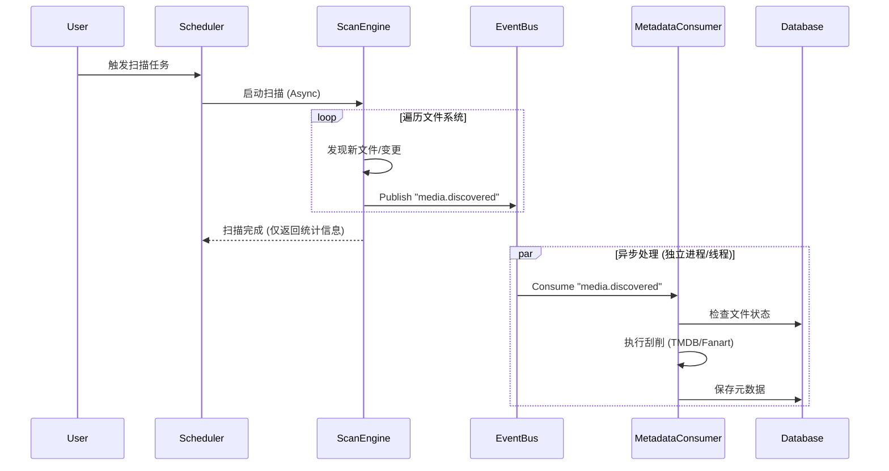

# 扫描与丰富化（刮削）解耦设计方案 (Event-Driven Architecture)

## 1. 现状与问题分析

### 1.1 当前架构痛点
*   **强耦合**: `UnifiedTaskScheduler` 在 `_execute_combined_task` 中显式编排“扫描 -> 丰富化”流程。修改丰富化逻辑可能影响扫描流程。
*   **扩展性受限**: 若需增加新的处理环节（如：消息通知、转码、图片分析），必须修改调度器代码，违反开闭原则（OCP）。
*   **性能瓶颈**: 组合任务是串行的，扫描的大量结果堆积在内存中等待创建元数据任务，可能导致内存峰值。
*   **容错性差**: 扫描成功但丰富化任务创建失败时，缺乏优雅的重试或部分恢复机制（目前依赖整个任务重试）。

### 1.2 目标架构
*   **扫描纯粹化**: 扫描引擎专注于文件系统遍历与变更检测，产出“原子化事件”。
*   **事件驱动**: 通过事件总线解耦生产者（扫描）与消费者（丰富化、其他后续处理）。
*   **独立伸缩**: 扫描与丰富化可独立部署、独立扩展，处理速度互不影响。

---

## 2. 架构设计 (Event-Driven)

### 2.1 核心组件

1.  **Event Producer (Scan Engine)**:
    *   **职责**: 遍历存储，识别文件变更（新增/修改/删除）。
    *   **行为**: 每发现一个有效变更，立即（或分批）投递一个标准事件到事件总线，**不等待**后续处理。
    *   **输出**: `MediaDiscoveredEvent`, `MediaDeletedEvent`。

2.  **Event Bus (基于 Redis Stream 或 Pub/Sub)**:
    *   **职责**: 缓冲事件，确保事件可被一个或多个消费者组（Consumer Group）消费。
    *   **选型**: 建议复用现有的 Redis 基础设施，使用 **Redis Streams** 以支持持久化、消费者组和消息回溯。

3.  **Event Consumer (Metadata Enricher)**:
    *   **职责**: 订阅 `MediaDiscoveredEvent`。
    *   **行为**: 解析事件数据 -> 检查是否需要丰富化 -> 执行元数据抓取 -> 更新数据库。
    *   **特性**: 幂等性设计（重复消费不产生副作用）。

### 2.2 数据流向



---

## 3. 接口契约定义

### 3.1 事件模型 (Event Schema)

定义标准化的事件结构，确保消费者无需回查文件系统即可开始工作。

**Event Topic**: `media.lifecycle.events`

**Event Type**: `MEDIA_DISCOVERED`

**Payload (JSON)**:
```json
{
  "event_id": "uuid-v4",
  "event_type": "MEDIA_DISCOVERED",
  "timestamp": 1678888888,
  "source_system": "scan_engine",
  "data": {
    "storage_id": 1,
    "file_path": "/movies/Avatar.mkv",
    "file_name": "Avatar.mkv",
    "file_size": 10240000000,
    "modified_time": 1678888000,
    "hash": "optional_hash_value",
    "scan_snapshot": {  // 轻量级快照，避免消费者再次IO
       "video_codec": "h264",
       "resolution": "1080p"
    }
  }
}
```

### 3.2 消费者处理逻辑

消费者应实现为长期运行的后台服务（Daemon）或由调度器管理的Worker。

```python
class MetadataEventConsumer:
    async def listen(self):
        while True:
            event = await event_bus.read_group("metadata_group", "consumer_1")
            if event:
                try:
                    await self.process_discovery(event)
                    await event_bus.ack(event)
                except Exception:
                    await self.handle_failure(event)

    async def process_discovery(self, event):
        # 1. 幂等性检查 (Redis Set 或 DB 状态)
        if await self.is_processed(event.id):
            return

        # 2. 执行业务逻辑
        file_info = event.data
        # 调用现有的 metadata_enricher
        await metadata_enricher.enrich_media_file(
            path=file_info.path, 
            snapshot=file_info.scan_snapshot
        )
```

---

## 4. 优化与演进建议

### 4.1 批量处理优化 (Batching)
*   **问题**: 如果扫描速度极快（如本地SSD），逐个发送事件可能造成网络开销过大。
*   **优化**: 扫描引擎内部维护一个微批次缓冲区（例如 50 个文件或 500ms），满额后打包发送 `BatchMediaDiscoveredEvent`。

### 4.2 优先级队列
*   **场景**: 用户手动触发的扫描优先级应高于定时任务。
*   **设计**: 事件Payload中携带 `priority` 字段。消费者优先处理高优先级事件（Redis Stream 支持较弱，可能需要拆分 `high_priority_stream` 和 `normal_stream`）。

### 4.3 反压机制 (Backpressure)
*   **机制**: 监控 Redis Stream 的积压长度（Lag）。如果积压过大，扫描引擎可以主动降低扫描速率，或者动态增加消费者 Worker 数量（Auto-scaling）。

### 4.4 数据一致性
*   **最终一致性**: 扫描与入库是异步的，用户可能在文件列表中看到文件但暂时没有元数据。
*   **UI 优化**: 前端需适配“处理中”状态，通过 WebSocket 接收元数据更新通知。

---

## 5. 改造步骤 (Roadmap)

1.  **基础设施层**: 封装 `EventBus` 接口（支持 Publish/Subscribe/Ack），基于 Redis 实现。
2.  **生产端改造**: 修改 `UnifiedScanEngine`，在发现文件变更的 Hook 处注入 `EventBus.publish()`，移除原有的结果收集列表（或仅保留用于统计）。
3.  **消费端实现**: 创建 `MediaDiscoveryListener` 服务，复用现有的 `MetadataTaskProcessor` 逻辑。
4.  **调度器简化**: 移除 `UnifiedTaskScheduler` 中 `_execute_combined_task` 的编排逻辑，只负责触发扫描。