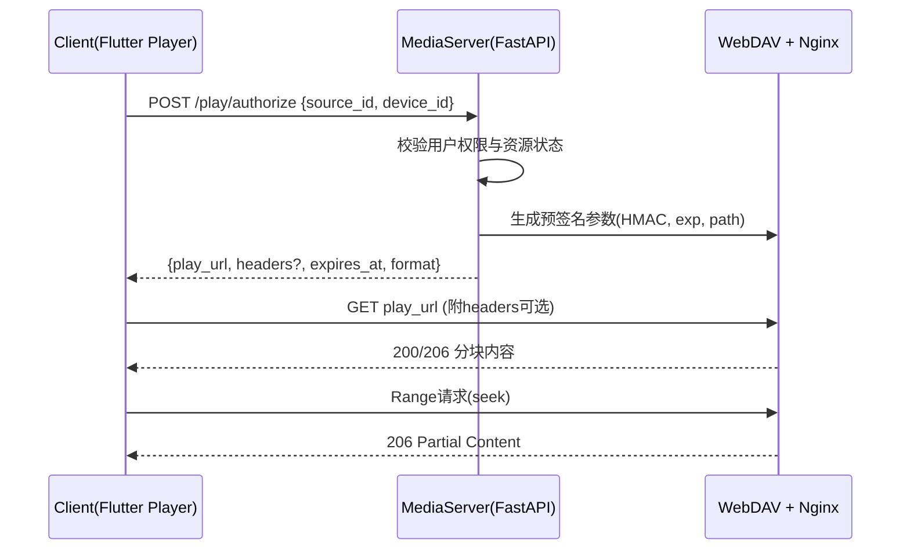
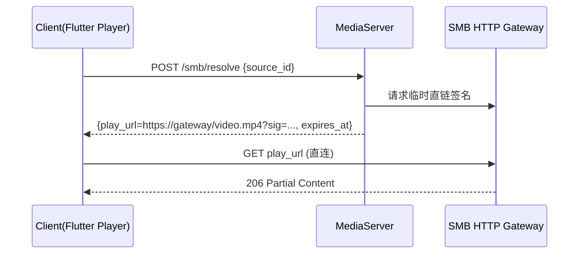

背景与目标 
- 移动端前端播放器插件位于 `\home\meal\Django-Web\mediacmn\media-client\lib\media_player`（Flutter/Dart）。后端项目位于 `\home\meal\Django-Web\mediacmn\media-server`（FastAPI）。 
- 主要视频源：本地、WebDAV（当前占比最高）、SMB、其他云盘链接。 
- 核心原则：所有视频流量直连源服务器，后端只负责提供播放链接与认证凭证，不做数据中转。 

总体原则（直连策略） 
- 播放直连：播放器对接源服务器的URL，支持Range请求（HTTP 206）。 
- 后端仅签发访问凭证：预签名URL、临时令牌、必要的HTTP头信息。 
- 安全最小化：凭证最小权限、短有效期、单域绑定、不可跨资源复用。 
- 适配差异：不同源由独立适配器处理，统一输出可播放实体。 

一、前端播放器插件架构（移动端 Flutter） 
1. 模块与职责 
- 播放器核心：基于 `video_player` 或增强型 `better_player`（支持HLS/DASH、缓存、headers）。 
- 视频源适配器工厂：按来源类型选择适配器（Local/WebDAV/SMB/CloudLink）。 
- 认证管理器：管理后端返回的JWT/HMAC签名、临时headers、过期刷新。 
- 统一播放接口层：向UI暴露统一 `PlayableSource`（含 `uri`、`headers`、`format`、`expiresAt`）。 
- 缓存与网络策略：分块缓存、断点续播、弱网重试、带宽自适应（优先HLS/DASH源）。 

2. 统一接口（概念模型） 
- `MediaSourceAdapter`：输入媒体标识或原始链接 → 输出 `PlayableSource`。 
- `PlayableSource`：`uri`（可直接播放的URL）、`headers`（可选，含认证/Range/UA等）、`format`（mp4、hls、dash）、`expiresAt`（ISO时间）、`drm`（可选）。 
- `PlayerCore`：接收 `PlayableSource` 初始化播放器，负责seek、缓冲、事件、错误上报。 

3. 各来源适配策略 
- 本地视频（LocalAdapter）：使用 `Uri.file` 直接播放；支持文件权限校验与离线缓存。 
- WebDAV（WebDAVAdapter）： 
  * 首选预签名URL（query签名、短有效期、域名绑定）。 
  * 如设备支持HTTP自定义头，允许使用 `Authorization`/自定义token头直连。 
  * 保证Range支持（seek与跳转时自动触发）。 
- SMB（SMBAdapter）：移动端无法直接以SMB协议播放，需源侧网关将SMB转HTTP流或HLS： 
  * 源侧HTTP Range网关：将 `smb://path` 映射为 `https://gateway/...`，后端仅签发该网关的临时访问凭证。 
  * 或WebSocket桥接：适用于受限网络，但推荐HTTP流以兼容播放器与缓存。 
- 云盘链接（CloudLinkAdapter）：解析原始分享URL → 兑换为临时直链（若云盘支持token化直链或HLS播放清单），输出 `PlayableSource`。 

4. 错误与重试 
- 统一错误码：来源不可达、凭证过期、无权限、格式不支持。 
- 自动刷新：在 `expiresAt` 前后触发凭证刷新（后端接口），不中断播放。 
- 降级策略：无法直链时，尝试HLS/DASH播放（云盘/网关侧提供）。 

二、后端播放相关功能设计（FastAPI） 
1. 服务职责 
- 元数据管理：资源目录、来源类型、权限绑定、可用性状态。 
- 认证令牌服务：签发JWT/HMAC，控制资源、域名、过期、可选设备绑定。 
- 播放链接转换/签名：将WebDAV/SMB/云盘资源转换为可直连的临时URL。 
- 访问权限校验：用户会话校验、资源授权、操作审计。 

2. API设计（示例，无代码） 
- `POST /play/authorize`：请求播放授权 
  * 输入：`source_id` 或 `raw_url`、`device_id`（可选） 
  * 输出：`play_url`、`headers`（可选）、`expires_at`、`format`、`refresh_url` 
- `POST /play/refresh`：刷新临时链接/令牌（不切换资源） 
- `POST /webdav/sign`：对 `webdav://host/path` 生成预签名直链（面向客户端适配器）。 
- `POST /smb/resolve`：返回SMB源的HTTP网关直链（由源侧网关提供，后端只签名）。 
- `POST /cloud/resolve`：云盘链接兑换直链/HLS播放清单。 

3. WebDAV处理方案（重点） 
- 预签名URL（推荐）： 
  * 签名结构：`play_url = https://webdav.example.com/secure?path=/video.mp4&exp=1730000000&sig=<HMAC>` 
  * 绑定策略：绑定域名、资源路径、过期时间、可选设备ID；防重放。 
  * Range支持：直链指向原WebDAV服务或其前置Nginx/Trafik，返回206分块。 
- 认证头回传（设备支持时）： 
  * 返回 `headers = { Authorization: 'Bearer <token>' }` 或 Basic/Digest 信息（不返回原始账号，使用临时token）。 
  * 在移动端播放器初始化时注入HTTP头，直连WebDAV。 
- 返回形式：JSON直链或302重定向到预签名URL（移动端更推荐JSON以携带headers）。 

4. 解耦与架构隔离 
- API网关：将播放授权与签名服务抽象为独立网关（后端不承载流量）。 
- 消息队列：云盘链接解析、SMB → HTTP映射等异步任务通过队列执行。 
- 认证微服务：JWT/HMAC签发与校验独立服务，统一密钥轮转与审计。 

三、关键流程（序列图） 
1. WebDAV直链授权流程（移动端直连） 

2. SMB源HTTP化播放流程 

四、多源播放差异与策略 
- 协议差异： 
  * 本地：`file://`，无需网络与认证。 
  * WebDAV：HTTP扩展协议，需认证与Range良好支持。 
  * SMB：局域网文件共享，需HTTP化才能被移动播放器高效播放。 
  * 云盘：多为分享页，需兑换直链或HLS清单。 
- 认证方式：OAuth（云盘）、Basic/Digest（WebDAV/SMB网关）、JWT/HMAC（临时直链）。 
- 加载策略：直链MP4（分块）、HLS/DASH（自适应）、离线缓存（本地/受限网络）。 

五、安全审计要点 
- 临时凭证最小权限：仅限特定资源与操作，短过期（如10-30分钟）。 
- 密钥管理与轮转：签名密钥定期轮换，区分环境与服务。 
- 设备与域绑定：可选绑定 `device_id`、限制可访问域名，防盗链。 
- 防重放与限速：签名包含nonce或时间窗；源侧限速防滥用。 
- 不泄露源账号：不返回真实WebDAV/SMB账户信息，使用代理token或预签名。 

六、性能优化建议 
- HTTP/2与Keep-Alive：提升并发与首包时间。 
- 分块大小与缓存：播放器侧适配合理Range大小，启用磁盘缓存。 
- HLS优先：在弱网/云盘场景优先HLS以获得自适应码率。 
- 断点续播与预缓冲：记录播放位置，启动时预缓冲少量片段。 
- 日志与指标：收集缓冲耗时、重试次数、失败率，用于调优。 

七、交付物 
- 架构图（前后端交互、适配器模块图）。 
- 序列图（WebDAV授权直链、SMB网关直链流程）。 
- 接口规范（授权、刷新、签名、解析四类接口的字段定义）。 
- 安全审计清单与运维策略（密钥轮转、限流、防盗链）。 
- 性能优化建议与指标列表。 

八、问题解答 
1) 流量不经后端如何实现？ 
- 通过预签名URL或临时认证头，客户端直连源服务器；后端仅做签发与权限校验，不代理数据。 

2) 前端能否播放多种来源？区别是什么？ 
- 能，通过适配器工厂统一为 `PlayableSource`。区别在协议（HTTP/WebDAV/SMB）、认证（OAuth/Basic/JWT）、加载（直链分块 vs HLS/DASH），播放器按 `format` 与 `headers` 初始化即可。 

3) WebDAV播放链接与认证如何处理？ 
- 推荐预签名直链（HMAC+过期+域绑定），或返回临时 `Authorization` 头（不暴露真实账号）。均支持HTTP 206分块。返回JSON包含 `play_url`、`headers`、`expires_at`。 

4) 前端架构与后端功能如何设计并解耦？ 
- 前端以适配器+认证管理器+统一接口层组织；后端将授权与签名抽象为网关服务，认证微服务独立，云盘/SMB解析走队列。两侧以REST接口解耦，数据流量不经过后端。 

九、开发落地记录（阶段一：仅返回直连 playurl） 
- 后端接口实现： 
  - 新增 `GET /api/media/play/{file_id}`，校验用户隔离后返回当前文件的可播放直链，必要时动态生成签名直链并回写。位置：`media-server/api/routes_media.py:80-114`。 
  - 直链生成沿用既有逻辑：`services/media/metadata_persistence_service.py:46-101`（WebDAV预签名，包含 `sig/exp/nonce/res` 参数，支持HTTP 206）。 
  - 数据模型承载：`FileAsset.playurl` 字段（插入/刷新时写入）。 
  - 配置项要求：`core/config.py` 中 `PLAYURL_MODE=direct_signed`、`URL_SIGNING_SECRET`、`URL_SIGNING_TTL_SECONDS`。 
- 前端实现： 
  - API客户端新增 `getPlayUrl(fileId)` 方法，调用后端播放接口返回 `{file_id, playurl}`。位置：`media-client/lib/core/api_client.dart`。 
  - 路由新增 `/media/play/:id` 并创建播放器页面 `PlayPage`，接受 `extra.asset`，若无 `playurl` 则按 `fileId` 拉取直链，使用 `media_kit` 播放。位置：`media-client/lib/router.dart`、`media-client/lib/media_player/play_page.dart`。 
- 流量与安全： 
  - 客户端以直链播放，后端不承载视频流量，仅签发凭证；凭证短时效与域绑定。 
  - 不暴露源侧真实账号，签名参数或临时头承载认证。 
- 验收说明： 
  - 在“详情页”点击播放，路由跳转至 `/media/play/:id`；如资产中无 `playurl`，前端调用 `/api/media/play/{file_id}` 获取直链并开始播放。 

十、接口字段规范与错误码策略（阶段二扩展） 
- 接口：`GET /api/media/play/{file_id}` 
  - 请求：路径参数 `file_id`（int），鉴权使用JWT。 
  - 响应：`{ file_id: int, playurl: string, headers?: object, expires_at?: number(UNIX), format?: 'file'|'hls_master'|'dash', source_type?: 'webdav'|'smb'|'local'|'cloud' }` 
  - 错误：
    * 404 `{ code: 'file_not_found', message: '文件不存在或无权限' }`
    * 400 `{ code: 'compose_playurl_failed', message: '无法生成播放链接' }`
    * 401/403 标准鉴权错误（统一中间件处理）
- 接口：`POST /api/media/play/refresh` 
  - 请求：`{ file_id: int }`，鉴权使用JWT。 
  - 响应：同上（返回新的短效 `playurl`）。 
  - 错误：同上。 
- 字段约定：
  - `playurl` 必填、可直连播放；`expires_at` 为秒级时间戳；`headers` 为需要附加的HTTP头（当前为null，保留扩展）；`format` 便于前端选择合适播放器管线；`source_type` 用于统计与适配策略。 
- 前端错误处理建议：
  - `file_not_found` 跳回详情并提示；`compose_playurl_failed` 提供“重试/刷新”选项；`401/403` 引导用户重新登录。 
